# Capítulo II: Requirements Development and Software Solution Design

## 2.1. Competidores
Para evaluar el posicionamiento de **Gethics** en el mercado de soluciones digitales para la gestión pecuaria y ganadera, se identifican tres competidores clave (directos e indirectos) con presencia en el mercado nacional y regional:

* **Contigo Pecuario (Competidor Directo):** Plataforma de software ganadero y AgTech desarrollada por una empresa peruana, orientada a pequeños, medianos y grandes productores del Perú. Permite realizar el seguimiento del hato, control de producción, visualización de reportes interactivos y fortalecimiento de la asociatividad.
* **iambov (Competidor Directo):** Plataforma y asistente de gestión ganadera impulsado por Inteligencia Artificial y análisis de datos, desarrollado por Nauka Labs S.A.C. en Perú. Permite llevar un control digitalizado del hato bovino, monitoreo reproductivo, sanitario y asistencia inteligente.
* **Control Ganadero (Competidor Indirecto):** Aplicación móvil utilizada para el registro individual de animales, salud, producción de leche y costos de finca. Funciona principalmente como un cuaderno de registro digital sin herramientas colaborativas en tiempo real para médicos veterinarios.
### 2.1.1. Análisis competitivo
#### **Competitive Analysis Landscape**

**¿Por qué llevar a cabo este análisis?**  
Evaluar la propuesta de valor, modelo de negocio, alcance funcional y capacidades tecnológicas de los principales competidores frente a **Gethics**, identificando brechas en el mercado para consolidar una ventaja competitiva sostenible.

| Criterio / Perfil | 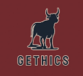<br>**Gethics** | <br>**Contigo Pecuario** | <br>**iambov** | <br>**Control Ganadero** |
| :--- | :--- | :--- | :--- | :--- |
| **Overview** | Startup móvil enfocada en la gestión integral del hato, control sanitario, trazabilidad y módulo colaborativo para veterinarios de campo. | Empresa peruana AgTech de software y análisis de datos ganaderos orientada a la productividad. | Plataforma peruana de gestión ganadera asistida por Inteligencia Artificial de Nauka Labs. | Aplicación móvil para el registro individual de animales, producción y costos de finca. |
| **Ventaja competitiva** | Solución *mobile-first* con perfil nativo exclusivo para veterinarios, registro *in situ* y alertas *push* automáticas. | Análisis de datos enfocado en el fortalecimiento de la asociatividad y cadenas de suministro. | Asistencia por IA y análisis predictivo del hato desde plataforma web/móvil. | Amplia base de usuarios y simplicidad como libreta de registro digital accesible. |
| **Mercado objetivo** | Pequeños y medianos ganaderos, y veterinarios de campo en Perú y LATAM. | Pequeños, medianos y grandes productores y cooperativas en el Perú. | Ganaderos y empresas pecuarias que buscan analítica avanzada e IA. | Ganaderos independientes y pequeños productores en Latinoamérica. |
| **Estrategias de marketing** | Alianzas con gremios y asociaciones locales, difusión con profesionales veterinarios y prueba *in-app* con contenido educativo. | Contenido educativo (blogs/tutoriales), participación en programas AgTech (ProInnóvate) y alianzas con cooperativas. | Posicionamiento como solución innovadora con IA y marketing digital agropecuario. | Posicionamiento orgánico en tiendas de aplicaciones y comunidades pecuarias. |
| **Productos & Servicios** | App móvil con gestión de animales, sanidad, calendario sanitario, módulo veterinario, finanzas y reportes. | Plataforma Web y App con reportes de producción, salud, finanzas y módulo asociativo. | Plataforma Web y App con asistentes de IA, monitoreo reproductivo, sanitario y tableros. | App móvil para registro individual de animales, control de leche, reproducciones y gastos. |
| **Precios & Costos** | Modelo de suscripción *in-app* según el tamaño del hato y licencias institucionales. | Planes de suscripción y licenciamiento de software para productores y cooperativas. | Suscripción mensual/anual SaaS por volumen de uso e IA. | Modelo *Freemium* con pagos por funcionalidades avanzadas. |
| **Canales de distribución** | Aplicación móvil (Android e iOS) optimizada para smartphones y tablets. | Plataforma Web interactiva y aplicación móvil. | Plataforma Web interactiva y aplicación móvil. | Aplicación móvil (Android e iOS). |
| **Fortalezas (SWOT)** | Módulo nativo para veterinarios, interfaz *mobile-first* intuitiva, sistema de alertas *push* e integración IoT. | Adaptado al contexto peruano, buen sistema de reportes y enfoque en asociatividad. | Tecnología de vanguardia con IA y análisis predictivo del hato. | Facilidad de uso, reconocimiento de marca y rápida instalación. |
| **Debilidades (SWOT)** | Marca nueva en fase de introducción e inicio de penetración de mercado. | Dependencia de conexión web para ciertas funciones analíticas complejas. | Requiere mayor capacitación para usuarios con bajo nivel de alfabetización digital. | Carece de módulo para veterinarios y herramientas colaborativas en tiempo real. |
| **Oportunidades (SWOT)** | Creciente adopción de smartphones en zonas rurales de LATAM y falta de digitalización sanitaria. | Alianzas con programas estatales de desarrollo ganadero en el Perú. | Integración con dispositivos IoT y sensores pecuarios en el mercado nacional. | Creciente demanda de herramientas sencillas de registro individual. |
| **Amenazas (SWOT)** | Resistencia al cambio tecnológico en productores ganaderos tradicionales. | Ingreso de soluciones internacionales con presupuestos de marketing más elevados. | Plataformas globales que incorporen asistentes de IA genéricos. | Competidores emergentes con ofertas totalmente gratuitas. |

### 2.1.2. Estrategias y tácticas frente a competidores

#### **Estrategia de Diferenciación por Propuesta de Valor Dual**
* **Módulo nativo colaborativo Ganadero-Veterinario:** A diferencia de competidores orientados únicamente al productor como *Control Ganadero* o *Contigo Pecuario*, **Gethics** ofrece un perfil exclusivo para médicos veterinarios de campo, permitiendo compartir historiales clínicos en tiempo real y coordinar tratamientos directamente *in situ*.
* **Experiencia Mobile-First intuitiva:** Frente a plataformas complejas como *iambov* que demandan mayor alfabetización digital, **Gethics** implementa un diseño simplificado para pantallas táctiles, optimizado para ser utilizado por productores rurales en condiciones de campo.

#### **Tácticas de Penetración de Mercado y Crecimiento**
* **Alianzas con gremios e instituciones clave:** Establecer convenios con cooperativas ganaderas, asociaciones locales y entidades del sector (como SENASA) para acelerar la adopción en pequeños y medianos hatos frente al posicionamiento de *Contigo Pecuario*.
* **Modelo Freemium escalable:** Mitigar la resistencia a la adopción tecnológica mediante un plan gratuito con funciones esenciales de registro individual, facilitando la conversión posterior a suscripciones *in-app* según el crecimiento del hato.

#### **Tácticas de Producto y Retención**
* **Arquitectura Offline-First:** Permitir la recolección de datos sanitarios y económicos sin dependencia de conexión continua a internet en zonas rurales remotas, superando las limitaciones de soluciones basadas predominantemente en web.
* **Automatización mediante notificaciones push:** Implementar un sistema de alertas automáticas para calendarios de vacunación, tratamientos y eventos reproductivos, reduciendo olvidos operativos y garantizando el uso continuo de la aplicación.

## 2.2. Entrevistas
Las entrevistas son una herramienta esencial para comprender a fondo a nuestro público objetivo. Para que sean efectivas, deben seguir una estructura clara y directa, utilizando preguntas específicas que permitan recolectar información de valor y datos precisos de los participantes.

### 2.2.1. Diseño de entrevistas
A continuación se detalla la guía de entrevista estructurada por segmentos y categorías temáticas:
## Segmento 1: Pequeños y Medianos Ganaderos
> **Perfil:** Productores dedicados al manejo diario de hatos ganaderos bovinos en zonas rurales o semiurbanas que requieren mejorar el control sanitario, la trazabilidad y la rentabilidad de su negocio desde dispositivos móviles.

### 1. Características Demográficas, Antecedentes y Biografía
* **Pregunta Principal:** ¿Podría presentarse e indicarnos a qué se dedica exactamente, en qué distrito se ubica su unidad productiva y cómo inició su trayectoria en la actividad ganadera?
* **Pregunta Complementaria:** ¿Cuál es su edad, género, estado civil y la composición de su núcleo familiar?

### 2. Hábitos Tecnológicos, Dispositivos y Canales Digitales
* **Pregunta Principal:** ¿Qué dispositivos tecnológicos (smartphones, tablets, computadoras) utiliza diariamente en el campo o en su hogar?
* **Pregunta Complementaria:** ¿Cuáles son sus marcas de dispositivos o sistemas operativos preferidos? ¿Qué navegador web y aplicaciones móviles utiliza con mayor frecuencia?

### 3. Habilidades y Procesos Actuales de Gestión Ganadera
* **Pregunta Principal:** ¿Cómo lleva actualmente el registro de sus animales, el control de vacunas, eventos sanitarios, partos y la economía de su finca?
* **Pregunta Complementaria:** ¿Qué nivel de destreza considera que tiene con el uso de aplicaciones móviles?

### 4. Objetivos y Motivaciones
* **Pregunta Principal:** ¿Cuáles son sus principales objetivos a corto y mediano plazo en relación con su negocio ganadero?
* **Pregunta Complementaria:** ¿Qué metas productivas, financieras o de trazabilidad le motivan a buscar una solución digital?

### 5. Frustraciones, Dolores y Desafíos
* **Pregunta Principal:** ¿Cuáles son los mayores problemas o dificultades que enfrenta en la gestión diaria de su ganado?
* **Pregunta Complementaria:** ¿Ha tenido pérdidas de información o problemas económicos por no llevar un registro ordenado?

---

## Segmento 2: Veterinarios y Técnicos Agropecuarios
> **Perfil:** Profesionales y técnicos dedicados a brindar asistencia de salud animal, seguimiento clínico *in situ* y asesoría técnica a ganaderos en campo.

### 1. Características Demográficas, Antecedentes y Biografía
* **Pregunta Principal:** ¿Podría detallar su formación académica, los distritos donde presta servicios veterinarios y su experiencia profesional en el sector pecuario?
* **Pregunta Complementaria:** ¿Cuál es su edad, género, ocupación actual y con qué tipo de ganaderos u organizaciones trabaja con mayor frecuencia?

### 2. Hábitos Tecnológicos, Dispositivos y Canales Digitales
* **Pregunta Principal:** ¿Qué dispositivos móviles y herramientas digitales lleva consigo durante sus visitas a establos o predios rurales?
* **Pregunta Complementaria:** ¿Qué marcas de tecnología prefiere y cuáles son sus canales digitales de interacción profesional habituales (navegadores, redes, apps de consulta)?

### 3. Habilidades y Procesos de Atención Clínica en Campo
* **Pregunta Principal:** ¿Cómo realiza la consulta y el registro de las fichas clínicas, tratamientos y eventos sanitarios de sus pacientes en el campo?
* **Pregunta Complementaria:** ¿Qué facilidades o dificultades tiene al interactuar con aplicaciones móviles en entornos de trabajo sin buena conectividad?

### 4. Objetivos y Motivaciones
* **Pregunta Principal:** ¿Cuáles son sus principales metas profesionales al brindar servicios veterinarios a hatos ganaderos?
* **Pregunta Complementaria:** ¿De qué manera busca hacer más eficiente el tiempo de atención y el seguimiento médico de sus clientes asignados?

### 5. Frustraciones, Dolores y Desafíos
* **Pregunta Principal:** ¿Qué frustraciones o contratiempos experimenta cuando atiende a un cliente que no cuenta con un historial ganadero organizado?
* **Pregunta Complementaria:** ¿Qué fallas en el seguimiento de recetas o en el registro de datos sanitarios entorpecen su trabajo clínico diario?

### 2.2.2. Registro de entrevistas


### 2.2.3. Análisis de entrevistas


---

## 2.3. Needfinding
En esta sección se presentarán los artefactos resultantes del proceso de análisis de la información recolectada de los segmentos objetivos. Aquí se incluyen secciones para User Personas, User Task Matrix, User Journey Maps, Empathy Mapping y As-is Scenario Mapping.

### 2.3.1. User Personas
En esta sección se exponen los User Personas construidos para caracterizar a los segmentos objetivo definidos durante la investigación de campo. Estos arquetipos sintetizan atributos demográficos, perfiles psicográficos, patrones de comportamiento, así como los principales pains (frustraciones) y gains (metas) observados en su operativa cotidiana. Adicionalmente, se examina el nivel de madurez digital de cada perfil y su relación con las herramientas tecnológicas pecuarias. El diseño visual y la sistematización de estos hallazgos se realizaron mediante UXPressia a partir de los datos cualitativos obtenidos en las entrevistas. 

#### **User Persona 1: Pequeños y Medianos Ganaderos**

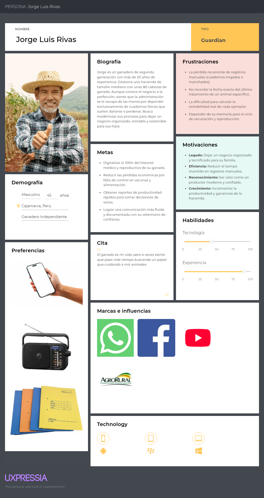

---

#### **User Persona 2: Veterinarios y Técnicos Agropecuarios**

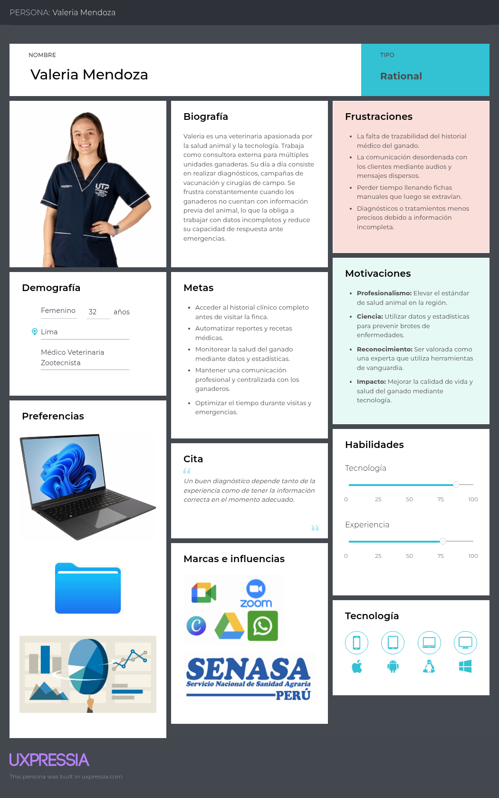

### 2.3.2. User Task Matrix
La **User Task Matrix** permite sistematizar y jerarquizar la operatividad cotidiana de los actores del ecosistema pecuario. Al evaluar la recurrencia (*frecuencia*) y la relevancia (*importancia*) de cada tarea en la gestión actual, este artefacto visibiliza los cuellos de botella y puntos de fricción del proceso, sentando las bases para priorizar las funcionalidades clave de la solución móvil **Gethics**.

#### **Matriz de Tareas por Segmento Objetivo**

| USER TASK | Jorge Luis Rivas (Frecuencia) | Jorge Luis Rivas (Importancia) | Valeria Mendoza (Frecuencia) | Valeria Mendoza (Importancia) |
| :--- | :--- | :--- | :--- | :--- |
| **Anotar el nacimiento o compra de un nuevo animal en cuadernos físicos** | Sometimes | High | Rarely | Medium |
| **Registrar manualmente vacunas y tratamientos del ganado** | Often | High | Always | High |
| **Revisar fechas de vacunación en notas, calendarios o cuadernos** | Often | High | Often | High |
| **Recordar manualmente vacunas o controles pendientes** | Sometimes | High | Sometimes | High |
| **Anotar peso y crecimiento del ganado durante controles** | Often | Medium | Often | Medium |
| **Revisar manualmente información sobre productividad y rendimiento** | Sometimes | Medium | Often | Medium |
| **Compartir documentos físicos o fotografías de registros con asociaciones o compradores** | Rarely | Medium | Rarely | Low |
| **Buscar información o capacitaciones ganaderas en internet y redes sociales** | Sometimes | Low | Sometimes | Medium |
| **Llevar el control reproductivo mediante anotaciones manuales** | Rarely | Medium | Rarely | Medium |
| **Buscar antecedentes médicos y sanitarios en cuadernos o archivos físicos** | Sometimes | High | Sometimes | High |

---

### 2.3.3. User Journey Mapping

### Segmento #1 - Ganaderos

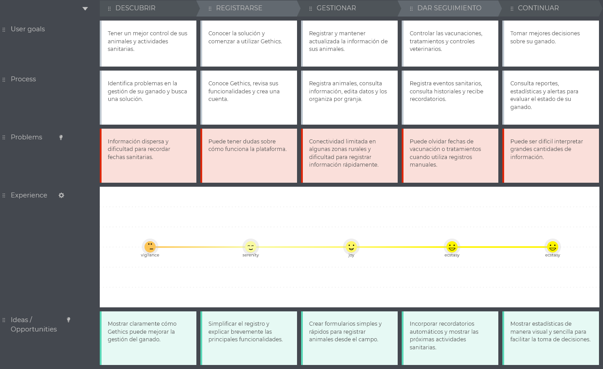

### Segmento #2 - Veterinarios


### 2.3.4. Empathy Mapping

### Segmento #1 - Ganaderos

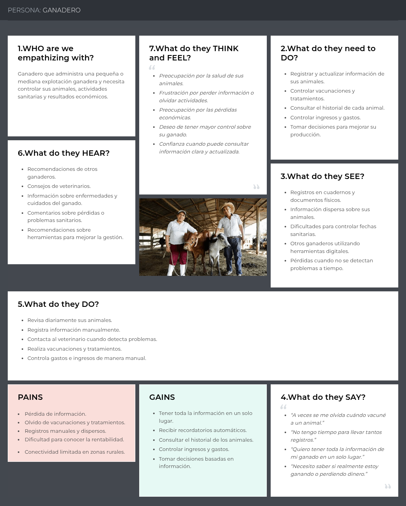

### Segmento #2 - Veterinarios

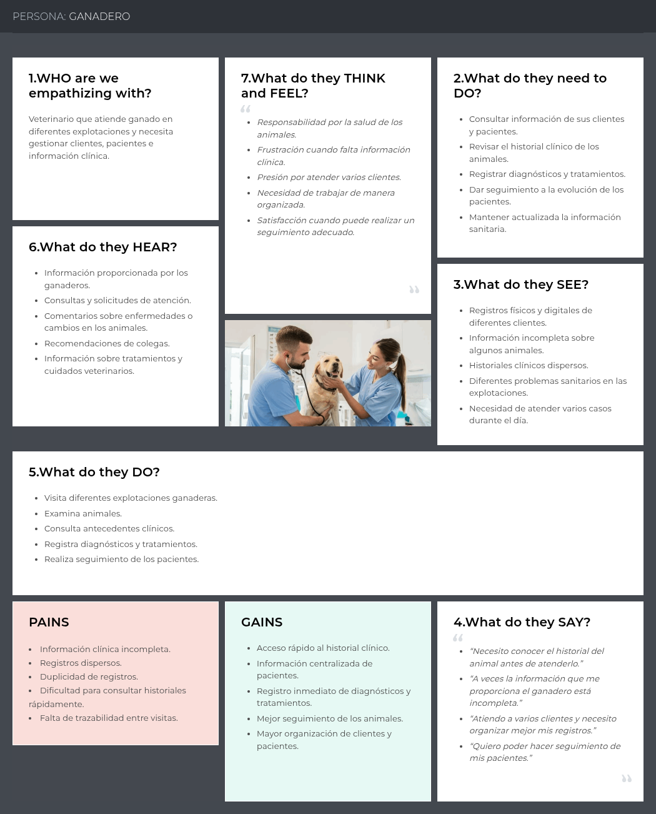

### 2.3.5. Big Picture EventStorming

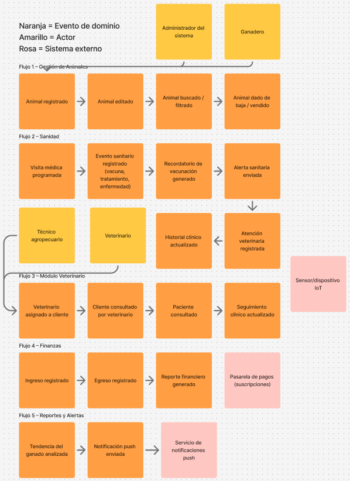

### 2.3.6. Ubiquitous Language

| Term | Definition |
|---|---|
| **Animal** | Unidad individual del ganado registrada en el sistema, con atributos como raza, edad, sexo y estado de salud. |
| **Herd** | Conjunto de animales que pertenecen a un mismo ganadero o granja. |
| **Farm** | Unidad productiva o terreno donde se ubica el ganado gestionado por el ganadero. |
| **Sanitary Event** | Registro de una acción médica realizada a un animal (vacuna, tratamiento, diagnóstico, enfermedad). |
| **Sanitary Calendar** | Módulo que organiza y recuerda fechas de vacunación, tratamientos y controles veterinarios. |
| **Push Notification** | Notificación automática enviada al usuario ante un evento relevante (vacuna próxima, anomalía detectada). |
| **Assigned Client** | Ganadero vinculado a un veterinario específico para la atención de su ganado. |
| **Patient** | Animal que está bajo seguimiento clínico de un veterinario. |
| **Clinical History** | Registro cronológico de todos los eventos sanitarios de un animal. |
| **Financial Management** | Módulo de registro de ingresos y egresos asociados a la actividad ganadera. |
| **Report / Statistics** | Visualización de datos consolidados del ganado para apoyar la toma de decisiones. |
| **Subscription Plan** | Modalidad de acceso a la app (gratuito o pago) según el tamaño del ganado o funcionalidades contratadas. |
| **IoT Device** | Sensor o dispositivo conectado que provee datos en tiempo real sobre el ganado. |

---

## 2.4. Requirements Specification

### 2.4.1. User Stories

| Épica | Descripción |
|---|---|
| **EPIC-01: Product Landing Page** | Como visitante interesado en Gethics, quiero conocer el propósito, beneficios y principales funcionalidades de la solución para decidir si deseo utilizarla. |
| **EPIC-02: Cuenta y Perfil de Usuario** | Como usuario (ganadero o veterinario), quiero gestionar mi cuenta para acceder de forma segura a la aplicación. |
| **EPIC-03: Gestión de Animales** | Como ganadero, quiero registrar y administrar la información de mis animales para tener control individual de mi ganado. |
| **EPIC-04: Gestión de Granjas** | Como ganadero, quiero administrar mis granjas para organizar mi producción por ubicación. |
| **EPIC-05: Sanidad y Calendario** | Como ganadero, quiero registrar y recibir recordatorios de eventos sanitarios para no descuidar la salud de mi ganado. |
| **EPIC-06: Control Económico** | Como ganadero, quiero registrar ingresos y egresos para conocer la rentabilidad de mi actividad. |
| **EPIC-07: Módulo Veterinario** | Como veterinario, quiero consultar mis clientes y pacientes asignados para dar seguimiento clínico desde el campo. |
| **EPIC-08: Reportes y Estadísticas** | Como ganadero, quiero visualizar reportes y alertas de tendencias para tomar mejores decisiones. |
| **EPIC-09: Notificaciones y Dispositivos IoT** | Como usuario, quiero recibir alertas automáticas y conectar dispositivos para mejorar el monitoreo del ganado. |
| **EPIC-10: Monetización** | Como usuario de Gethics, quiero acceder a planes de suscripción para utilizar funcionalidades según el plan contratado. |

---

#### US-25 — Propuesta de valor del producto

Como visitante, quiero conocer la propuesta de valor de Gethics para comprender cómo la solución puede ayudarme a gestionar el ganado.

- **Escenario 1:** Dado que el visitante accede al Landing Page, cuando la página termina de cargar, entonces el sistema muestra el propósito y la propuesta de valor de Gethics.
- **Escenario 2:** Dado que el visitante revisa la sección principal, cuando consulta la información del producto, entonces puede identificar el problema que Gethics busca resolver y su beneficio principal.

#### US-26 — Principales funcionalidades

Como visitante, quiero conocer las principales funcionalidades de Gethics para identificar qué problemas de gestión ganadera puedo resolver con la aplicación.

- **Escenario 1:** Dado que el visitante se encuentra en el Landing Page, cuando revisa la sección de funcionalidades, entonces el sistema muestra las principales capacidades de la solución.
- **Escenario 2:** Dado que el visitante selecciona una funcionalidad, cuando consulta su descripción, entonces el sistema muestra una explicación breve de su utilidad.

#### US-27 — Call To Action

Como visitante, quiero acceder a un Call To Action para poder iniciar el proceso de uso de Gethics.

- **Escenario 1:** Dado que el visitante se encuentra en el Landing Page, cuando selecciona el CTA principal, entonces el sistema lo dirige a la sección de acceso o registro correspondiente.
- **Escenario 2:** Dado que el visitante selecciona un CTA secundario, cuando realiza la acción, entonces el sistema lo dirige al destino definido para obtener más información o iniciar el uso de la solución.

#### US-28 — Información de contacto y redes sociales

Como visitante, quiero encontrar información de contacto y enlaces a las redes sociales de Gethics para poder obtener más información sobre la startup.

- **Escenario 1:** Dado que el visitante navega hacia el pie de página, cuando consulta la información disponible, entonces el sistema muestra los medios de contacto y enlaces a las redes sociales.
- **Escenario 2:** Dado que el visitante selecciona un enlace social, cuando realiza la acción, entonces el sistema lo dirige al canal correspondiente.

#### US-01 — Registro de usuario

Como ganadero o veterinario, quiero registrarme en la aplicación para acceder a las funcionalidades según mi rol.

- **Escenario 1:** Dado que el usuario está en la pantalla de registro, cuando completa nombre, correo, contraseña y selecciona su rol, entonces el sistema crea la cuenta y lo redirige al inicio de sesión.
- **Escenario 2:** Dado que el usuario ingresa un correo ya existente, cuando intenta registrarse, entonces el sistema muestra un mensaje indicando que el correo ya está en uso.

#### US-02 — Inicio de sesión

Como usuario registrado, quiero iniciar sesión con mi correo y contraseña para acceder a mi cuenta.

- **Escenario 1:** Dado que el usuario ingresa credenciales correctas, cuando presiona "Iniciar sesión", entonces el sistema lo redirige a su panel principal según su rol.
- **Escenario 2:** Dado que el usuario ingresa una contraseña incorrecta, cuando intenta iniciar sesión, entonces el sistema muestra un mensaje de error sin especificar cuál dato falló.

#### US-03 — Recuperación de contraseña

Como usuario, quiero recuperar mi contraseña olvidada para volver a acceder a mi cuenta.

- **Escenario 1:** Dado que el usuario ingresa su correo registrado, cuando solicita recuperar contraseña, entonces el sistema envía un enlace de restablecimiento a su correo.
- **Escenario 2:** Dado que el usuario ingresa un correo no registrado, cuando solicita la recuperación, entonces el sistema muestra un mensaje indicando que no existe una cuenta asociada.

#### US-04 — Editar perfil

Como usuario, quiero editar los datos de mi perfil para mantener mi información actualizada.

- **Escenario 1:** Dado que el usuario está en su perfil, cuando modifica su nombre, teléfono o foto y guarda, entonces el sistema actualiza los datos y muestra confirmación.
- **Escenario 2:** Dado que el usuario ingresa un formato de teléfono inválido, cuando intenta guardar, entonces el sistema muestra un mensaje de validación.

#### US-05 — Registro de animal

Como ganadero, quiero registrar un nuevo animal con sus datos básicos para llevar control individual de mi ganado.

- **Escenario 1:** Dado que el ganadero está en el módulo de animales, cuando ingresa los datos requeridos y guarda, entonces el sistema registra el animal.
- **Escenario 2:** Dado que el ganadero deja un campo obligatorio vacío, cuando intenta guardar, entonces el sistema muestra un mensaje solicitando completar la información.

#### US-06 — Listado y búsqueda de animales

Como ganadero, quiero buscar y filtrar animales de mi ganado para encontrar información rápidamente.

- **Escenario 1:** Dado que el ganadero ingresa un criterio de búsqueda (raza, nombre o ID), cuando presiona buscar, entonces el sistema muestra los animales que coinciden.
- **Escenario 2:** Dado que el criterio de búsqueda no coincide con ningún animal, cuando se ejecuta la búsqueda, entonces el sistema muestra un mensaje de "sin resultados".

#### US-07 — Edición de animal

Como ganadero, quiero editar los datos de un animal registrado para mantener su información actualizada.

- **Escenario 1:** Dado que el ganadero selecciona un animal, cuando modifica sus datos y guarda, entonces el sistema actualiza la información del animal.
- **Escenario 2:** Dado que el ganadero está editando un animal, cuando presiona "Cancelar", entonces el sistema descarta los cambios y regresa a la vista anterior.

#### US-08 — Eliminación de animal

Como ganadero, quiero eliminar o dar de baja un animal de mi ganado cuando ya no forma parte de mi producción.

- **Escenario 1:** Dado que el ganadero selecciona un animal, cuando confirma la eliminación, entonces el sistema lo remueve de la lista activa y conserva su historial.
- **Escenario 2:** Dado que el ganadero inicia la eliminación, cuando cancela la confirmación, entonces el animal permanece sin cambios.

#### US-09 — Registro de granja

Como ganadero, quiero registrar una granja para organizar mi producción por ubicación.

- **Escenario 1:** Dado que el ganadero está en el módulo de granja, cuando ingresa nombre, ubicación y tamaño y guarda, entonces la granja se agrega a su cuenta.
- **Escenario 2:** Dado que el ganadero ingresa un nombre de granja ya existente en su cuenta, cuando intenta guardar, entonces el sistema muestra un mensaje de advertencia.

#### US-10 — Asociar animales a una granja

Como ganadero, quiero asociar animales a una granja específica para saber dónde se encuentra cada uno.

- **Escenario 1:** Dado que el ganadero selecciona un animal, cuando le asigna una granja de la lista, entonces el sistema guarda la relación y la refleja en el listado de la granja.
- **Escenario 2:** Dado que un animal ya está asociado a una granja, cuando el ganadero lo mueve a otra granja, entonces el sistema actualiza la asociación y conserva el historial del cambio.

#### US-11 — Registro de evento sanitario

Como ganadero, quiero registrar una vacuna, tratamiento o enfermedad aplicada a un animal para mantener actualizado su historial.

- **Escenario 1:** Dado que el ganadero selecciona un animal, cuando registra tipo de evento, fecha y observaciones, entonces el evento se guarda en el historial clínico.
- **Escenario 2:** Dado que el ganadero ingresa una fecha futura para un evento ya ocurrido, cuando intenta guardar, entonces el sistema muestra un mensaje de validación.

#### US-12 — Calendario sanitario

Como ganadero, quiero visualizar un calendario con los eventos sanitarios programados para planificar las actividades de mi ganado.

- **Escenario 1:** Dado que el ganadero abre el calendario sanitario, cuando selecciona un mes, entonces el sistema muestra todos los eventos programados en ese periodo.
- **Escenario 2:** Dado que no hay eventos registrados en el mes seleccionado, cuando el ganadero consulta el calendario, entonces el sistema muestra un mensaje indicando que no hay actividades pendientes.

#### US-13 — Recordatorio de vacunación

Como ganadero, quiero recibir una notificación push antes de la fecha de una vacuna programada para no olvidarla.

- **Escenario 1:** Dado que existe una vacuna programada próxima a vencer, cuando faltan 3 días para la fecha, entonces el sistema envía una alerta push al ganadero.
- **Escenario 2:** Dado que la vacuna ya fue registrada como aplicada, cuando llega el momento del recordatorio, entonces el sistema no envía una alerta duplicada.

#### US-14 — Historial clínico por animal

Como ganadero o veterinario, quiero consultar el historial clínico completo de un animal para conocer su evolución sanitaria.

- **Escenario 1:** Dado que el usuario selecciona un animal, cuando accede a su historial, entonces el sistema muestra todos los eventos sanitarios en orden cronológico.
- **Escenario 2:** Dado que un animal recién registrado no tiene eventos sanitarios, cuando se consulta su historial, entonces el sistema muestra un mensaje de "sin registros".

#### US-15 — Registro de ingreso/egreso

Como ganadero, quiero registrar un ingreso o egreso económico para llevar el control financiero de mi ganado.

- **Escenario 1:** Dado que el ganadero accede al módulo financiero, cuando ingresa monto, tipo, categoría y fecha, entonces el sistema guarda el movimiento y actualiza el balance.
- **Escenario 2:** Dado que el ganadero ingresa un monto negativo o en cero, cuando intenta guardar, entonces el sistema muestra un mensaje de validación.

#### US-16 — Balance económico del ganado

Como ganadero, quiero visualizar el balance económico de mi ganado para conocer mi rentabilidad.

- **Escenario 1:** Dado que el ganadero accede al módulo financiero, cuando selecciona un periodo, entonces el sistema muestra el total de ingresos, egresos y balance neto.
- **Escenario 2:** Dado que no existen movimientos registrados en el periodo seleccionado, cuando se consulta el balance, entonces el sistema muestra el balance en cero con un mensaje informativo.

#### US-17 — Consulta de clientes asignados

Como veterinario, quiero ver la lista de clientes (ganaderos) asignados para planificar mis visitas de campo.

- **Escenario 1:** Dado que el veterinario inicia sesión, cuando accede a su panel, entonces el sistema muestra la lista de clientes asignados con su ubicación.
- **Escenario 2:** Dado que el veterinario aún no tiene clientes asignados, cuando accede a su panel, entonces el sistema muestra un mensaje indicando que no hay clientes vinculados.

#### US-18 — Consulta de pacientes

Como veterinario, quiero consultar los animales (pacientes) de un cliente asignado para revisar su estado antes de la visita.

- **Escenario 1:** Dado que el veterinario selecciona un cliente, cuando accede al listado de pacientes, entonces el sistema muestra los animales bajo su seguimiento con su historial resumido.
- **Escenario 2:** Dado que el cliente seleccionado no tiene animales registrados, cuando el veterinario consulta la lista, entonces el sistema muestra un mensaje vacío.

#### US-19 — Registro de evento sanitario por veterinario

Como veterinario, quiero registrar la atención brindada a un animal durante una visita para dejar constancia del diagnóstico y tratamiento.

- **Escenario 1:** Dado que el veterinario selecciona un paciente, cuando registra diagnóstico, tratamiento aplicado y próximos controles, entonces el evento se guarda en el historial clínico del animal y es visible para el ganadero.
- **Escenario 2:** Dado que el veterinario está en una zona sin cobertura, cuando registra la atención, entonces el sistema guarda el registro localmente y lo sincroniza al recuperar conexión.

#### US-20 — Reportes y estadísticas del ganado

Como ganadero, quiero visualizar reportes y estadísticas de mi ganado para identificar tendencias y tomar mejores decisiones.

- **Escenario 1:** Dado que el ganadero accede al módulo de reportes, cuando selecciona un rango de fechas, entonces el sistema muestra gráficos de salud, productividad y finanzas del ganado.
- **Escenario 2:** Dado que el ganado tiene muy pocos registros históricos, cuando se genera el reporte, entonces el sistema muestra un aviso de que los datos aún son limitados para un análisis completo.

#### US-21 — Alertas automáticas por tendencias

Como ganadero, quiero recibir una alerta automática cuando se detecte una tendencia anómala en mi ganado para actuar a tiempo.

- **Escenario 1:** Dado que el sistema detecta un patrón anómalo, cuando se supera el umbral definido, entonces se envía una notificación push al ganadero.
- **Escenario 2:** Dado que los indicadores del ganado están dentro de rangos normales, cuando el sistema realiza el análisis periódico, entonces no se genera ninguna alerta.

#### US-22 — Notificaciones push generales

Como usuario, quiero recibir notificaciones push relevantes (sanitarias, financieras y del sistema) para mantenerme informado sin tener que revisar la app constantemente.

- **Escenario 1:** Dado que ocurre un evento relevante, cuando se genera dicho evento, entonces el sistema envía la notificación push al dispositivo del usuario.
- **Escenario 2:** Dado que el usuario desactivó las notificaciones en su configuración, cuando ocurre un evento relevante, entonces el sistema no envía la notificación push.

#### US-23 — Integración con dispositivos IoT

Como ganadero, quiero conectar sensores IoT a la aplicación para recibir datos en tiempo real sobre mi ganado.

- **Escenario 1:** Dado que el ganadero cuenta con un dispositivo IoT compatible, cuando lo vincula desde la app mediante su código, entonces el sistema comienza a recibir y registrar los datos del sensor.
- **Escenario 2:** Dado que un dispositivo IoT vinculado pierde conexión, cuando el sistema intenta sincronizar datos, entonces muestra un estado de "desconectado" y notifica al ganadero.

#### US-24 — Planes de suscripción in-app

Como ganadero, quiero contratar un plan de suscripción según el tamaño de mi ganado para acceder a funcionalidades avanzadas.

- **Escenario 1:** Dado que el ganadero selecciona un plan de pago, cuando completa el proceso de pago, entonces el sistema activa las funcionalidades del plan contratado.
- **Escenario 2:** Dado que el método de pago es rechazado, cuando el ganadero intenta suscribirse, entonces el sistema muestra un mensaje de error y mantiene el plan gratuito activo.

### 2.4.2. Impact Mapping

| SMART Business Goal | Persona | Impact | Deliverable | User Stories |
|---|---|---|---|---|
| Lograr que al menos el 70% de los ganaderos participantes del piloto registre y actualice digitalmente la información de sus animales durante los primeros 3 meses de uso. | Ganaderos | Registrar y mantener organizada la información de los animales desde el celular. | Módulo de gestión de animales | US-05, US-06, US-07, US-08 |
| Lograr que al menos el 80% de los ganaderos participantes del piloto tenga sus animales asociados a una granja durante los primeros 3 meses de uso. | Ganaderos | Organizar los animales por ubicación y mejorar la trazabilidad de la producción. | Módulo de gestión de granjas y asociación de animales | US-09, US-10 |
| Reducir en al menos 30% los olvidos de vacunaciones y tratamientos programados entre los usuarios del piloto durante los primeros 3 meses de uso. | Ganaderos | Registrar actividades sanitarias y recibir recordatorios oportunos. | Módulo de sanidad, calendario y notificaciones | US-11, US-12, US-13, US-14, US-22 |
| Lograr que al menos el 70% de los ganaderos participantes del piloto registre sus ingresos y egresos al menos una vez al mes durante los primeros 3 meses. | Ganaderos | Conocer ingresos, egresos y balance para apoyar decisiones económicas. | Módulo de control económico y balance | US-15, US-16 |
| Lograr que al menos el 80% de los veterinarios participantes del piloto consulte la información de sus clientes y pacientes antes de realizar una visita durante los primeros 3 meses. | Veterinarios | Acceder rápidamente a clientes y pacientes asignados para planificar y atender visitas. | Módulo de gestión veterinaria | US-17, US-18 |
| Lograr que al menos el 80% de los eventos sanitarios registrados por veterinarios durante el piloto quede disponible en el historial clínico del animal el mismo día de la atención. | Veterinarios | Registrar diagnósticos, tratamientos y próximos controles con trazabilidad. | Historial clínico y registro sanitario para veterinarios | US-14, US-19 |
| Lograr que al menos el 70% de los ganaderos participantes consulte reportes o estadísticas al menos una vez al mes durante los primeros 3 meses. | Ganaderos | Analizar información histórica, productividad y tendencias para tomar decisiones. | Módulo de reportes, estadísticas y alertas por tendencias | US-20, US-21 |
| Lograr que al menos el 70% de los usuarios activos reciba correctamente notificaciones relevantes durante el periodo inicial de validación. | Ganaderos y veterinarios | Mantener informados a los usuarios sobre eventos sanitarios, alertas y mensajes relevantes. | Servicio de notificaciones push | US-13, US-21, US-22 |
| Conseguir que al menos el 60% de los visitantes del Landing Page identifique correctamente la propuesta de valor y el CTA principal durante la primera etapa de validación. | Visitantes | Comprender el propósito de Gethics y reconocer cómo iniciar el uso de la solución. | Product Landing Page | US-25, US-26, US-27, US-28 |

### 2.4.3. Product Backlog

| ID | User Story | Epic | Priority | Story Points |
|---|---|---|---|---|
| US-25 | Propuesta de valor del producto | EPIC-01 | Must | 3 |
| US-26 | Principales funcionalidades | EPIC-01 | Must | 5 |
| US-27 | Call To Action | EPIC-01 | Must | 3 |
| US-28 | Información de contacto y redes sociales | EPIC-01 | Should | 2 |
| US-01 | Registro de usuario | EPIC-02 | Must | 3 |
| US-02 | Inicio de sesión | EPIC-02 | Must | 2 |
| US-03 | Recuperación de contraseña | EPIC-02 | Must | 3 |
| US-04 | Editar perfil | EPIC-02 | Should | 2 |
| US-05 | Registro de animal | EPIC-03 | Should | 5 |
| US-06 | Listado y búsqueda de animales | EPIC-03 | Must | 5 |
| US-07 | Edición de animal | EPIC-03 | Must | 3 |
| US-08 | Eliminación de animal | EPIC-03 | Must | 2 |
| US-09 | Registro de granja | EPIC-04 | Should | 3 |
| US-10 | Asociar animales a una granja | EPIC-04 | Must | 3 |
| US-11 | Registro de evento sanitario | EPIC-05 | Should | 5 |
| US-12 | Calendario sanitario | EPIC-05 | Must | 5 |
| US-13 | Recordatorio de vacunación (push) | EPIC-05 | Must | 5 |
| US-14 | Historial clínico por animal | EPIC-05 | Must | 5 |
| US-15 | Registro de ingreso/egreso | EPIC-06 | Must | 5 |
| US-16 | Balance económico del ganado | EPIC-06 | Should | 3 |
| US-17 | Consulta de clientes asignados (veterinario) | EPIC-07 | Must | 5 |
| US-18 | Consulta de pacientes (veterinario) | EPIC-07 | Must | 5 |
| US-19 | Registro de evento sanitario por veterinario | EPIC-07 | Must | 5 |
| US-20 | Reportes y estadísticas del ganado | EPIC-08 | Must | 8 |
| US-21 | Alertas automáticas por tendencias | EPIC-08 | Should | 5 |
| US-22 | Notificaciones push generales | EPIC-09 | Must | 3 |
| US-23 | Integración con dispositivos IoT | EPIC-09 | Could | 8 |
| US-24 | Planes de suscripción in-app | EPIC-10 | Won't | 6 |

---

## 2.5. Strategic-Level Domain-Driven Design.

En esta sección se presenta el proceso realizado para las decisiones de nivel estratégico del dominio de Gethics Mobile, aplicando los principios de Domain-Driven Design (DDD). El objetivo de este nivel es descomponer el sistema en subconjuntos con límites naturales, conocidos como Bounded Contexts, que permitan al equipo de desarrollo trabajar con un lenguaje ubicuo consistente dentro de cada límite y evitar la ambigüedad conceptual que surge al modelar un dominio complejo como un único bloque monolítico.

### 2.5.1. EventStorming.

La sesión se desarrolló de manera colaborativa en Miro, siguiendo la secuencia de pasos recomendada para el EventStorming de diseño: Pivotal Events, Commands, Policies, Read Models, External Systems y Aggregates. El agrupamiento de agregados relacionados obtenido al final de esta secuencia constituye la base para la identificación de los candidate bounded contexts que se detalla en la sección 2.5.1.1.

Como parte de esta sesión, el equipo incorporó además el flujo de identificación de animales mediante código QR dentro de Gestión de Animales, evidenciando el feature de aprendizaje autónomo del proyecto: cada animal registrado genera automáticamente un código QR de identificación (mediante una política de automatización), el cual puede escanearse posteriormente en campo para acceder a su ficha sin necesidad de una búsqueda manual. Asimismo, se evidenció en el flujo de Sanidad la posibilidad de registrar un evento sanitario sin conexión a internet, sustentando el requisito de almacenamiento local de la aplicación móvil.

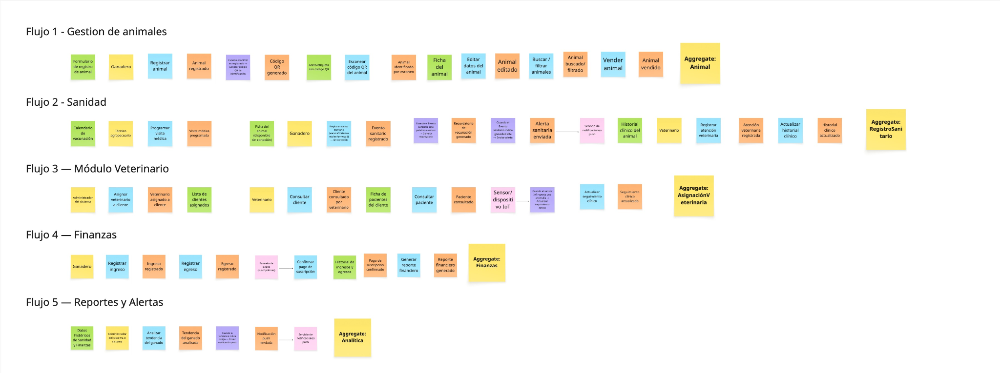

Link del tablero en Miro: [https://miro.com/app/board/uXjVHoAKl0Q=/?share_link_id=820485524389](https://miro.com/app/board/uXjVHoAKl0Q=/?share_link_id=820485524389)

#### 2.5.1.1. Candidate Context Discovery.

A partir de los agregados identificados en el Event Storming de diseño (Animal, RegistroSanitario, AsignaciónVeterinaria, Finanzas y Analítica), el equipo realizó una sesión de Candidate Context Discovery con una duración de 1 hora.

El equipo identificó los siguientes candidate bounded contexts para Gethics Mobile:

| # | Candidate Bounded Context | Agregado principal | Justificación (técnica aplicada) |
|---|---|---|---|
| 1 | **Livestock Management** (Gestión de Animales) | Animal | *Start-with-value*: es el registro maestro sobre el que giran los demás contextos; incorpora además el feature de aprendizaje autónomo (identificación por código QR). |
| 2 | **Sanitary Tracking** (Sanidad) | RegistroSanitario | *Look-for-pivotal-events*: el evento *sanitario registrado* es pivotal porque dispara políticas de recordatorio y alerta, y requiere un límite de consistencia propio por el registro sin conexión en campo. |
| 3 | **Veterinary Care** (Módulo Veterinario) | AsignaciónVeterinaria | *Start-with-simple*: agrupa el flujo de asignación veterinario-cliente y consulta profesional, con un ritmo y actor protagonista distintos a Sanidad. |
| 4 | **Financial Management** (Finanzas) | Finanzas | *Start-with-simple*: agrupa el registro de ingresos, egresos y confirmación de pago de suscripción, con una razón de cambio (contable/financiera) ajena al dominio ganadero. |
| 5 | **Analytics & Alerts** (Reportes y Alertas) | Analítica | *Look-for-pivotal-events*: el evento *Tendencia del ganado analizada* es pivotal porque consolida datos de Sanidad y Finanzas y dispara la política de notificación push. |
| 6 | **Identity & Access** | (no modelado como agregado en esta sesión) | Contexto de soporte identificado por necesidad general del sistema: los cuatro actores (Ganadero, Veterinario, Técnico Agropecuario, Administrador del Sistema) requieren autenticación y control de roles; al no generar eventos de negocio propios del dominio ganadero, se trata como subdominio genérico, no derivado directamente del EventStorm. |

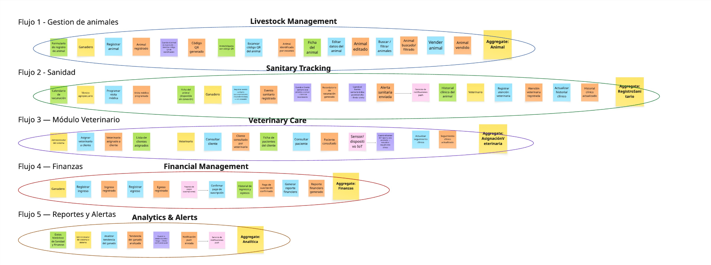

Link del tablero en Miro: [https://miro.com/app/board/uXjVHoAKl0Q=/?share_link_id=820485524389](https://miro.com/app/board/uXjVHoAKl0Q=/?share_link_id=820485524389)

#### 2.5.1.2. Domain Message Flows Modeling

Se aplicó la técnica de **Domain Storytelling**, construyendo las historias de dominio para los dos escenarios que el equipo consideró más representativos de la colaboración entre contextos, priorizando aquellos que involucran a más de un bounded context.

**Domain Story 1 - "El ganadero registra un evento sanitario grave y el veterinario es notificado"**

| # | Actor/Sistema | Acción | Objeto de trabajo | Bounded Context |
|---|---|---|---|---|
| 1 | Ganadero | consulta | Ficha del animal | Livestock Management |
| 2 | Ganadero | registra | Evento sanitario | Sanitary Tracking |
| 3 | Sanitary Tracking | evalúa gravedad y dispara política | Alerta sanitaria | Sanitary Tracking |
| 4 | Sanitary Tracking | envía solicitud a | Servicio de notificaciones push | Sistema externo |
| 5 | Servicio de notificaciones push | entrega notificación a | Veterinario | Sistema externo |
| 6 | Veterinario | consulta | Ficha del paciente/cliente | Veterinary Care |
| 7 | Veterinario | actualiza | Seguimiento clínico | Veterinary Care |

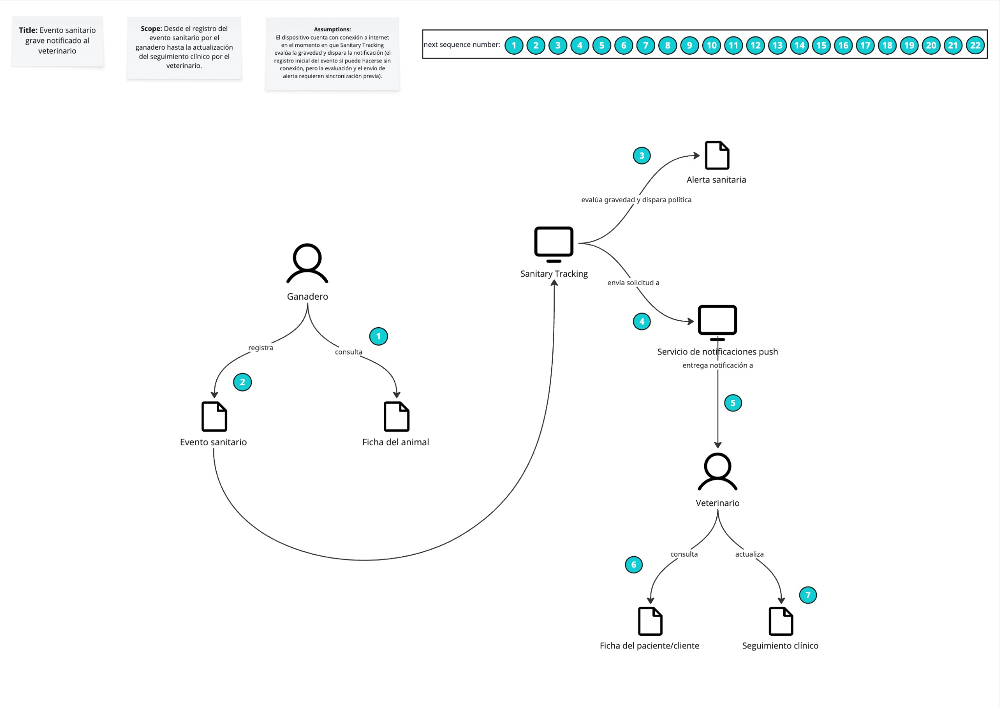

**Domain Story 2 - "El sistema analiza tendencias combinando Sanidad y Finanzas, y el ganadero recibe una alerta"**

| # | Actor/Sistema | Acción | Objeto de trabajo | Bounded Context |
|---|---|---|---|---|
| 1 | Sanitary Tracking | expone | Historial clínico actualizado | Sanitary Tracking |
| 2 | Financial Management | expone | Reporte financiero generado | Financial Management |
| 3 | Administrador del sistema | analiza | Tendencia del ganado | Analytics & Alerts |
| 4 | Analytics & Alerts | evalúa riesgo y dispara política | Notificación push | Analytics & Alerts |
| 5 | Analytics & Alerts | envía solicitud a | Servicio de notificaciones push | Sistema externo |
| 6 | Servicio de notificaciones push | entrega notificación a | Ganadero | Sistema externo |

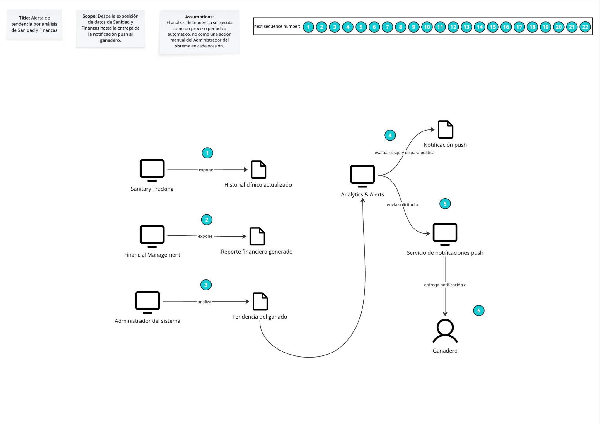

**Nota:** Identity & Access no se representa explícitamente en ninguna de las dos historias porque su participación es transversal —autenticación previa a cualquier acción— y no constituye en sí misma un paso de colaboración de negocio entre contextos.

Link del tablero en Miro: [https://miro.com/app/board/uXjVHoEjNcw=/?share_link_id=344537401259](https://miro.com/app/board/uXjVHoEjNcw=/?share_link_id=344537401259)

#### 2.5.1.3. Bounded Context Canvases.

Siguiendo el orden de importancia obtenido en el Candidate Context Discovery, el equipo elaboró el Bounded Context Canvas de los tres contextos considerados más críticos para el negocio: **Sanitary Tracking**, **Livestock Management** y **Analytics & Alerts**. Cada canvas se construyó de forma iterativa, cubriendo los pasos de Context Overview Definition, Business Rules Distillation & Ubiquitous Language Capture, Capability Analysis, Capability Layering, Dependencies Capture y Design Critique.

### Bounded Context Canvas - Sanitary Tracking

**1. Context Overview Definition**

| Campo | Detalle |
|---|---|
| Nombre | Sanitary Tracking |
| Propósito | Registrar y dar seguimiento a los eventos sanitarios del animal (vacunas, tratamientos, enfermedades), incluso sin conexión en campo, y disparar recordatorios y alertas automáticas. |
| Rol estratégico | Core Domain (mayor valor directo del negocio: reduce pérdidas por enfermedades no atendidas a tiempo). |

**2. Business Rules Distillation & Ubiquitous Language Capture**

- Un EventoSanitario siempre pertenece a un único Animal.
- Un EventoSanitario registrado sin conexión debe sincronizarse automáticamente al recuperar conectividad.
- Cuando un EventoSanitario está próximo a vencer (vacuna), se genera un RecordatorioDeVacunación.
- Cuando un EventoSanitario indica gravedad alta, se genera una AlertaSanitaria enviada por el Servicio de Notificaciones Push.
- Términos del lenguaje ubicuo: EventoSanitario, Vacuna, Tratamiento, HistorialClínico, RecordatorioDeVacunación, AlertaSanitaria.

**3. Capability Analysis**

- Programar visita médica.
- Registrar evento sanitario (con o sin conexión).
- Generar recordatorio de vacunación y alerta sanitaria.
- Registrar atención veterinaria y actualizar historial clínico.

**4. Capability Layering**

- Core (diferenciador): registro y sincronización de eventos sanitarios sin conexión.
- Supporting: generación de recordatorios y alertas automáticas.

**5. Dependencies Capture**

| Dependencia | Tipo | Contexto/Sistema |
|---|---|---|
| Entrante | Consulta | Livestock Management (datos del animal) |
| Saliente | Solicita envío de alerta | Servicio de Notificaciones Push (externo) |
| Saliente | Expone | Analytics & Alerts (historial clínico actualizado) |
| Relacionada | Comparte agregado HistorialClínico | Veterinary Care |

**6. Design Critique**

- Fortaleza: el límite de consistencia local (registro offline) resuelve directamente la restricción de conectividad rural identificada en las entrevistas.
- Riesgo: tanto Sanitary Tracking como Veterinary Care leen/actualizan el historial clínico. El equipo decide que Sanitary Tracking es el dueño (owner) del agregado, y que Veterinary Care solo lo modifica a través de un comando expuesto por Sanitary Tracking (relación Customer/Supplier, ver 2.5.2), evitando inconsistencias por doble escritura.

### Bounded Context Canvas - Livestock Management

**1. Context Overview Definition**

| Campo | Detalle |
|---|---|
| Nombre | Livestock Management |
| Propósito | Mantener el registro maestro de animales y habilitar su identificación rápida en campo mediante código QR (feature de aprendizaje autónomo). |
| Rol estratégico | Core Domain (fuente de verdad; contexto raíz del que dependen los demás). |

**2. Business Rules Distillation & Ubiquitous Language Capture**

- Un Animal se identifica de forma única mediante su CódigoQR, generado automáticamente al registrarlo.
- Un Animal no puede eliminarse si tiene eventos sanitarios asociados; sólo puede marcarse como vendido o dado de baja.
- Términos del lenguaje ubicuo: Animal, CódigoQR, FichaDelAnimal.

**3. Capability Analysis**

- Registrar animal (genera código QR automáticamente).
- Escanear código QR para identificar animal.
- Editar ficha del animal.
- Buscar/filtrar animales.
- Vender/dar de baja animal.

**4. Capability Layering**

- Core (diferenciador/aprendizaje autónomo): generación y escaneo del código QR de identificación.
- Generic: búsqueda y filtro estándar de registros.

**5. Dependencies Capture**

| Dependencia | Tipo | Contexto/Sistema |
|---|---|---|
| Saliente | Expone | Sanitary Tracking, Veterinary Care (datos del animal) |
| Entrante | Ninguna | Contexto raíz |

**6. Design Critique**

- Fortaleza: al ser contexto raíz, sus cambios son poco frecuentes una vez estabilizado el modelo.
- Riesgo: depende de la biblioteca externa mobile_scanner para el escaneo QR; si se cambia de proveedor, esa dependencia debe quedar aislada en la capa de infraestructura, sin afectar el agregado Animal.

### Bounded Context Canvas - Veterinary Care

**1. Context Overview Definition**

| Campo | Detalle |
|---|---|
| Nombre | Veterinary Care |
| Propósito | Gestionar la asignación de veterinarios a clientes (ganaderos) y el registro de la atención profesional a los pacientes (animales), incluyendo el seguimiento clínico apoyado por sensores/dispositivos IoT. |
| Rol estratégico | Core Domain (la relación profesional veterinario-cliente-paciente es un diferenciador frente a soluciones que no ofrecen seguimiento veterinario integrado). |

**2. Business Rules Distillation & Ubiquitous Language Capture**

- Un Veterinario puede estar asignado a varios Clientes (ganaderos).
- Un Cliente consultado por veterinario debe tener al menos un Paciente (animal) asociado.
- Cuando un sensor/dispositivo IoT reporta una anomalía, se debe actualizar automáticamente el seguimiento clínico.
- Términos del lenguaje ubicuo: AsignaciónVeterinaria, Cliente, Paciente, SeguimientoClínico.

**3. Capability Analysis**

- Asignar veterinario a cliente.
- Consultar cliente asignado.
- Consultar paciente.
- Actualizar seguimiento clínico (manual o automático por IoT).

**4. Capability Layering**

- Core: la relación profesional veterinario-cliente-paciente y su seguimiento clínico especializado.
- Generic: la recepción de datos del sensor IoT (delegada a infraestructura).

**5. Dependencies Capture**

| Dependencia | Tipo | Contexto/Sistema |
|---|---|---|
| Entrante | Consulta | Livestock Management (datos del animal/paciente) |
| Entrante | Recibe dato de sensor | Sensor/Dispositivo IoT (externo) |
| Relacionada | Actualiza agregado HistorialClínico vía comando expuesto | Sanitary Tracking (owner) |

**6. Design Critique**

- Fortaleza: separar la vista veterinario-céntrica de la vista ganadero-céntrica (Sanitary Tracking) permite que cada una evolucione según las necesidades de su actor principal.
- Riesgo: la integración con el sensor IoT depende de un dispositivo físico externo cuya disponibilidad/conectividad no está garantizada; se debe definir tolerancia a fallos si el sensor no reporta.

### Bounded Context Canvas - Financial Management

**1. Context Overview Definition**

| Campo | Detalle |
|---|---|
| Nombre | Financial Management |
| Propósito | Registrar los ingresos y egresos de la operación ganadera y gestionar la confirmación de pagos de suscripción a la plataforma. |
| Rol estratégico | Supporting Domain (necesario para la sostenibilidad del negocio, pero no es el diferenciador principal frente a la competencia). |

**2. Business Rules Distillation & Ubiquitous Language Capture**

- Un Ingreso o Egreso siempre pertenece a la operación del Ganadero.
- Un PagoDeSuscripción debe confirmarse a través de la Pasarela de Pagos antes de habilitar funcionalidades premium.
- Un ReporteFinanciero se genera a partir del historial de ingresos y egresos.
- Términos del lenguaje ubicuo: Ingreso, Egreso, PagoDeSuscripción, ReporteFinanciero.

**3. Capability Analysis**

- Registrar ingreso.
- Registrar egreso.
- Confirmar pago de suscripción.
- Generar reporte financiero.

**4. Capability Layering**

- Core: el cálculo y consolidación del reporte financiero (valor para la toma de decisiones del ganadero).
- Generic: el procesamiento del pago en sí (delegado a la pasarela externa).

**5. Dependencies Capture**

| Dependencia | Tipo | Contexto/Sistema |
|---|---|---|
| Saliente | Solicita confirmación de pago | Pasarela de Pagos (externo) |
| Saliente | Expone | Analytics & Alerts (reporte financiero generado) |

**6. Design Critique**

- Fortaleza: aislar la lógica financiera del resto del dominio ganadero facilita cumplir a futuro con regulaciones contables sin afectar otros contextos.
- Riesgo: depender de una pasarela de pagos externa introduce latencia/fallos fuera del control del equipo; se debe definir qué ocurre si la confirmación de pago no llega (reintentos, estado pendiente).

### Bounded Context Canvas - Analytics & Alerts

**1. Context Overview Definition**

| Campo | Detalle |
|---|---|
| Nombre | Analytics & Alerts |
| Propósito | Consolidar información de Sanidad y Finanzas para detectar tendencias relevantes del ganado y alertar oportunamente al ganadero. |
| Rol estratégico | Supporting Domain (agrega valor analítico transversal sobre otros contextos). |

**2. Business Rules Distillation & Ubiquitous Language Capture**

- Una TendenciaDelGanado se calcula a partir de HistorialClínicoActualizado (Sanitary Tracking) y ReporteFinancieroGenerado (Financial Management).
- Cuando la tendencia indica riesgo, se dispara automáticamente una NotificaciónPush.
- Términos del lenguaje ubicuo: TendenciaDelGanado, NotificaciónPush.

**3. Capability Analysis**

- Analizar tendencia del ganado (proceso periódico).
- Generar y enviar notificación push ante riesgo detectado.

**4. Capability Layering**

- Core: la regla/algoritmo de detección de tendencias de riesgo (valor diferencial del negocio).
- Generic: el envío de la notificación en sí (delegado al servicio externo).

**5. Dependencies Capture**

| Dependencia | Tipo | Contexto/Sistema |
|---|---|---|
| Entrante | Consume | Sanitary Tracking (historial clínico actualizado) |
| Entrante | Consume | Financial Management (reporte financiero generado) |
| Saliente | Solicita envío de notificación | Servicio de Notificaciones Push (externo) |

**6. Design Critique**

- Fortaleza: aislar el análisis en su propio contexto evita que Sanitary Tracking o Financial Management se sobrecarguen con lógica ajena a su propósito principal.
- Riesgo: al ser un proceso periódico/automático (no disparado por un actor humano), debe definirse claramente su disparador (tarea programada) en la capa de infraestructura del nivel táctico.

### Bounded Context Canvas - Identity & Access

**1. Context Overview Definition**

| Campo | Detalle |
|---|---|
| Nombre | Identity & Access |
| Propósito | Gestionar la autenticación y autorización de los cuatro roles de usuario de la plataforma: Ganadero, Veterinario, Técnico Agropecuario y Administrador del Sistema. |
| Rol estratégico | Generic Subdomain (necesario para todos los contextos, pero no aporta ventaja competitiva directa). |

**2. Business Rules Distillation & Ubiquitous Language Capture**

- Un Usuario tiene un único Rol activo a la vez.
- Solo el Administrador del Sistema puede asignar el rol de Veterinario o Técnico Agropecuario a un Usuario.
- Una Sesión expira tras un periodo de inactividad definido.
- Términos del lenguaje ubicuo: Usuario, Rol, Sesión.

**3. Capability Analysis**

- Registrar/autenticar usuario.
- Asignar rol.
- Gestionar sesión (incluye expiración y cierre).

**4. Capability Layering**

- Generic/Supporting en su totalidad: no forma parte de la propuesta de valor ganadera, pero es indispensable para todos los demás contextos.

**5. Dependencies Capture**

| Dependencia | Tipo | Contexto/Sistema |
|---|---|---|
| Saliente | Provee modelo Usuario/Rol como Shared Kernel | Todos los demás contextos (ver 2.5.2) |

**6. Design Critique**

- Fortaleza: mantenerlo como shared kernel evita duplicar lógica de autenticación en cada contexto.
- Riesgo: cualquier cambio en el modelo de Usuario/Rol impacta a todo el sistema y requiere coordinación entre todos los desarrolladores del equipo antes de desplegarlo.

### 2.5.2. Context Mapping.

A partir de los seis candidate bounded contexts y sus respectivos canvases, el equipo elaboró el Context Map de Gethics Mobile.

**Relaciones identificadas:**

| Upstream | Downstream | Patrón DDD | Justificación |
|---|---|---|---|
| Identity & Access | Livestock Management, Sanitary Tracking, Veterinary Care, Financial Management, Analytics & Alerts | Shared Kernel | El modelo de Usuario/Rol es compartido y estable; el equipo acepta coordinar cambios entre todos dado su tamaño reducido. |
| Livestock Management | Sanitary Tracking | Customer/Supplier | Sanitary Tracking depende de los datos de Animal, pero Livestock Management planifica sus cambios considerando a Sanitary Tracking como cliente prioritario. |
| Livestock Management | Veterinary Care | Customer/Supplier | Veterinary Care consulta la ficha del paciente (animal); misma relación de prioridad de cliente. |
| Sanitary Tracking | Veterinary Care | Customer/Supplier | Sanitary Tracking es dueño (owner) del agregado HistorialClínico; Veterinary Care lo actualiza únicamente a través de un comando expuesto por Sanitary Tracking, nunca por escritura directa. |
| Sanitary Tracking | Analytics & Alerts | Customer/Supplier | Analytics & Alerts consume el historial clínico actualizado como insumo de su análisis de tendencia. |
| Financial Management | Analytics & Alerts | Customer/Supplier | Analytics & Alerts consume el reporte financiero generado como segundo insumo de su análisis. |
| Pasarela de Pagos (terceros) | Financial Management | Anticorruption Layer (ACL) | Se traduce el modelo de datos propietario de la pasarela (identificadores de transacción, estados de pago) al lenguaje ubicuo propio (PagoDeSuscripción), evitando que un cambio de proveedor de pagos impacte el dominio financiero. |
| Sensor/Dispositivo IoT (terceros) | Veterinary Care | Anticorruption Layer (ACL) | Se traduce la lectura cruda del sensor (formato propio del fabricante) al concepto de dominio SeguimientoClínico, evitando acoplar el contexto a un protocolo de hardware específico. |
| Servicio de Notificaciones Push (terceros) | Sanitary Tracking, Analytics & Alerts | Conformist | Ambos contextos se ajustan directamente al formato de mensaje que exige el servicio de notificaciones (título, cuerpo, token del dispositivo), sin necesidad de una capa de traducción adicional dado lo simple del contrato. |

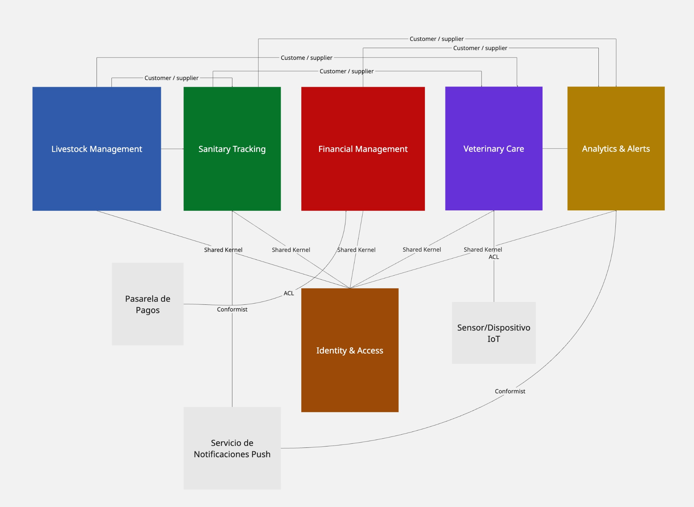

Link del tablero en Miro: [https://miro.com/app/board/uXjVHnjkDzI=/?share_link_id=677793613271](https://miro.com/app/board/uXjVHnjkDzI=/?share_link_id=677793613271)

### 2.5.3. Software Architecture.

Se presentan a continuación tres niveles del C4 Model: el Software Architecture Context Level Diagram, que muestra a Gethics Mobile como un único sistema rodeado de sus actores y de los sistemas externos con los que se integra (Pasarela de Pagos, Sensor/Dispositivo IoT y Servicio de Notificaciones Push); el Software Architecture Container Level Diagram, que descompone el sistema en sus unidades desplegables de alto nivel (aplicación móvil, landing page, API RESTful y bases de datos); y el Software Architecture Deployment Diagram, que describe cómo estos contenedores se despliegan sobre la infraestructura física real.

#### 2.5.3.1. Software Architecture Context Level Diagrams.

El Context Diagram muestra a Gethics Mobile como un único sistema en el centro, rodeado de sus cuatro actores Ganadero, Veterinario, Técnico Agropecuario y Administrador del Sistema y de los tres sistemas externos con los que se integra: la Pasarela de Pagos (confirmación de pagos de suscripción), el Sensor/Dispositivo IoT (monitoreo del seguimiento clínico) y el Servicio de Notificaciones Push (entrega de alertas sanitarias y de tendencia). Este nivel permite comunicar, sin detalle técnico, quién usa el sistema y de qué depende para funcionar.

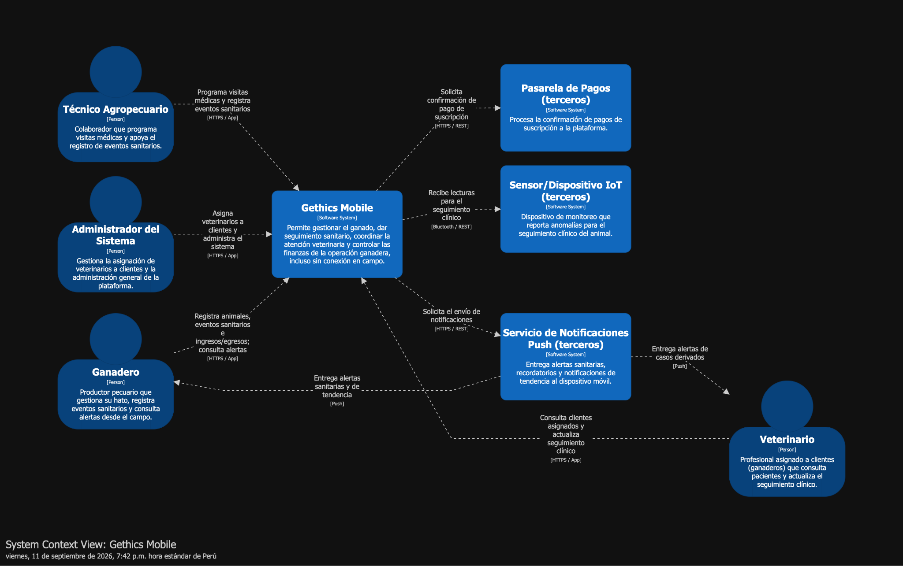

#### 2.5.3.2. Software Architecture Container Level Diagrams.

El Container Diagram descompone Gethics Mobile en sus unidades desplegables de alto nivel: la aplicación móvil multiplataforma desarrollada en Flutter (con su base de datos local para el registro sin conexión), la landing page estática, la API RESTful desarrollada en ASP.NET Core y la base de datos del backend. Aquí se evidencian también las principales decisiones de tecnología y cómo se comunican los contenedores entre sí.

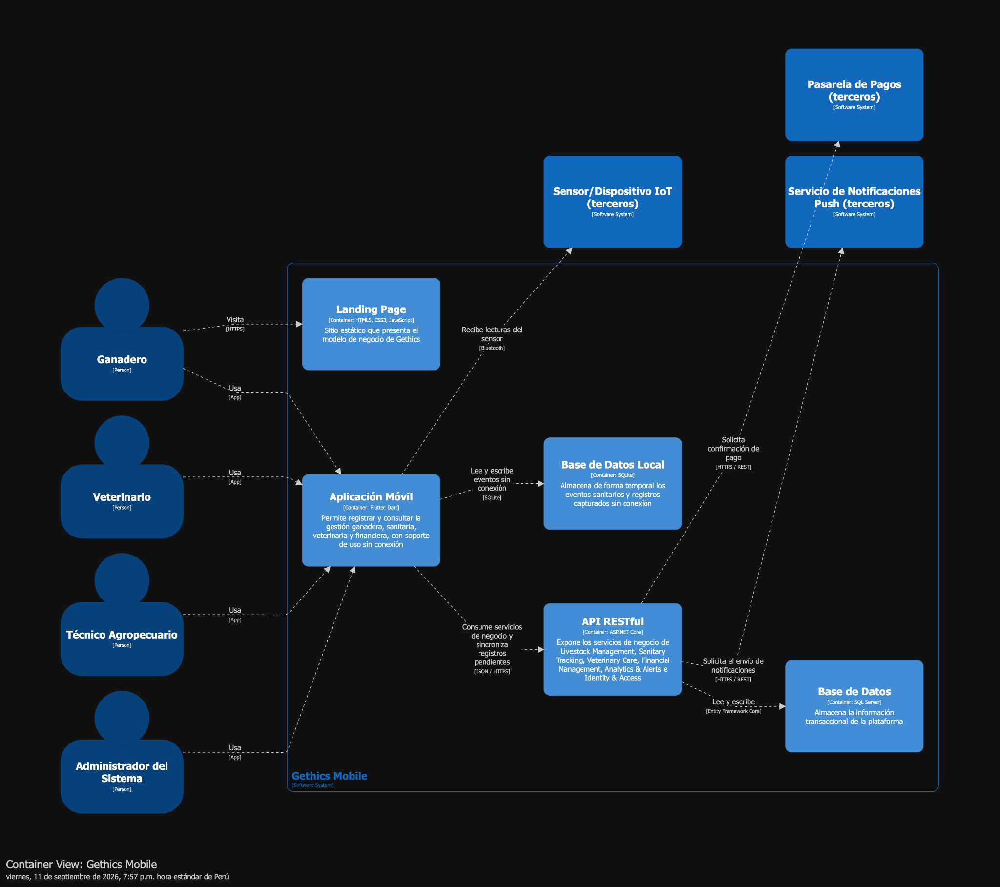

#### 2.5.3.3. Software Architecture Deployment Diagrams.

El Deployment Diagram muestra la distribución física de Gethics Mobile sobre la infraestructura de hardware real: el dispositivo móvil del usuario final (con su base de datos local embebida y el sensor/dispositivo IoT conectado vía Bluetooth), el proveedor cloud que hospeda la API y la base de datos gestionada, el servicio de hosting estático para la landing page, y los servicios de terceros (Pasarela de Pagos y Firebase para notificaciones push). Su objetivo es describir cómo se implementa el sistema en la infraestructura real, más allá de sus contenedores lógicos ya presentados en 2.5.3.2.

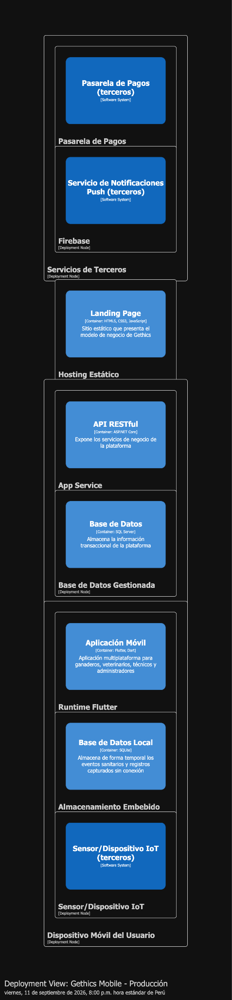

---

## 2.6. Tactical-Level Domain-Driven Design

En esta sección se presenta la perspectiva táctica de Domain-Driven Design aplicada a Gethics. A partir de los bounded contexts identificados durante el diseño estratégico, se define la estructura interna de cada uno de ellos, considerando sus responsabilidades, elementos de dominio y las capas que conforman la solución.

Cada bounded context mantiene sus propias reglas de negocio y responsabilidades, permitiendo separar las diferentes capacidades de Gethics y reducir el acoplamiento entre los módulos de la aplicación.

Para el diseño táctico de Gethics se consideran los siguientes bounded contexts:

| N.° | Bounded Context | Responsabilidad principal |
|---|---|---|
| 1 | Livestock Management | Gestionar las fincas y el registro individual de los animales del ganado. |
| 2 | Animal Health Management | Gestionar historiales médicos, visitas veterinarias, vacunas, tratamientos y eventos sanitarios. |
| 3 | Financial Management | Gestionar los ingresos y egresos relacionados con la actividad ganadera. |
| 4 | Monitoring and Analytics | Gestionar dispositivos IoT, mediciones, reportes, estadísticas y alertas. |
| 5 | Identity and Access Management | Gestionar usuarios, roles y relaciones entre ganaderos y veterinarios. |
| 6 | Subscription Management | Gestionar los planes y suscripciones disponibles para los usuarios de Gethics. |

A continuación, se desarrolla la perspectiva táctica correspondiente a cada bounded context.

### 2.6.1. Bounded Context: Livestock Management

El bounded context **Livestock Management** se encarga de gestionar la información principal relacionada con las fincas y los animales registrados en Gethics. Su objetivo es permitir que los ganaderos mantengan organizada la información de su ganado desde la aplicación móvil, reemplazando progresivamente el uso de registros manuales.

Dentro de este bounded context se consideran funcionalidades como el registro de fincas, registro individual de animales, consulta de información, búsqueda, filtrado, actualización de datos y control del estado de cada animal.

Livestock Management se mantiene separado de otros bounded contexts como **Animal Health Management**, debido a que su responsabilidad se concentra en la identificación y administración general del ganado, mientras que los historiales médicos, tratamientos, vacunas y demás información sanitaria son gestionados por el dominio de salud animal.

#### Diccionario de clases

Las principales clases identificadas para el bounded context Livestock Management son las siguientes:

| Clase | Tipo | Propósito | Atributos principales | Métodos principales | Relaciones |
|---|---|---|---|---|---|
| `Farm` | Aggregate Root / Entity | Representa una finca registrada dentro de Gethics y permite organizar los animales pertenecientes a un ganadero. | `id`, `ownerId`, `name`, `location`, `status` | `updateInformation()`, `activate()`, `deactivate()` | Una finca puede estar relacionada con múltiples animales. |
| `Animal` | Aggregate Root / Entity | Representa a cada animal registrado dentro de una finca. | `id`, `farmId`, `tag`, `name`, `breed`, `birthDate`, `sex`, `status` | `updateInformation()`, `changeStatus()`, `remove()` | Cada animal pertenece a una finca. |
| `AnimalTag` | Value Object | Representa el código o identificador utilizado para reconocer a un animal dentro de una finca. | `value` | `validate()` | Es utilizado por `Animal`. |
| `Breed` | Value Object | Representa la raza registrada para un animal. | `name` | `validate()` | Es utilizado por `Animal`. |
| `AnimalSex` | Enumeration | Define los posibles valores para el sexo de un animal. | `MALE`, `FEMALE` | No aplica | Es utilizado por `Animal`. |
| `AnimalStatus` | Enumeration | Define el estado actual del registro de un animal. | `ACTIVE`, `SOLD`, `DECEASED`, `INACTIVE` | No aplica | Es utilizado por `Animal`. |
| `FarmRepository` | Repository Interface | Define las operaciones necesarias para almacenar y recuperar fincas. | No aplica | `save()`, `findById()`, `findByOwnerId()` | Trabaja con `Farm`. |
| `AnimalRepository` | Repository Interface | Define las operaciones necesarias para almacenar y recuperar animales. | No aplica | `save()`, `findById()`, `findByFarmId()`, `existsByTag()` | Trabaja con `Animal`. |
| `AnimalRegistrationService` | Domain Service | Aplica las reglas necesarias antes de registrar un animal dentro de una finca. | No aplica | `validateRegistration()` | Utiliza información de `Animal`, `Farm` y `AnimalRepository`. |

---

#### 2.6.1.1. Domain Layer

El **Domain Layer** contiene las clases que representan el núcleo de negocio de Livestock Management. En esta capa se encuentran las entidades, Aggregate Roots, Value Objects, enumeraciones, Domain Services y las interfaces de Repository necesarias para manejar las reglas relacionadas con las fincas y los animales.

`Farm` representa una finca perteneciente a un ganadero y funciona como un Aggregate Root independiente. Mantiene información como el nombre, ubicación, propietario y estado de la finca.

`Animal` representa a un animal registrado dentro de Gethics y también funciona como Aggregate Root. Cada animal posee una identidad propia y mantiene información general como su identificador, raza, fecha de nacimiento, sexo y estado.

Los conceptos `AnimalTag` y `Breed` son representados como Value Objects debido a que no poseen una identidad propia y su importancia está determinada por el valor que contienen.

Las enumeraciones `AnimalSex` y `AnimalStatus` permiten restringir los posibles estados de estos atributos y mantener consistencia dentro del modelo.

`AnimalRegistrationService` contiene las reglas de dominio necesarias para validar el registro de un animal. Por ejemplo, puede verificar que un animal tenga información válida y que no exista otro registro con el mismo identificador dentro de una finca.

Finalmente, `FarmRepository` y `AnimalRepository` son interfaces que definen las operaciones de persistencia requeridas por el dominio sin establecer todavía qué tecnología de almacenamiento será utilizada.

---

#### 2.6.1.2. Interface Layer

El **Interface Layer** contiene los componentes responsables de recibir las solicitudes realizadas desde las aplicaciones móviles y comunicar dichas solicitudes con los casos de uso definidos en el Application Layer.

Para Livestock Management se consideran principalmente los siguientes Controllers:

| Clase | Tipo | Propósito | Operaciones principales |
|---|---|---|---|
| `FarmController` | Controller | Recibe las solicitudes relacionadas con la gestión de las fincas del usuario. | `createFarm()`, `getFarm()`, `getFarms()`, `updateFarm()` |
| `AnimalController` | Controller | Recibe las solicitudes relacionadas con el registro y gestión de animales. | `createAnimal()`, `getAnimal()`, `getAnimals()`, `updateAnimal()`, `deleteAnimal()` |

`FarmController` permite exponer las operaciones requeridas para registrar, consultar y actualizar las fincas asociadas a un ganadero.

`AnimalController` permite registrar nuevos animales, consultar la información de un animal, recuperar el listado correspondiente a una finca, actualizar sus datos y eliminar o desactivar registros.

Los Controllers no contienen directamente las reglas de negocio. Su responsabilidad consiste en recibir la información enviada por el cliente, enviarla al caso de uso correspondiente y retornar el resultado obtenido.

---

#### 2.6.1.3. Application Layer

El **Application Layer** coordina los casos de uso disponibles dentro de Livestock Management. Esta capa conecta las solicitudes recibidas desde Interface Layer con las reglas existentes en Domain Layer.

Para mantener separadas las operaciones que modifican información de aquellas que solamente realizan consultas, se consideran Commands y Queries.

| Clase | Tipo | Propósito |
|---|---|---|
| `CreateFarmCommandHandler` | Command Handler | Coordina el registro de una nueva finca. |
| `UpdateFarmCommandHandler` | Command Handler | Coordina la actualización de los datos de una finca. |
| `CreateAnimalCommandHandler` | Command Handler | Coordina el registro de un nuevo animal. |
| `UpdateAnimalCommandHandler` | Command Handler | Coordina la modificación de la información de un animal. |
| `DeleteAnimalCommandHandler` | Command Handler | Coordina la eliminación o desactivación de un animal. |
| `GetFarmByIdQueryHandler` | Query Handler | Obtiene la información correspondiente a una finca. |
| `GetFarmsByOwnerQueryHandler` | Query Handler | Obtiene las fincas pertenecientes a un ganadero. |
| `GetAnimalByIdQueryHandler` | Query Handler | Obtiene la información de un animal específico. |
| `GetAnimalsByFarmQueryHandler` | Query Handler | Obtiene los animales registrados dentro de una finca. |
| `AnimalRegisteredEventHandler` | Event Handler | Gestiona las acciones posteriores al registro exitoso de un animal. |

Por ejemplo, cuando el usuario registra un nuevo animal desde la aplicación móvil, la solicitud es recibida por `AnimalController`, el cual invoca a `CreateAnimalCommandHandler`. El handler utiliza las reglas definidas en el Domain Layer y posteriormente solicita al `AnimalRepository` almacenar la información.

De esta manera, las reglas del dominio permanecen separadas de los procesos de coordinación de la aplicación.

---

#### 2.6.1.4. Infrastructure Layer

El **Infrastructure Layer** contiene las implementaciones encargadas de acceder a recursos técnicos y servicios externos necesarios para Livestock Management.

Aquí se ubican las implementaciones concretas de las interfaces Repository definidas en Domain Layer, así como los mecanismos utilizados para comunicarse con la base de datos o almacenamiento correspondiente.

| Clase | Tipo | Propósito |
|---|---|---|
| `FarmRepositoryImpl` | Repository Implementation | Implementa las operaciones definidas por `FarmRepository` para almacenar y recuperar fincas. |
| `AnimalRepositoryImpl` | Repository Implementation | Implementa las operaciones definidas por `AnimalRepository` para almacenar y recuperar animales. |
| `LivestockDataSource` | Data Source | Gestiona la comunicación con la fuente de datos utilizada por Livestock Management. |
| `LocalLivestockDataSource` | Local Data Source | Permite almacenar localmente en el dispositivo la información necesaria para determinadas funcionalidades móviles. |
| `LivestockApiClient` | API Client | Permite que la aplicación móvil se comunique con los servicios REST relacionados con la gestión del ganado. |

`FarmRepositoryImpl` y `AnimalRepositoryImpl` implementan las interfaces definidas en el dominio, permitiendo que este último permanezca independiente de la tecnología utilizada para persistir la información.

Asimismo, `LocalLivestockDataSource` permite contemplar el almacenamiento local requerido por la aplicación móvil, mientras que `LivestockApiClient` gestiona la comunicación con los servicios REST de Gethics.

---

### 2.6.1.5. Bounded Context Software Architecture Component Level Diagrams

En esta sección se presenta el Component Diagram correspondiente al bounded context **Livestock Management**, siguiendo el enfoque del modelo C4 y la arquitectura basada en Domain-Driven Design.

El objetivo del diagrama es representar la estructura interna del bounded context, mostrando los principales componentes que participan en la gestión del ganado, sus responsabilidades y la comunicación existente entre las diferentes capas definidas previamente: Interface Layer, Application Layer, Domain Layer e Infrastructure Layer.

Dentro de **Livestock Management**, la aplicación móvil permite a los usuarios gestionar la información principal de los animales registrados en una finca, incluyendo operaciones como el registro, actualización, consulta e identificación mediante códigos QR.

El flujo principal inicia cuando el usuario interactúa con la aplicación móvil. Las solicitudes realizadas son recibidas por los componentes pertenecientes a la capa de interfaz, los cuales delegan la ejecución hacia los servicios correspondientes de la capa de aplicación. Posteriormente, esta capa coordina los casos de uso utilizando las reglas definidas en el dominio, donde se encuentran los agregados principales como **Animal** y **Farm**. Finalmente, la capa de infraestructura proporciona los mecanismos necesarios para la persistencia y comunicación con servicios externos.

**Livestock Management Software Architecture Component Level Diagram**

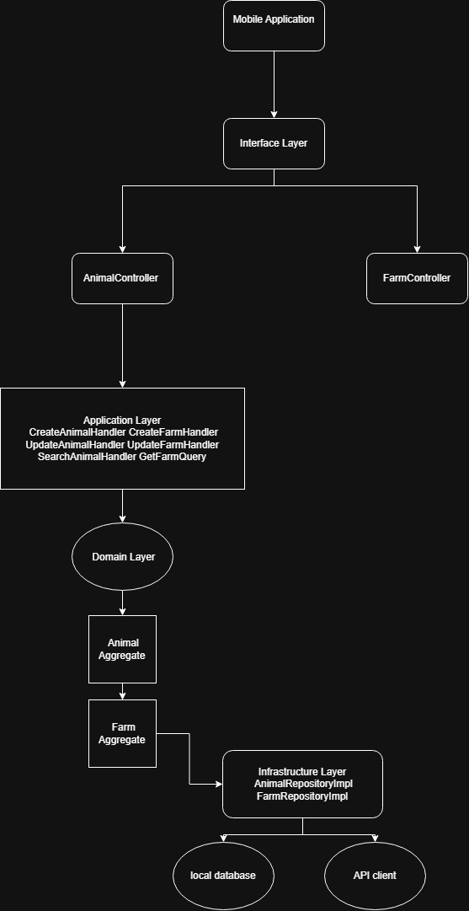


El diagrama representa los siguientes componentes principales:

| Componente | Responsabilidad |
|---|---|
| Animal Controller | Recibe las solicitudes relacionadas con la gestión de animales desde la aplicación móvil. |
| Farm Controller | Gestiona las operaciones relacionadas con la administración de fincas. |
| Animal Application Services | Coordina los casos de uso relacionados con el registro, actualización y consulta de animales. |
| Farm Application Services | Coordina las operaciones relacionadas con la gestión de fincas. |
| Animal Aggregate | Representa la entidad principal del dominio y contiene las reglas relacionadas con el ciclo de vida del animal. |
| Farm Aggregate | Representa la unidad productiva donde se organizan los animales registrados. |
| Animal Repository Interface | Define las operaciones necesarias para almacenar y recuperar información relacionada con animales. |
| Farm Repository Interface | Define las operaciones necesarias para almacenar y recuperar información relacionada con fincas. |
| Animal Repository Implementation | Implementa el acceso a los datos correspondientes al agregado Animal. |
| Farm Repository Implementation | Implementa el acceso a los datos correspondientes al agregado Farm. |
| Local Data Source | Permite almacenar información localmente para soportar escenarios con conectividad limitada. |
| API Client | Permite la comunicación con servicios externos mediante solicitudes REST. |


El flujo principal de comunicación dentro del bounded context sigue los siguientes pasos:

1. El usuario interactúa con la aplicación móvil para registrar, actualizar o consultar información relacionada con un animal o una finca.
2. La solicitud es recibida por los componentes de la Interface Layer, como los controladores correspondientes.
3. La capa de aplicación procesa la solicitud mediante los casos de uso definidos utilizando Commands y Queries.
4. La capa de dominio valida las reglas de negocio asociadas a los agregados principales del contexto.
5. Los repositorios definidos en el dominio son implementados por la capa de infraestructura para acceder a los mecanismos de persistencia.
6. La información procesada es retornada nuevamente hacia la aplicación móvil.

---

### 2.6.1.6. Bounded Context Software Architecture Code Level Diagrams

En esta sección se presentan los diagramas correspondientes al nivel de código del bounded context **Livestock Management**, siguiendo la propuesta de diseño basada en Domain-Driven Design.

Estos diagramas permiten representar la estructura interna del contexto a nivel de implementación, mostrando las principales clases, relaciones y componentes que forman parte de la capa de dominio.

El diseño mantiene la separación de responsabilidades definida previamente, donde la lógica de negocio permanece encapsulada dentro del dominio, mientras que las capas externas se encargan de la comunicación con interfaces de usuario, aplicación e infraestructura.

---

### 2.6.1.6.1. Bounded Context Domain Layer Class Diagrams

En esta sección se presenta el diagrama de clases UML correspondiente a la capa de dominio del bounded context **Livestock Management**.

El diagrama representa las principales entidades, objetos de valor y contratos definidos dentro del dominio para gestionar la información relacionada con animales y fincas.

La entidad **Animal** representa el agregado principal del contexto, debido a que concentra la información necesaria para identificar y administrar cada animal registrado dentro del sistema. Asimismo, la entidad **Farm** representa la finca donde se organizan los animales pertenecientes al usuario.

Además, se incluyen los objetos de valor utilizados para representar identificadores únicos y códigos QR, así como las interfaces de repositorio encargadas de definir las operaciones necesarias para acceder a la información del dominio sin depender de una implementación tecnológica específica.

**Livestock Management Domain Layer Class Diagram**

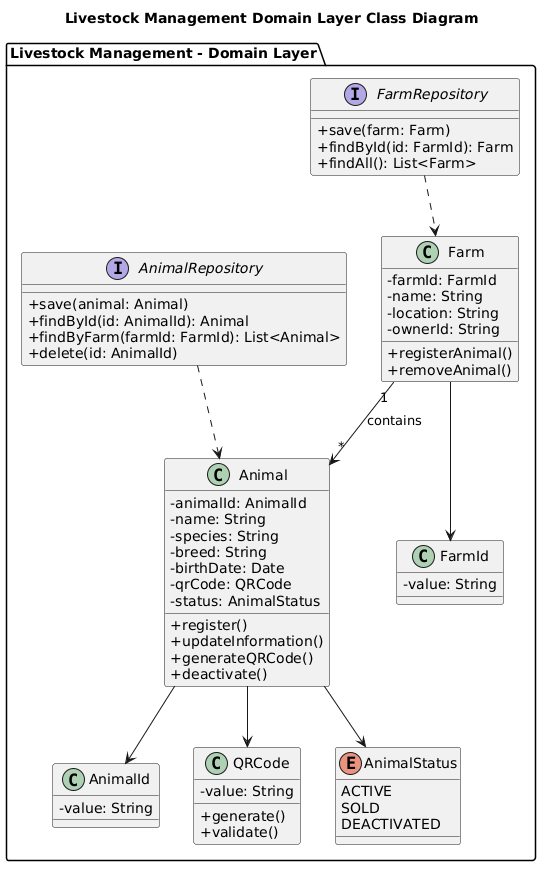

El diseño del dominio permite mantener las reglas de negocio independientes de los mecanismos de persistencia, facilitando la evolución del sistema y manteniendo los principios establecidos por Domain-Driven Design.

Las principales relaciones representadas en el diagrama son:

- **Farm** mantiene una relación de composición con múltiples objetos **Animal**, debido a que una finca puede contener varios animales registrados.
- **Animal** utiliza objetos de valor como **AnimalId** y **QRCode** para garantizar una identificación única dentro del sistema.
- **AnimalRepository** y **FarmRepository** definen los contratos necesarios para almacenar y recuperar información de las entidades principales.
- La separación entre entidades, objetos de valor y repositorios permite mantener una arquitectura desacoplada y preparada para cambios futuros.


Esta separación permite mantener la lógica de negocio independiente de los mecanismos tecnológicos utilizados para almacenar información o comunicarse con servicios externos, siguiendo los principios establecidos por Domain-Driven Design y facilitando la evolución futura del sistema.

---

##### 2.6.1.6.2. Bounded Context Database Design Diagram

En esta sección se presenta el diseño de base de datos correspondiente al bounded context **Livestock Management**.

El modelo de persistencia representa la información necesaria para gestionar las fincas y los animales registrados dentro de Gethics. Este diseño mantiene la separación de responsabilidades definida en el modelo de dominio, permitiendo almacenar únicamente la información perteneciente a este bounded context.

La estructura principal está conformada por las entidades **Farm** y **Animal**, donde una finca puede contener múltiples animales registrados, mientras que cada animal pertenece únicamente a una finca determinada.

Asimismo, se considera la identificación mediante código QR como parte de la información principal del animal, debido a que esta característica permite facilitar la identificación rápida del ganado, una de las responsabilidades principales definidas para este bounded context.

**Livestock Management Database Design Diagram**

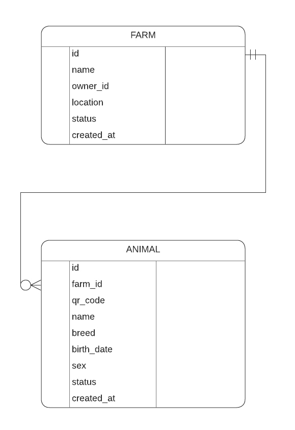


El diseño propuesto contiene las siguientes entidades:

| Entidad | Descripción |
|---|---|
| Farm | Representa la información principal de una finca registrada dentro de Gethics. |
| Animal | Representa cada animal perteneciente a una finca y contiene la información necesaria para su identificación y gestión. |


### Entidad Farm

| Campo | Tipo | Restricción | Descripción |
|---|---|---|---|
| id | UUID | Primary Key | Identificador único de la finca. |
| owner_id | UUID | Foreign Key | Identificador del usuario propietario de la finca. |
| name | VARCHAR | NOT NULL | Nombre asignado a la finca. |
| location | VARCHAR | NOT NULL | Ubicación registrada de la finca. |
| status | VARCHAR | NOT NULL | Estado actual de la finca. |
| created_at | DATETIME | NOT NULL | Fecha de creación del registro. |


### Entidad Animal

| Campo | Tipo | Restricción | Descripción |
|---|---|---|---|
| id | UUID | Primary Key | Identificador único del animal. |
| farm_id | UUID | Foreign Key | Identificador de la finca a la que pertenece. |
| qr_code | VARCHAR | UNIQUE, NOT NULL | Código QR utilizado para identificar al animal. |
| name | VARCHAR | NULL | Nombre asignado al animal. |
| breed | VARCHAR | NOT NULL | Raza del animal registrado. |
| birth_date | DATE | NOT NULL | Fecha de nacimiento del animal. |
| sex | VARCHAR | NOT NULL | Sexo del animal. |
| status | VARCHAR | NOT NULL | Estado actual del animal. |
| created_at | DATETIME | NOT NULL | Fecha de creación del registro. |


### Relaciones principales

La relación principal del modelo es:

- Una entidad **Farm** puede tener múltiples entidades **Animal** asociadas.
- Cada entidad **Animal** pertenece únicamente a una entidad **Farm**.

La multiplicidad de la relación se representa como:
Farm 1 -------- 0..* Animal

Esta relación permite organizar el ganado dentro de una estructura jerárquica donde cada animal se encuentra asociado a la finca correspondiente.

Además, se establece una restricción de unicidad para el atributo `qr_code`, evitando que dos animales diferentes posean el mismo código de identificación dentro del sistema.

El diseño de base de datos mantiene la consistencia con el modelo de dominio previamente definido, donde **Animal** representa el agregado principal encargado de mantener la información individual del ganado, mientras que **Farm** representa el contexto organizativo donde estos registros son almacenados.

---

## 2.6.2. Bounded Context: Sanitary Tracking

El bounded context **Sanitary Tracking** se encarga de gestionar el seguimiento de los eventos sanitarios asociados a los animales registrados dentro de Gethics.

Su objetivo es permitir que los ganaderos puedan organizar y monitorear actividades preventivas relacionadas con la salud del ganado, como vacunaciones, desparasitaciones y controles programados, evitando depender únicamente de registros manuales.

Este bounded context mantiene la responsabilidad de administrar la planificación y seguimiento de eventos sanitarios, mientras que la información relacionada con diagnósticos médicos y tratamientos específicos realizados por veterinarios pertenece al bounded context **Veterinary Care**.

Sanitary Tracking utiliza la identificación del animal proporcionada por **Livestock Management**, permitiendo asociar cada evento sanitario con el animal correspondiente sin modificar directamente la información interna de dicho contexto.

---

### Diccionario de clases

Las principales clases identificadas para el bounded context **Sanitary Tracking** son las siguientes:

| Clase | Tipo | Propósito | Atributos principales | Métodos principales | Relaciones |
|---|---|---|---|---|---|
| `SanitaryEvent` | Aggregate Root / Entity | Representa una actividad sanitaria programada o realizada sobre un animal. | `id`, `animalId`, `type`, `scheduledDate`, `status`, `description` | `schedule()`, `complete()`, `cancel()` | Se relaciona con un animal mediante `animalId`. |
| `SanitaryCalendar` | Entity | Representa la planificación de eventos sanitarios de una finca o animal. | `id`, `ownerId`, `createdAt` | `addEvent()`, `removeEvent()`, `getUpcomingEvents()` | Contiene múltiples eventos sanitarios. |
| `Reminder` | Entity | Representa una notificación preventiva asociada a un evento sanitario próximo. | `id`, `eventId`, `date`, `status` | `send()`, `markAsSent()` | Se relaciona con un evento sanitario. |
| `SanitaryType` | Enumeration | Define el tipo de actividad sanitaria registrada. | `VACCINATION`, `DEWORMING`, `CHECKUP`, `OTHER` | No aplica | Es utilizado por `SanitaryEvent`. |
| `SanitaryStatus` | Enumeration | Define el estado actual del evento sanitario. | `PENDING`, `COMPLETED`, `CANCELLED` | No aplica | Es utilizado por `SanitaryEvent`. |
| `ScheduleDate` | Value Object | Representa una fecha válida para programar un evento sanitario. | `date` | `validate()` | Es utilizado por `SanitaryEvent`. |
| `SanitaryEventRepository` | Repository Interface | Define las operaciones necesarias para almacenar y consultar eventos sanitarios. | No aplica | `save()`, `findByAnimalId()`, `findUpcoming()` | Trabaja con `SanitaryEvent`. |
| `ReminderRepository` | Repository Interface | Define las operaciones necesarias para gestionar recordatorios. | No aplica | `save()`, `findPending()` | Trabaja con `Reminder`. |
| `SanitaryScheduleService` | Domain Service | Contiene reglas relacionadas con la programación sanitaria. | No aplica | `validateSchedule()`, `createReminder()` | Utiliza eventos sanitarios. |

---

## 2.6.2.1. Domain Layer

El **Domain Layer** contiene las reglas principales relacionadas con el seguimiento sanitario preventivo del ganado.

El agregado principal del contexto es `SanitaryEvent`, encargado de representar cada actividad sanitaria asociada a un animal. Este agregado permite controlar el ciclo de vida del evento desde su programación hasta su finalización o cancelación.

`SanitaryCalendar` representa la organización de los eventos sanitarios programados, permitiendo consultar actividades próximas y mantener un seguimiento ordenado.

Los Value Objects permiten representar conceptos que requieren validación propia. Por ejemplo, `ScheduleDate` permite controlar que las fechas utilizadas para programar eventos sean válidas dentro del dominio.

Las enumeraciones `SanitaryType` y `SanitaryStatus` permiten restringir los valores aceptados para los tipos y estados de los eventos sanitarios.

Finalmente, las interfaces `SanitaryEventRepository` y `ReminderRepository` definen las operaciones necesarias para acceder a la información persistida sin depender de una tecnología específica.

---

## 2.6.2.2. Interface Layer

El **Interface Layer** contiene los componentes encargados de recibir las solicitudes provenientes de la aplicación móvil relacionadas con el seguimiento sanitario.

Esta capa permite que los usuarios puedan consultar eventos próximos, registrar actividades sanitarias y visualizar recordatorios asociados al ganado.

| Clase | Tipo | Propósito | Operaciones principales |
|---|---|---|---|
| `SanitaryEventController` | Controller | Gestiona las operaciones relacionadas con eventos sanitarios. | `createEvent()`, `getEvents()`, `updateEvent()`, `completeEvent()` |
| `SanitaryCalendarController` | Controller | Gestiona la consulta del calendario sanitario. | `getCalendar()`, `getUpcomingEvents()` |
| `ReminderController` | Controller | Gestiona los recordatorios generados por eventos sanitarios. | `getReminders()`, `markAsRead()` |

Los Controllers reciben las solicitudes del usuario y delegan la ejecución hacia los casos de uso correspondientes definidos en la capa de aplicación.

---

## 2.6.2.3. Application Layer

El **Application Layer** coordina los casos de uso relacionados con la planificación y seguimiento de eventos sanitarios.

Esta capa no contiene reglas de negocio propias, sino que coordina la interacción entre los Controllers, los agregados del dominio y los repositorios correspondientes.

| Clase | Tipo | Propósito |
|---|---|---|
| `CreateSanitaryEventCommandHandler` | Command Handler | Coordina la creación de un nuevo evento sanitario. |
| `UpdateSanitaryEventCommandHandler` | Command Handler | Coordina la actualización de información de un evento sanitario. |
| `CompleteSanitaryEventCommandHandler` | Command Handler | Coordina el cambio de estado de un evento sanitario completado. |
| `CancelSanitaryEventCommandHandler` | Command Handler | Coordina la cancelación de una actividad sanitaria. |
| `GetSanitaryCalendarQueryHandler` | Query Handler | Obtiene el calendario sanitario asociado al usuario. |
| `GetUpcomingEventsQueryHandler` | Query Handler | Obtiene próximos eventos sanitarios pendientes. |
| `GenerateReminderEventHandler` | Event Handler | Genera recordatorios asociados a eventos próximos. |

Por ejemplo, cuando un usuario programa una vacunación desde la aplicación móvil, la solicitud llega al Controller correspondiente, el Application Handler coordina la operación y finalmente el dominio valida que el evento pueda ser registrado correctamente.

---

## 2.6.2.4. Infrastructure Layer

El **Infrastructure Layer** contiene las implementaciones técnicas necesarias para almacenar información y comunicarse con servicios externos utilizados por Sanitary Tracking.

Esta capa implementa las interfaces definidas por el dominio y permite que los componentes internos permanezcan independientes de la tecnología utilizada.

| Clase | Tipo | Propósito |
|---|---|---|
| `SanitaryEventRepositoryImpl` | Repository Implementation | Implementa las operaciones de persistencia de eventos sanitarios. |
| `ReminderRepositoryImpl` | Repository Implementation | Implementa las operaciones de persistencia de recordatorios. |
| `SanitaryDataSource` | Data Source | Gestiona el acceso a la fuente de datos sanitaria. |
| `LocalSanitaryDataSource` | Local Data Source | Permite almacenar información sanitaria localmente en el dispositivo móvil. |
| `SanitaryApiClient` | API Client | Permite la comunicación con servicios REST relacionados con eventos sanitarios. |
| `NotificationService` | External Service Adapter | Permite enviar recordatorios y notificaciones al usuario. |

La separación entre capas permite que la lógica relacionada con eventos sanitarios pueda evolucionar sin depender directamente de la base de datos, servicios de notificación o mecanismos específicos de comunicación.

---

### 2.6.2.5. Bounded Context Software Architecture Component Level Diagrams

En esta sección se presenta el Component Level Diagram correspondiente al bounded context **Sanitary Tracking**, siguiendo el enfoque del modelo C4 y manteniendo consistencia con las decisiones establecidas previamente en el Strategic-Level Domain-Driven Design de Gethics Mobile.

El objetivo del diagrama es representar la organización interna de los componentes responsables del seguimiento sanitario de los animales, así como las interacciones entre las capas de Interface, Application, Domain e Infrastructure.

Sanitary Tracking tiene como responsabilidad principal registrar y dar seguimiento a los eventos sanitarios asociados a los animales, incluyendo vacunas, tratamientos y enfermedades. Asimismo, permite programar actividades sanitarias, mantener actualizado el historial clínico y generar recordatorios o alertas cuando corresponda.

Este bounded context recibe la identificación y datos generales del animal desde **Livestock Management**, manteniendo separados ambos modelos. Asimismo, Sanitary Tracking es propietario del historial clínico, por lo que las actualizaciones realizadas desde **Veterinary Care** deben efectuarse mediante las operaciones expuestas por este contexto y no mediante acceso directo a sus datos.

Finalmente, la información sanitaria generada puede ser utilizada por **Analytics & Alerts** para el análisis de tendencias, mientras que el envío de recordatorios y alertas se delega al **Servicio de Notificaciones Push** definido como sistema externo.

**Sanitary Tracking Software Architecture Component Level Diagram**

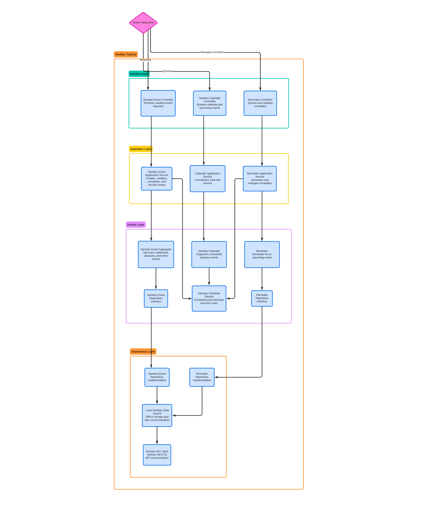

El diagrama presenta los componentes principales que participan en el bounded context:

| Componente | Responsabilidad |
|---|---|
| `Sanitary Event Controller` | Recibe las solicitudes relacionadas con el registro, consulta, actualización y finalización de eventos sanitarios. |
| `Sanitary Calendar Controller` | Gestiona las solicitudes relacionadas con la consulta y planificación del calendario sanitario. |
| `Reminder Controller` | Gestiona las solicitudes relacionadas con los recordatorios sanitarios. |
| `Sanitary Event Application Service` | Coordina los casos de uso relacionados con el registro y actualización de eventos sanitarios. |
| `Calendar Application Service` | Coordina los casos de uso relacionados con la programación y consulta del calendario sanitario. |
| `Reminder Application Service` | Coordina la generación y administración de recordatorios relacionados con los eventos sanitarios. |
| `Sanitary Event Aggregate` | Representa el agregado principal del contexto y controla el ciclo de vida de los eventos sanitarios. |
| `Sanitary Calendar` | Organiza los eventos sanitarios programados y permite consultar las actividades próximas. |
| `Reminder` | Representa un recordatorio asociado a un evento sanitario próximo. |
| `Sanitary Schedule Service` | Contiene las reglas de dominio necesarias para validar la programación de actividades sanitarias y la generación de recordatorios. |
| `Sanitary Event Repository Interface` | Define las operaciones requeridas por el dominio para almacenar y recuperar eventos sanitarios. |
| `Reminder Repository Interface` | Define las operaciones requeridas para almacenar y consultar recordatorios. |
| `Sanitary Event Repository Implementation` | Implementa las operaciones de persistencia definidas por el dominio para los eventos sanitarios. |
| `Reminder Repository Implementation` | Implementa las operaciones de persistencia correspondientes a los recordatorios. |
| `Local Sanitary Data Source` | Permite mantener temporalmente información sanitaria en el dispositivo móvil para soportar el registro sin conexión. |
| `Sanitary API Client` | Permite la comunicación entre la aplicación móvil y los servicios RESTful asociados al bounded context. |
| `Notification Service` | Adaptador encargado de solicitar el envío de recordatorios y alertas mediante el servicio externo de notificaciones push. |

El flujo principal de comunicación dentro de Sanitary Tracking se desarrolla de la siguiente manera:

1. El usuario interactúa con Gethics Mobile para registrar, consultar o actualizar información sanitaria de un animal.
2. Los Controllers de la Interface Layer reciben la solicitud y delegan su procesamiento hacia los servicios correspondientes del Application Layer.
3. Los Application Services coordinan el caso de uso y utilizan los elementos del Domain Layer para aplicar las reglas de negocio.
4. `SanitaryEvent` controla el ciclo de vida del evento sanitario, mientras que `SanitaryScheduleService` valida las reglas relacionadas con su programación.
5. Las interfaces de Repository definidas en el dominio permiten solicitar la persistencia de la información sin depender de una tecnología concreta.
6. Los Repository Implementations y Data Sources de la Infrastructure Layer realizan el almacenamiento y recuperación de la información.
7. Cuando un evento sanitario requiere generar un recordatorio o alerta, la infraestructura solicita el envío correspondiente al Servicio de Notificaciones Push.

Además de este flujo interno, Sanitary Tracking mantiene las siguientes relaciones con otros bounded contexts y sistemas:

- **Livestock Management → Sanitary Tracking:** proporciona los datos necesarios para identificar al animal relacionado con el evento sanitario.
- **Veterinary Care → Sanitary Tracking:** solicita la actualización del historial clínico mediante las operaciones expuestas por Sanitary Tracking.
- **Sanitary Tracking → Analytics & Alerts:** expone la información del historial clínico actualizado para apoyar el análisis de tendencias.
- **Sanitary Tracking → Servicio de Notificaciones Push:** solicita el envío de recordatorios y alertas sanitarias hacia los usuarios.

Esta organización permite mantener a **Sanitary Tracking** como propietario de la información sanitaria y del historial clínico, evitando que otros bounded contexts modifiquen directamente sus datos. Al mismo tiempo, la separación por capas reduce el acoplamiento entre las reglas de negocio y los mecanismos técnicos de persistencia, sincronización y notificación.

---

### 2.6.2.6. Bounded Context Software Architecture Code Level Diagrams

En esta sección se presentan los diagramas de nivel de código correspondientes al bounded context **Sanitary Tracking**. Estos diagramas permiten detallar la implementación de los componentes definidos previamente, manteniendo consistencia con las decisiones tomadas durante el Strategic-Level Domain-Driven Design.

Para este bounded context se consideran el **Domain Layer Class Diagram**, encargado de representar las clases y relaciones que conforman el dominio sanitario, y el **Database Design Diagram**, encargado de representar los objetos necesarios para persistir su información.

---

#### 2.6.2.6.1. Bounded Context Domain Layer Class Diagrams

En esta sección se presenta el Class Diagram UML correspondiente al Domain Layer del bounded context **Sanitary Tracking**.

El modelo representa las clases responsables de gestionar el historial clínico y los eventos sanitarios asociados a los animales de Gethics. De acuerdo con las decisiones tomadas en el diseño estratégico, **Sanitary Tracking es el propietario del agregado ClinicalHistory**, garantizando que la información sanitaria sea modificada únicamente mediante las operaciones controladas por este bounded context.

`ClinicalHistory` funciona como Aggregate Root y mantiene los eventos sanitarios correspondientes a un animal. Cada `SanitaryEvent` representa una vacuna, tratamiento, enfermedad, control u otra actividad sanitaria registrada.

Asimismo, `SanitaryCalendar` permite organizar los eventos programados, mientras que `Reminder` representa los recordatorios asociados a actividades próximas. `SanitaryScheduleService` concentra las reglas de dominio necesarias para validar la programación de eventos y generar recordatorios.

Las interfaces de Repository permiten definir las operaciones necesarias para recuperar y persistir la información del dominio sin acoplarla directamente a una tecnología de almacenamiento.

**Sanitary Tracking Domain Layer Class Diagram**

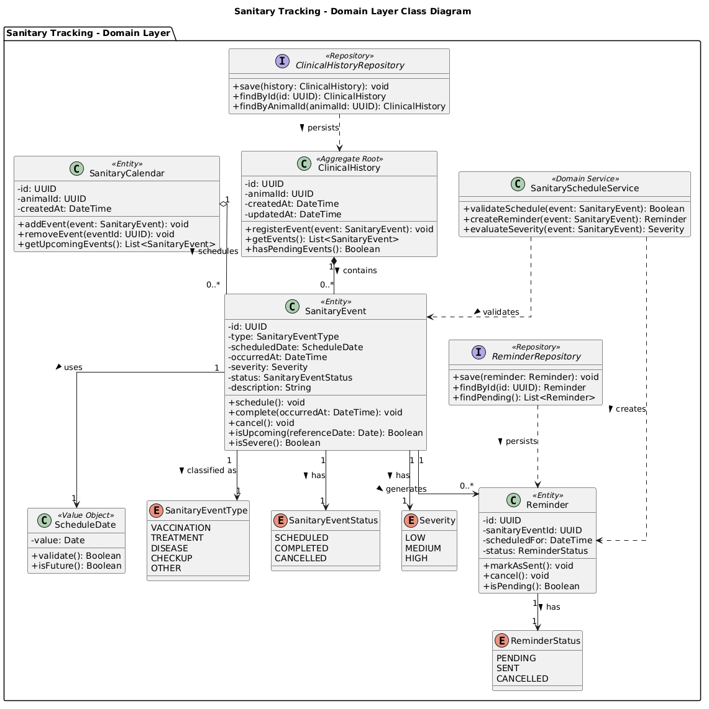

Las principales relaciones representadas en el diagrama son:

- Un `ClinicalHistory` pertenece a un único animal identificado mediante `animalId`.
- Un `ClinicalHistory` puede contener cero o múltiples `SanitaryEvent`.
- Cada `SanitaryEvent` pertenece a un único `ClinicalHistory`.
- Un `SanitaryEvent` utiliza `SanitaryEventType`, `SanitaryEventStatus` y `Severity` para mantener valores controlados dentro del dominio.
- Un `SanitaryEvent` puede generar cero o múltiples `Reminder`.
- `SanitaryCalendar` organiza los eventos sanitarios programados.
- `SanitaryScheduleService` aplica reglas relacionadas con la programación de eventos y generación de recordatorios.
- `ClinicalHistoryRepository` define las operaciones de persistencia correspondientes al Aggregate Root.
- `ReminderRepository` define las operaciones necesarias para recuperar y persistir recordatorios.

Esta estructura permite mantener centralizada la información sanitaria dentro de Sanitary Tracking y evita que otros bounded contexts modifiquen directamente el historial clínico. De esta forma, las interacciones provenientes de **Veterinary Care** deben realizarse mediante las operaciones expuestas por Sanitary Tracking, manteniendo el límite de consistencia definido para el contexto.

---

#### 2.6.2.6.2. Bounded Context Database Design Diagram

En esta sección se presenta el Database Design Diagram correspondiente al bounded context **Sanitary Tracking**. El modelo representa las estructuras de persistencia necesarias para almacenar el historial clínico de los animales, los eventos sanitarios registrados y los recordatorios asociados a dichos eventos.

De acuerdo con las decisiones establecidas durante el Strategic-Level Domain-Driven Design, **Sanitary Tracking es el propietario de la información relacionada con el historial clínico**. Por ello, las estructuras de persistencia correspondientes al historial y sus eventos pertenecen exclusivamente a este bounded context.

La identificación del animal se mantiene mediante el atributo `animal_id`, el cual representa una referencia al animal administrado por **Livestock Management**. Esta referencia no se implementa como una Foreign Key hacia una tabla externa, debido a que ambos elementos pertenecen a bounded contexts diferentes. De esta manera se mantiene la independencia y el desacoplamiento entre sus respectivos modelos de persistencia.

**Sanitary Tracking Database Design Diagram**

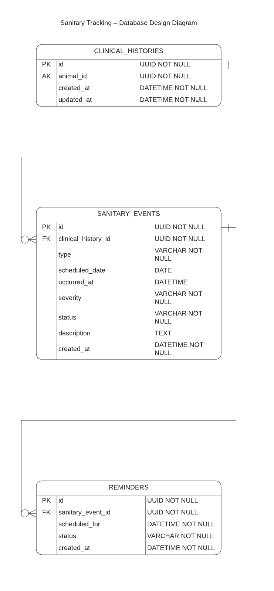

El diseño de base de datos está conformado por las siguientes entidades:

### Clinical Histories

La tabla `CLINICAL_HISTORIES` representa el historial clínico asociado a cada animal. Cada animal mantiene un único historial dentro del bounded context Sanitary Tracking.

| Campo | Tipo | Restricción | Descripción |
|---|---|---|---|
| `id` | UUID | Primary Key, NOT NULL | Identificador único del historial clínico. |
| `animal_id` | UUID | UNIQUE, NOT NULL | Identificador externo del animal administrado por Livestock Management. |
| `created_at` | DATETIME | NOT NULL | Fecha y hora de creación del historial clínico. |
| `updated_at` | DATETIME | NOT NULL | Fecha y hora de la última actualización del historial. |

El atributo `animal_id` se define como una Alternate Key dentro del modelo para garantizar que un mismo animal no posea más de un historial clínico dentro de Sanitary Tracking.

### Sanitary Events

La tabla `SANITARY_EVENTS` almacena los diferentes eventos sanitarios registrados dentro del historial clínico de un animal. Estos eventos pueden representar vacunaciones, tratamientos, enfermedades, controles médicos u otras actividades relacionadas con la salud del ganado.

| Campo | Tipo | Restricción | Descripción |
|---|---|---|---|
| `id` | UUID | Primary Key, NOT NULL | Identificador único del evento sanitario. |
| `clinical_history_id` | UUID | Foreign Key, NOT NULL | Identificador del historial clínico al que pertenece el evento. |
| `type` | VARCHAR | NOT NULL | Tipo de evento sanitario registrado. |
| `scheduled_date` | DATE | NULL | Fecha programada para la realización del evento, cuando corresponda. |
| `occurred_at` | DATETIME | NULL | Fecha y hora en la que el evento ocurrió o fue realizado. |
| `severity` | VARCHAR | NOT NULL | Nivel de severidad asociado al evento sanitario. |
| `status` | VARCHAR | NOT NULL | Estado actual del evento sanitario. |
| `description` | TEXT | NULL | Información adicional relacionada con el evento. |
| `created_at` | DATETIME | NOT NULL | Fecha y hora de creación del registro. |

El atributo `clinical_history_id` funciona como Foreign Key hacia `CLINICAL_HISTORIES.id`, estableciendo la relación entre cada evento sanitario y su respectivo historial clínico.

### Reminders

La tabla `REMINDERS` almacena los recordatorios generados a partir de eventos sanitarios programados. Estos recordatorios permiten informar al usuario sobre actividades próximas, como vacunaciones, tratamientos o controles sanitarios.

| Campo | Tipo | Restricción | Descripción |
|---|---|---|---|
| `id` | UUID | Primary Key, NOT NULL | Identificador único del recordatorio. |
| `sanitary_event_id` | UUID | Foreign Key, NOT NULL | Identificador del evento sanitario asociado. |
| `scheduled_for` | DATETIME | NOT NULL | Fecha y hora programada para generar el recordatorio. |
| `status` | VARCHAR | NOT NULL | Estado actual del recordatorio. |
| `created_at` | DATETIME | NOT NULL | Fecha y hora de creación del registro. |

El atributo `sanitary_event_id` funciona como Foreign Key hacia `SANITARY_EVENTS.id`, permitiendo relacionar cada recordatorio con el evento sanitario que lo originó.

### Relaciones del modelo

El modelo establece las siguientes relaciones principales:

- Un `CLINICAL_HISTORY` puede contener cero o múltiples `SANITARY_EVENTS`.
- Cada `SANITARY_EVENT` pertenece obligatoriamente a un único `CLINICAL_HISTORY`.
- Un `SANITARY_EVENT` puede generar cero o múltiples `REMINDERS`.
- Cada `REMINDER` pertenece obligatoriamente a un único `SANITARY_EVENT`.
- Cada `CLINICAL_HISTORY` corresponde a un único animal identificado mediante `animal_id`.

Las cardinalidades principales pueden representarse de la siguiente manera:

```text
CLINICAL_HISTORIES  1 ───────── 0..* SANITARY_EVENTS

SANITARY_EVENTS     1 ───────── 0..* REMINDERS
```

---

## 2.6.3. Bounded Context: Veterinary Care

El bounded context **Veterinary Care** se encarga de gestionar la relación profesional entre veterinarios y ganaderos dentro de Gethics, permitiendo administrar asignaciones, consultar los pacientes asociados a cada cliente y realizar el seguimiento clínico de los animales atendidos.

Este bounded context tiene como concepto principal la **Veterinary Assignment**, que representa la relación existente entre un veterinario y un cliente. A partir de dicha asignación, el profesional puede consultar los animales pertenecientes al ganadero y registrar información relacionada con su seguimiento clínico.

Los datos maestros de los animales no son administrados directamente por Veterinary Care, sino que se consultan desde **Livestock Management**, que mantiene la propiedad de dicha información.

De manera similar, Veterinary Care no es propietario del historial clínico. Cuando un veterinario registra información que debe formar parte del historial sanitario de un paciente, la actualización se realiza mediante las operaciones expuestas por **Sanitary Tracking**, evitando el acceso directo a las estructuras internas de dicho bounded context.

Veterinary Care también contempla la recepción de información proveniente de sensores o dispositivos IoT. Debido a que estos dispositivos pueden manejar protocolos y estructuras de datos propias, su integración se realiza mediante una Anti-Corruption Layer que transforma las lecturas externas en conceptos comprensibles por el dominio.

### Class Dictionary

Las principales clases identificadas para el bounded context **Veterinary Care** son las siguientes:

| Clase | Tipo | Propósito | Atributos principales | Métodos principales | Relaciones |
|---|---|---|---|---|---|
| `VeterinaryAssignment` | Aggregate Root | Representa la asignación entre un veterinario y un cliente ganadero. | `id`, `veterinarianId`, `clientId`, `assignedAt`, `status` | `assign()`, `activate()`, `deactivate()` | Relaciona un veterinario con un cliente. |
| `ClinicalFollowUp` | Entity | Representa el seguimiento profesional realizado sobre un paciente. | `id`, `assignmentId`, `patientId`, `notes`, `status`, `updatedAt` | `update()`, `registerObservation()`, `registerAnomaly()` | Pertenece a una asignación y referencia a un paciente. |
| `VeterinaryAssignmentId` | Value Object | Representa el identificador de una asignación veterinaria. | `value` | `validate()` | Identifica a `VeterinaryAssignment`. |
| `VeterinaryAssignmentStatus` | Enumeration | Representa el estado actual de una asignación. | `ACTIVE`, `INACTIVE` | No aplica | Utilizado por `VeterinaryAssignment`. |
| `FollowUpStatus` | Enumeration | Representa el estado del seguimiento clínico. | `NORMAL`, `OBSERVATION`, `ALERT` | No aplica | Utilizado por `ClinicalFollowUp`. |
| `VeterinaryAssignmentRepository` | Repository Interface | Define las operaciones necesarias para persistir y consultar asignaciones veterinarias. | No aplica | `save()`, `findById()`, `findByVeterinarianId()` | Trabaja con `VeterinaryAssignment`. |
| `ClinicalFollowUpRepository` | Repository Interface | Define las operaciones necesarias para almacenar y consultar seguimientos clínicos. | No aplica | `save()`, `findByPatientId()` | Trabaja con `ClinicalFollowUp`. |
| `ClinicalMonitoringService` | Domain Service | Evalúa información clínica y determina si un paciente requiere seguimiento o alerta. | No aplica | `evaluateReading()`, `detectAnomaly()` | Trabaja con `ClinicalFollowUp`. |

---

### 2.6.3.1. Domain Layer

El **Domain Layer** contiene las reglas de negocio relacionadas con la asignación de veterinarios a clientes y el seguimiento profesional de los pacientes atendidos.

El agregado principal del bounded context es `VeterinaryAssignment`, encargado de representar la relación entre un veterinario y un cliente. Una misma persona con rol Veterinarian puede mantener múltiples asignaciones activas, permitiéndole consultar los diferentes ganaderos bajo su atención profesional.

Cada asignación mantiene las referencias necesarias hacia el veterinario y el cliente mediante sus respectivos identificadores. Veterinary Care no mantiene una copia del modelo completo de usuario, debido a que la información de identidad y roles es proporcionada por **Identity & Access**.

La clase `ClinicalFollowUp` representa el seguimiento clínico que el veterinario realiza sobre un paciente. El paciente se identifica mediante `patientId`, correspondiente al identificador del animal administrado por **Livestock Management**. De esta manera, Veterinary Care utiliza al animal como una referencia externa sin apropiarse de su información maestra.

`ClinicalMonitoringService` concentra las reglas necesarias para evaluar observaciones clínicas y las lecturas recibidas desde dispositivos IoT. Cuando una lectura indica una anomalía, el dominio puede actualizar el estado del seguimiento clínico para reflejar que el paciente requiere observación o atención.

El historial clínico completo no forma parte del modelo interno de Veterinary Care. Cuando una observación o atención debe incorporarse al historial sanitario del animal, el bounded context solicita dicha actualización a **Sanitary Tracking**, que mantiene la propiedad del agregado correspondiente.

Las interfaces `VeterinaryAssignmentRepository` y `ClinicalFollowUpRepository` permiten que el Domain Layer defina sus necesidades de persistencia sin depender directamente de una tecnología de almacenamiento específica.

---

### 2.6.3.2. Interface Layer

El **Interface Layer** contiene los componentes responsables de recibir las solicitudes relacionadas con las operaciones del módulo veterinario.

Esta capa permite gestionar las asignaciones veterinarias, consultar los clientes atendidos por un profesional, acceder a los pacientes asociados y registrar actualizaciones relacionadas con su seguimiento clínico.

| Clase | Tipo | Propósito | Operaciones principales |
|---|---|---|---|
| `VeterinaryAssignmentController` | Controller | Gestiona las operaciones relacionadas con asignaciones entre veterinarios y clientes. | `createAssignment()`, `getAssignments()`, `deactivateAssignment()` |
| `VeterinaryClientController` | Controller | Permite consultar los clientes asignados a un veterinario. | `getAssignedClients()`, `getClient()` |
| `VeterinaryPatientController` | Controller | Permite consultar los pacientes pertenecientes a los clientes asignados. | `getPatients()`, `getPatientById()` |
| `ClinicalFollowUpController` | Controller | Gestiona las operaciones relacionadas con el seguimiento clínico de los pacientes. | `getFollowUp()`, `updateFollowUp()`, `registerObservation()` |

Los Controllers reciben las solicitudes provenientes de la aplicación y delegan la ejecución de cada operación hacia los casos de uso definidos en el Application Layer.

La información detallada de los pacientes no se obtiene directamente desde una estructura propia de Veterinary Care. Las solicitudes correspondientes son coordinadas con **Livestock Management**, respetando los límites establecidos entre ambos bounded contexts.

---

### 2.6.3.3. Application Layer

El **Application Layer** coordina los casos de uso relacionados con la atención veterinaria y la interacción con los bounded contexts y servicios externos necesarios.

Esta capa organiza el flujo de ejecución entre los Controllers, los elementos del dominio y las interfaces necesarias para acceder a información administrada por otros contextos.

| Clase | Tipo | Propósito |
|---|---|---|
| `AssignVeterinarianToClientCommandHandler` | Command Handler | Coordina la creación de una nueva asignación entre un veterinario y un cliente. |
| `DeactivateVeterinaryAssignmentCommandHandler` | Command Handler | Coordina la desactivación de una asignación veterinaria. |
| `GetAssignedClientsQueryHandler` | Query Handler | Obtiene los clientes asignados a un veterinario. |
| `GetPatientQueryHandler` | Query Handler | Obtiene la información de un paciente mediante Livestock Management. |
| `GetClientPatientsQueryHandler` | Query Handler | Obtiene los pacientes pertenecientes a un cliente asignado. |
| `UpdateClinicalFollowUpCommandHandler` | Command Handler | Coordina la actualización manual del seguimiento clínico de un paciente. |
| `ProcessIoTReadingCommandHandler` | Command Handler | Procesa una lectura proveniente de un dispositivo IoT y coordina la actualización del seguimiento clínico cuando corresponde. |
| `UpdateClinicalHistoryCommandHandler` | Command Handler | Coordina el envío de una actualización hacia Sanitary Tracking cuando la información debe incorporarse al historial clínico. |

Cuando un veterinario consulta un paciente, el Application Layer verifica la asignación correspondiente y coordina la obtención de la información del animal desde **Livestock Management**.

Cuando el profesional registra una nueva observación, `UpdateClinicalFollowUpCommandHandler` coordina la modificación del seguimiento clínico interno. Si dicha información debe formar parte del historial clínico del animal, se utiliza la integración correspondiente con **Sanitary Tracking**.

De manera similar, cuando se recibe información proveniente de un dispositivo IoT, `ProcessIoTReadingCommandHandler` coordina su procesamiento. Una vez que la lectura ha sido transformada al lenguaje del dominio, `ClinicalMonitoringService` puede evaluar si existe una anomalía y actualizar el seguimiento del paciente.

---

### 2.6.3.4. Infrastructure Layer

El **Infrastructure Layer** contiene las implementaciones técnicas necesarias para persistir la información de Veterinary Care y comunicarse con otros bounded contexts o servicios externos.

Esta capa mantiene aisladas las dependencias técnicas para evitar que los elementos del dominio dependan directamente de APIs, protocolos de comunicación, bases de datos o dispositivos físicos.

| Clase | Tipo | Propósito |
|---|---|---|
| `VeterinaryAssignmentRepositoryImpl` | Repository Implementation | Implementa las operaciones de persistencia de las asignaciones veterinarias. |
| `ClinicalFollowUpRepositoryImpl` | Repository Implementation | Implementa las operaciones de persistencia del seguimiento clínico. |
| `VeterinaryDataSource` | Data Source | Gestiona el acceso a los datos propios del bounded context Veterinary Care. |
| `LivestockManagementClient` | External Context Client | Permite consultar la información de los animales administrados por Livestock Management. |
| `SanitaryTrackingClient` | External Context Client | Permite solicitar actualizaciones del historial clínico administrado por Sanitary Tracking. |
| `IoTDeviceAdapter` | Anti-Corruption Layer Adapter | Transforma las lecturas provenientes de sensores o dispositivos IoT al modelo utilizado por Veterinary Care. |
| `IoTReadingMapper` | Mapper | Traduce las estructuras de datos externas provenientes de dispositivos IoT a conceptos utilizados por el dominio. |

La integración con los sensores o dispositivos IoT se realiza mediante una **Anti-Corruption Layer**. De esta forma, los formatos, protocolos o estructuras propias de cada dispositivo permanecen aislados de los elementos internos del bounded context.

El `IoTDeviceAdapter` recibe la información externa y utiliza `IoTReadingMapper` para convertirla en un formato comprensible para Veterinary Care. Posteriormente, la lectura puede ser evaluada por los servicios del dominio para determinar si existe alguna anomalía que requiera modificar el seguimiento clínico.

Por otro lado, `LivestockManagementClient` permite consultar los datos de los pacientes sin replicar el modelo de Animal dentro de Veterinary Care, mientras que `SanitaryTrackingClient` permite solicitar la actualización controlada del historial clínico sin realizar escrituras directas sobre los datos de Sanitary Tracking.

Esta separación permite que Veterinary Care mantenga su propio modelo centrado en la relación veterinario-cliente-paciente y en el seguimiento profesional, mientras que las responsabilidades correspondientes a los animales y al historial clínico permanecen dentro de sus respectivos bounded contexts.

---

### 2.6.3.5. Bounded Context Software Architecture Component Level Diagrams

En esta sección se presenta el Component Level Diagram correspondiente al bounded context **Veterinary Care**, siguiendo el modelo C4 y manteniendo consistencia con las decisiones establecidas durante el Strategic-Level Domain-Driven Design de Gethics.

El objetivo del diagrama es representar los principales componentes internos responsables de la gestión de asignaciones veterinarias, consulta de clientes y pacientes, seguimiento clínico e integración con dispositivos IoT.

Veterinary Care mantiene su modelo centrado en la relación entre el veterinario, sus clientes asignados y los pacientes asociados. La información maestra de los animales no es administrada directamente por este bounded context, sino que es consultada desde **Livestock Management**.

Asimismo, cuando una observación o atención veterinaria debe incorporarse al historial clínico del animal, Veterinary Care utiliza las operaciones expuestas por **Sanitary Tracking**, ya que dicho bounded context mantiene la propiedad del historial clínico.

La información proveniente de sensores o dispositivos IoT es procesada mediante una **Anti-Corruption Layer**, evitando que las estructuras, formatos o protocolos externos formen parte directamente del modelo interno de Veterinary Care.

**Veterinary Care Software Architecture Component Level Diagram**

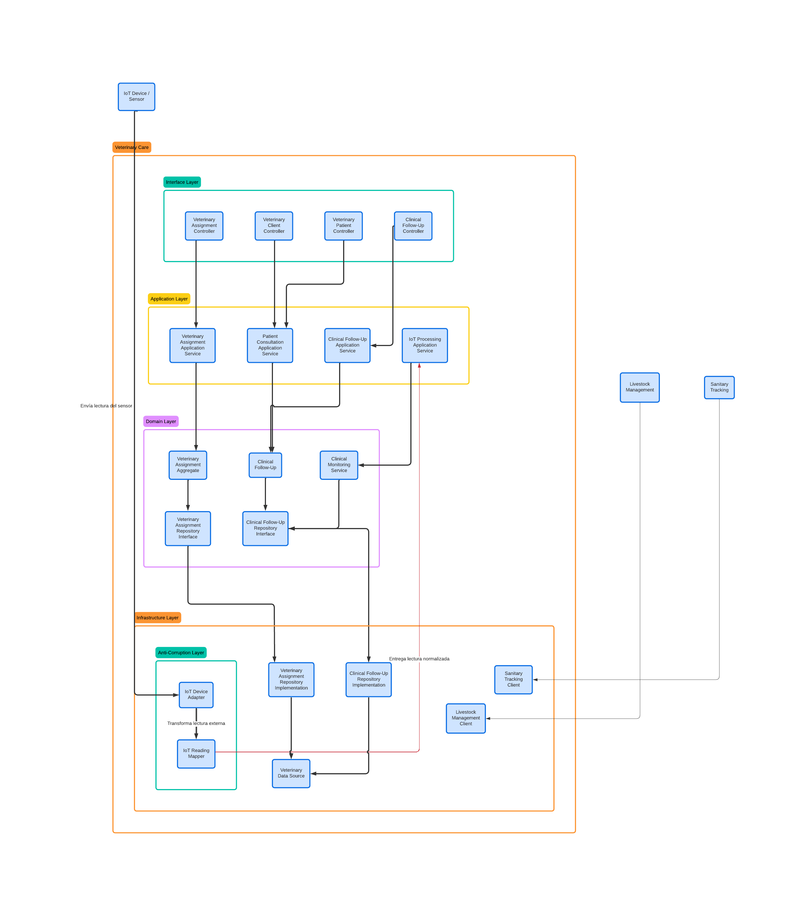

El diagrama considera los siguientes componentes principales:

| Componente | Responsabilidad |
|---|---|
| `Veterinary Assignment Controller` | Recibe solicitudes relacionadas con la creación, consulta y desactivación de asignaciones entre veterinarios y clientes. |
| `Veterinary Client Controller` | Gestiona las consultas de clientes asignados a un veterinario. |
| `Veterinary Patient Controller` | Gestiona las consultas relacionadas con los pacientes pertenecientes a los clientes asignados. |
| `Clinical Follow-Up Controller` | Recibe las operaciones relacionadas con el seguimiento clínico de los pacientes. |
| `Veterinary Assignment Application Service` | Coordina los casos de uso relacionados con las asignaciones veterinarias. |
| `Patient Consultation Application Service` | Coordina la obtención de información de pacientes desde Livestock Management. |
| `Clinical Follow-Up Application Service` | Coordina la actualización y consulta del seguimiento clínico. |
| `IoT Processing Application Service` | Coordina el procesamiento de las lecturas recibidas desde dispositivos IoT. |
| `Veterinary Assignment Aggregate` | Representa la relación entre un veterinario y un cliente dentro del dominio. |
| `Clinical Follow-Up` | Representa el seguimiento profesional realizado sobre un paciente. |
| `Clinical Monitoring Service` | Evalúa observaciones clínicas y lecturas de sensores para identificar posibles anomalías. |
| `Veterinary Assignment Repository Interface` | Define las operaciones necesarias para persistir y recuperar asignaciones veterinarias. |
| `Clinical Follow-Up Repository Interface` | Define las operaciones necesarias para persistir y consultar seguimientos clínicos. |
| `Veterinary Assignment Repository Implementation` | Implementa la persistencia de las asignaciones veterinarias. |
| `Clinical Follow-Up Repository Implementation` | Implementa la persistencia del seguimiento clínico. |
| `Livestock Management Client` | Permite consultar la información de los animales administrados por Livestock Management. |
| `Sanitary Tracking Client` | Permite solicitar actualizaciones del historial clínico administrado por Sanitary Tracking. |
| `IoT Device Adapter` | Implementa la Anti-Corruption Layer utilizada para recibir información proveniente de dispositivos IoT. |
| `IoT Reading Mapper` | Convierte las lecturas externas en estructuras comprensibles para el dominio de Veterinary Care. |

El flujo principal de comunicación dentro del bounded context se desarrolla de la siguiente manera:

1. El veterinario interactúa con Gethics Mobile para consultar sus clientes asignados, revisar pacientes o registrar información relacionada con el seguimiento clínico.
2. Los Controllers del Interface Layer reciben las solicitudes y delegan su ejecución hacia los componentes correspondientes del Application Layer.
3. Los Application Services coordinan los casos de uso y utilizan los elementos del Domain Layer para aplicar las reglas de negocio.
4. `VeterinaryAssignment` controla la relación existente entre el veterinario y el cliente.
5. `ClinicalFollowUp` mantiene la información relacionada con el seguimiento profesional de cada paciente.
6. Las interfaces de Repository permiten solicitar operaciones de persistencia sin que el dominio dependa directamente de la base de datos.
7. Los Repository Implementations del Infrastructure Layer ejecutan las operaciones de almacenamiento y recuperación de los datos propios de Veterinary Care.

Además del flujo interno, Veterinary Care mantiene las siguientes integraciones:

- **Veterinary Care → Livestock Management:** consulta la información del animal utilizado como paciente.
- **Veterinary Care → Sanitary Tracking:** solicita actualizaciones controladas del historial clínico cuando una atención veterinaria debe incorporarse al historial sanitario del animal.
- **IoT Device → Veterinary Care:** proporciona lecturas provenientes de sensores o dispositivos asociados al seguimiento del paciente.
- **IoT Device Adapter → IoT Reading Mapper:** transforma las estructuras externas antes de que sean procesadas por el dominio.

Cuando se recibe una lectura desde un dispositivo IoT, esta pasa primero por `IoTDeviceAdapter` y `IoTReadingMapper`. Posteriormente, `ClinicalMonitoringService` puede evaluar los datos obtenidos y determinar si existe una anomalía que requiera actualizar el seguimiento clínico.

Esta organización mantiene aisladas las responsabilidades de Veterinary Care y evita que el bounded context dependa directamente de las estructuras internas de Livestock Management, Sanitary Tracking o de los protocolos utilizados por dispositivos IoT. De esta manera, el diseño mantiene los límites establecidos por Domain-Driven Design y facilita la evolución independiente de cada componente.

---

### 2.6.3.6. Bounded Context Software Architecture Code Level Diagrams

En esta sección se presentan los diagramas de nivel de código correspondientes al bounded context **Veterinary Care**. Estos diagramas permiten representar con mayor detalle los elementos que conforman el modelo de dominio y las estructuras necesarias para persistir la información propia de este contexto.

Los diagramas mantienen consistencia con las decisiones establecidas previamente durante el Strategic-Level y Tactical-Level Domain-Driven Design. Veterinary Care se centra en la relación entre veterinarios, clientes y pacientes, así como en el seguimiento clínico profesional de los animales atendidos.

La información maestra de los animales continúa siendo responsabilidad de **Livestock Management**, mientras que el historial clínico completo pertenece a **Sanitary Tracking**. Veterinary Care conserva únicamente la información necesaria para administrar sus asignaciones y el seguimiento profesional de los pacientes.

Para este bounded context se consideran los siguientes diagramas:

- **Domain Layer Class Diagram**, que representa las clases, interfaces, enumeraciones, Value Objects, servicios de dominio y relaciones principales.
- **Database Design Diagram**, que representa las estructuras de persistencia necesarias para almacenar las asignaciones veterinarias y los seguimientos clínicos.

---

#### 2.6.3.6.1. Bounded Context Domain Layer Class Diagrams

En esta sección se presenta el UML Class Diagram correspondiente al Domain Layer del bounded context **Veterinary Care**.

El modelo tiene como Aggregate Root principal a `VeterinaryAssignment`, que representa la relación existente entre un veterinario y un cliente ganadero. Esta asignación permite determinar qué clientes pueden ser atendidos por cada profesional y proporciona el contexto necesario para consultar posteriormente a sus pacientes.

`ClinicalFollowUp` representa el seguimiento profesional asociado a un paciente. Esta entidad permite registrar observaciones, actualizar el estado del seguimiento y registrar anomalías identificadas durante una atención veterinaria o mediante información proveniente de dispositivos IoT.

El paciente no se representa mediante una entidad `Animal` propia de Veterinary Care. En su lugar, se utiliza `patientId` como referencia al animal administrado por **Livestock Management**, evitando duplicar el modelo perteneciente a otro bounded context.

De manera similar, Veterinary Care no mantiene el historial clínico completo del animal. Cuando una observación debe incorporarse al historial sanitario, dicha actualización se realiza posteriormente mediante las operaciones expuestas por **Sanitary Tracking**.

El Value Object `VeterinaryAssignmentId` permite representar y validar la identidad de cada asignación. Asimismo, `IoTReading` representa una lectura ya normalizada proveniente de un dispositivo IoT, después de haber sido procesada por la Anti-Corruption Layer definida en Infrastructure.

Las enumeraciones `VeterinaryAssignmentStatus` y `FollowUpStatus` restringen los estados permitidos para las asignaciones y seguimientos clínicos.

Finalmente, `ClinicalMonitoringService` contiene las reglas de dominio necesarias para evaluar las lecturas recibidas y determinar si existe alguna anomalía que requiera modificar el seguimiento clínico del paciente.

**Figura X. Veterinary Care Domain Layer Class Diagram**

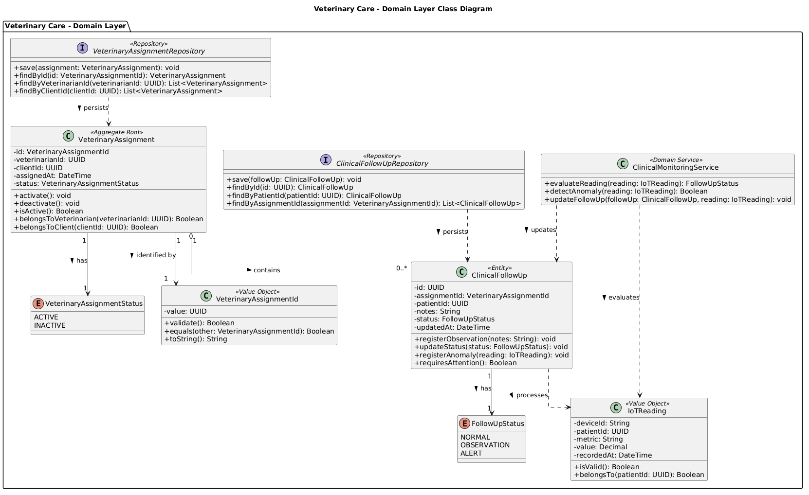

Las principales relaciones representadas en el diagrama son las siguientes:

- Un `VeterinaryAssignment` representa la relación entre un único veterinario y un único cliente.
- Un veterinario puede mantener diferentes asignaciones con distintos clientes.
- Un `VeterinaryAssignment` puede estar relacionado con cero o múltiples `ClinicalFollowUp`.
- Cada `ClinicalFollowUp` pertenece a una única `VeterinaryAssignment`.
- Cada `ClinicalFollowUp` referencia a un paciente mediante `patientId`.
- `VeterinaryAssignment` utiliza `VeterinaryAssignmentId` como identificador y `VeterinaryAssignmentStatus` para controlar su estado.
- `ClinicalFollowUp` utiliza `FollowUpStatus` para representar el estado actual del seguimiento.
- `ClinicalMonitoringService` evalúa objetos `IoTReading` y puede determinar la existencia de anomalías que requieran actualizar un `ClinicalFollowUp`.
- `VeterinaryAssignmentRepository` define las operaciones necesarias para persistir y consultar las asignaciones veterinarias.
- `ClinicalFollowUpRepository` define las operaciones necesarias para persistir y consultar el seguimiento clínico.

Esta estructura mantiene el dominio de Veterinary Care enfocado exclusivamente en las responsabilidades relacionadas con la atención veterinaria, evitando replicar modelos pertenecientes a Livestock Management o Sanitary Tracking y preservando los límites establecidos entre bounded contexts.

---

#### 2.6.3.6.2. Bounded Context Database Design Diagram

En esta sección se presenta el Database Design Diagram correspondiente al bounded context **Veterinary Care**. El modelo representa las estructuras de persistencia necesarias para administrar las asignaciones entre veterinarios y clientes, así como el seguimiento clínico profesional realizado sobre los pacientes.

De acuerdo con los límites definidos mediante Domain-Driven Design, Veterinary Care almacena únicamente la información propia de este bounded context. Los datos completos de usuarios, animales e historiales clínicos continúan siendo responsabilidad de **Identity & Access**, **Livestock Management** y **Sanitary Tracking**, respectivamente.

Por esta razón, los atributos `veterinarian_id`, `client_id` y `patient_id` se mantienen como identificadores externos y no como Foreign Keys físicas hacia tablas pertenecientes a otros bounded contexts.

**Figura X. Veterinary Care Database Design Diagram**

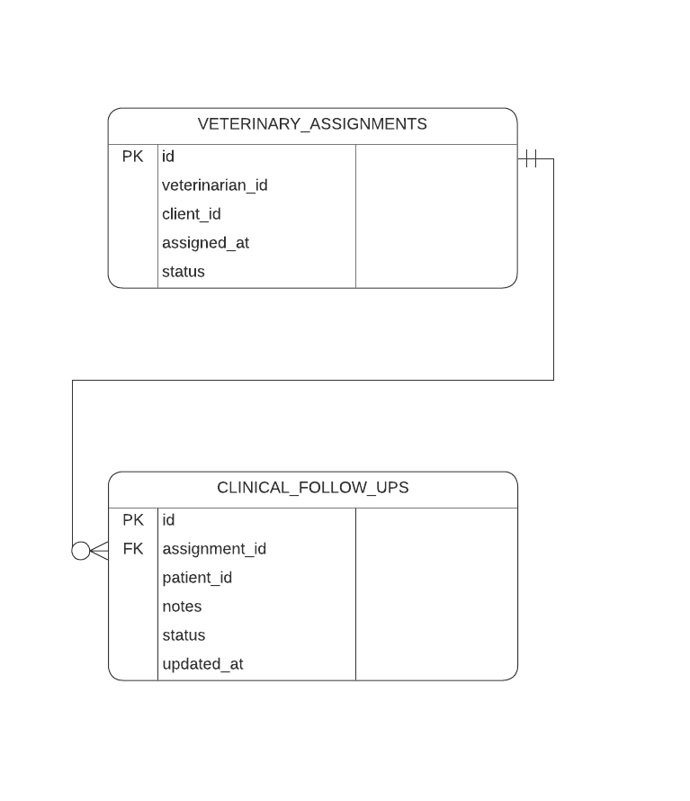

El diseño de persistencia está conformado por las tablas `VETERINARY_ASSIGNMENTS` y `CLINICAL_FOLLOW_UPS`.

### Veterinary Assignments

La tabla `VETERINARY_ASSIGNMENTS` almacena las asignaciones existentes entre un veterinario y un cliente ganadero. Estas asignaciones permiten determinar qué clientes pueden ser atendidos por cada profesional dentro de Gethics.

| Campo | Tipo | Restricción | Descripción |
|---|---|---|---|
| `id` | UUID | Primary Key, NOT NULL | Identificador único de la asignación veterinaria. |
| `veterinarian_id` | UUID | NOT NULL | Identificador externo del veterinario administrado por Identity & Access. |
| `client_id` | UUID | NOT NULL | Identificador externo del cliente administrado por Identity & Access. |
| `assigned_at` | DATETIME | NOT NULL | Fecha y hora en la que se creó la asignación. |
| `status` | VARCHAR | NOT NULL | Estado actual de la asignación veterinaria. |

Los atributos `veterinarian_id` y `client_id` representan referencias hacia usuarios administrados por **Identity & Access**. Debido a que dicho bounded context mantiene la propiedad de los usuarios y sus roles, Veterinary Care no replica estas estructuras dentro de su propio modelo de datos.

### Clinical Follow-Ups

La tabla `CLINICAL_FOLLOW_UPS` almacena la información correspondiente al seguimiento profesional realizado sobre los pacientes asociados a las asignaciones veterinarias.

| Campo | Tipo | Restricción | Descripción |
|---|---|---|---|
| `id` | UUID | Primary Key, NOT NULL | Identificador único del seguimiento clínico. |
| `assignment_id` | UUID | Foreign Key, NOT NULL | Identificador de la asignación veterinaria relacionada. |
| `patient_id` | UUID | NOT NULL | Identificador externo del paciente administrado por Livestock Management. |
| `notes` | TEXT | NULL | Observaciones registradas durante el seguimiento del paciente. |
| `status` | VARCHAR | NOT NULL | Estado actual del seguimiento clínico. |
| `updated_at` | DATETIME | NOT NULL | Fecha y hora de la última actualización del seguimiento. |

El atributo `assignment_id` funciona como Foreign Key hacia `VETERINARY_ASSIGNMENTS.id`, debido a que ambas tablas pertenecen al bounded context Veterinary Care.

El atributo `patient_id`, en cambio, representa al animal administrado por **Livestock Management**. Por esta razón, no se define como una Foreign Key física hacia una tabla `ANIMAL`, preservando la independencia entre bounded contexts.

### Relaciones del modelo

El modelo establece la siguiente relación principal:

- Una `VETERINARY_ASSIGNMENT` puede tener cero o múltiples `CLINICAL_FOLLOW_UPS`.
- Cada `CLINICAL_FOLLOW_UP` pertenece obligatoriamente a una única `VETERINARY_ASSIGNMENT`.
- Cada seguimiento clínico referencia a un único paciente mediante `patient_id`.
- Cada asignación identifica al veterinario y al cliente mediante `veterinarian_id` y `client_id`.

La cardinalidad principal del modelo se representa de la siguiente manera:

```text
VETERINARY_ASSIGNMENTS  1 ───────── 0..* CLINICAL_FOLLOW_UPS
```
---
