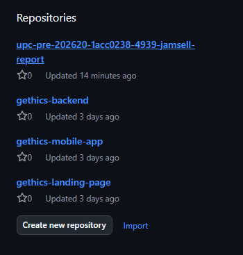

# Capítulo IV: Product Implementation & Validation

## 4. Product Implementation & Validation

Este capítulo documenta la implementación y validación de Gethics Mobile a lo largo de los Sprints de desarrollo. Se parte del Software Configuration Management del equipo: las herramientas de colaboración, el esquema de control de versiones con GitFlow, las convenciones de código y la configuración de despliegue que mantienen consistentes los tres productos de la solución: Landing Page, Web Services (backend) y la aplicación móvil. Sobre esa base, el capítulo reúne las evidencias de avance por Sprint (implementación, pruebas y despliegue de cada producto) junto con los resultados de las validaciones realizadas con los segmentos de usuario definidos en el Capítulo I, que permiten verificar que la solución responde a las necesidades identificadas para ganaderos, veterinarios y técnicos agropecuarios.

## 4.1. Software Configuration Management

Esta sección documenta las decisiones y convenciones que el equipo JamSell adopta para mantener la consistencia del proyecto Gethics Mobile durante todo su ciclo de vida: qué herramientas se usan para colaborar, cómo se organiza el versionado del código fuente, qué convenciones de estilo se siguen al programar y cómo se configura el despliegue de cada producto.

### 4.1.1. Software Development Environment Configuration

A continuación se especifica cada producto de software utilizado por el equipo para colaborar en el ciclo de vida de Gethics Mobile, agrupado por tipo de actividad. Para cada uno se indica su propósito dentro del proyecto y su ruta de referencia (herramientas SaaS) o de descarga (herramientas instaladas en el computador de cada miembro del equipo).

| Tipo de actividad | Producto | Propósito en el proyecto | Ruta de referencia / descarga |
|---|---|---|---|
| Project Management | Trello | Tablero Kanban del equipo (To Do / In Progress / Done) para organizar y dar seguimiento a las tareas de cada Sprint. | https://trello.com |
| Requirements Management | Trello | Mismo tablero del equipo, utilizado también para registrar y priorizar el backlog de historias de usuario del producto. | https://trello.com |
| Product UX/UI Design | Figma | Diseño de los wireframes y mock-ups de las pantallas de la aplicación móvil y del Landing Page, y definición del Design System (Style Guidelines: color, tipografía, iconografía) del equipo. | https://www.figma.com |
| Software Development | Android Studio | IDE utilizado por el equipo tanto para el desarrollo de la aplicación móvil (Flutter/Dart) como del backend (Spring Boot/Java). | https://developer.android.com/studio |
| Software Development | Flutter SDK | Framework utilizado para construir la aplicación móvil multiplataforma de Gethics. | https://flutter.dev |
| Software Development | PostgreSQL | Motor de base de datos relacional del backend, donde se persiste la información del hato, los usuarios y los eventos sanitarios. | https://www.postgresql.org |
| Software Development | GitHub | Control de versiones y colaboración sobre el código fuente de los tres productos del equipo (Landing Page, Web Services y Mobile App). | https://github.com |
| Software Testing | Postman | Pruebas manuales y colecciones de pruebas sobre los endpoints del backend (Web Services), antes de integrarlos con la aplicación móvil. | https://www.postman.com |
| Software Deployment | Vercel | Despliegue del Landing Page como sitio estático. | https://vercel.com |
| Software Deployment | Render | Despliegue del backend (Web Services) y de la base de datos PostgreSQL gestionada. | https://render.com |
| Software Documentation | GitHub | Repositorio del informe del proyecto, redactado en Markdown y versionado junto con el resto de productos del equipo. | https://github.com |

Como se observa, el equipo prioriza herramientas de modelo SaaS (Trello, Figma, GitHub, Postman, Vercel, Render) para facilitar la colaboración remota entre los miembros del equipo, reservando las instalaciones locales (Android Studio, Flutter SDK, PostgreSQL) a los productos que efectivamente requieren ejecutarse en el computador de cada desarrollador.

### 4.1.2. Source Code Management

Para la gestión y seguimiento de modificaciones del código fuente de **Gethics**, el equipo utiliza **GitHub** como plataforma de alojamiento de repositorios y **Git** como sistema de control de versiones.

La solución se encuentra distribuida en repositorios independientes de acuerdo con los principales productos de software desarrollados por el equipo: Landing Page, aplicación móvil, Web Services y documentación del proyecto.

### Repositories

| Product | Repository |
|---|---|
| Project Report | https://github.com/UPc-1ACC0238-2620-4939-JamSell/upc-pre-202620-1acc0238-4939-jamsell-report |
| Landing Page | https://github.com/UPc-1ACC0238-2620-4939-JamSell/gethics-landing-page.git |
| Mobile Application | https://github.com/UPc-1ACC0238-2620-4939-JamSell/gethics-mobile-app.git |
| Web Services / Backend | https://github.com/UPc-1ACC0238-2620-4939-JamSell/gethics-backend.git |

El repositorio correspondiente a **Web Services / Backend** contendrá tanto el código fuente de los servicios como los archivos relacionados con las pruebas unitarias y las pruebas de integración o aceptación desarrolladas durante la implementación.

A continuación, se presenta la organización actual de los repositorios del equipo en GitHub.



### GitFlow

Para organizar el desarrollo colaborativo del proyecto se aplicará **GitFlow** como modelo de ramificación.

El flujo de trabajo considera las siguientes ramas principales:

- `main`: contendrá las versiones estables y preparadas para entrega o despliegue.
- `develop`: funcionará como rama de integración para los cambios desarrollados durante cada Sprint.

Actualmente, el repositorio del Project Report cuenta con las ramas `main` y `develop`, utilizando `develop` como rama de integración para los avances del informe.

A partir de estas ramas principales se utilizarán ramas temporales de acuerdo con el tipo de modificación realizada.

#### Feature Branches

Cada nueva funcionalidad será desarrollada en una rama independiente creada a partir de `develop`.

La convención establecida será:

```text
feature/<user-story>-<short-description>
```

### 4.1.3. Source Code Style Guide & Conventions


### 4.1.4. Software Deployment Configuration


---

## 4.2. Landing Page & Mobile Application Implementation

### 4.2.1. Sprint n

#### 4.2.1.1. Sprint Planning n


#### 4.2.1.2. Aspect Leaders and Collaborators


#### 4.2.1.3. Sprint Backlog n


#### 4.2.1.4. Development Evidence for Sprint Review


#### 4.2.1.5. Testing Suite Evidence for Sprint Review


#### 4.2.1.6. Execution Evidence for Sprint Review


#### 4.2.1.7. Services Documentation Evidence for Sprint Review


#### 4.2.1.8. Software Deployment Evidence for Sprint Review


#### 4.2.1.9. Team Collaboration Insights during Sprint


---

## 4.3. Validation Interviews

### 4.3.1. Diseño de Entrevistas

Las entrevistas de validación se plantean con el objetivo de evaluar la percepción de los usuarios después de interactuar con el Landing Page y la aplicación móvil de Gethics. A diferencia de las entrevistas exploratorias realizadas en capítulos anteriores, esta etapa se enfoca en validar la claridad de la propuesta de valor, la facilidad de navegación, la comprensión de las funcionalidades principales y la utilidad percibida por los segmentos objetivo.

Para esta validación se consideran los dos segmentos principales definidos para Gethics:

- Pequeños y medianos ganaderos.
- Veterinarios y técnicos agropecuarios.

La dinámica de la entrevista consiste en presentar primero el Landing Page de Gethics, para observar si el usuario comprende el problema que busca resolver la solución, la confianza que transmite y la claridad de sus secciones. Posteriormente, se muestra la aplicación móvil, revisando el Inicio, el menú de navegación inferior y los módulos principales (Inventario, Tareas, Perfil) según corresponda al rol del entrevistado.

En el caso del segmento ganadero, la evaluación se orienta al registro de animales, el calendario sanitario (vacunas y tratamientos), las alertas automáticas y el control económico del hato. En el caso del segmento veterinario/técnico, se evalúa la revisión de clientes asignados, la consulta de pacientes (animales), el historial clínico, el registro de eventos sanitarios en campo y el comportamiento de la aplicación sin conexión. Al finalizar la demostración, el entrevistado responde un conjunto de preguntas diseñadas para recoger sus opiniones, dificultades y recomendaciones de mejora.

### Guía de preguntas para el segmento Ganadero

1. ¿A qué se dedica actualmente dentro de la actividad ganadera y qué tipo de animales maneja?
2. ¿Cómo registra hoy la información de sus animales, vacunas, tratamientos o gastos?
3. Al ver el Landing Page de Gethics, ¿entiende rápidamente qué problema busca resolver la aplicación?
4. ¿La información del Landing Page le genera confianza para probar la aplicación? ¿Por qué?
5. ¿Qué sección del Landing Page le pareció más útil o clara?
6. ¿Hubo alguna parte del Landing Page que le pareció confusa, innecesaria o poco creíble?
7. Al abrir la aplicación, ¿le resultó claro hacia dónde debía ir primero?
8. ¿La pantalla de Inicio le muestra información útil para tomar decisiones rápidas sobre su ganado?
9. ¿Los nombres de las opciones del menú (Inicio, Inventario, Tareas, Perfil) le resultan comprensibles?
10. ¿Le resultó fácil encontrar y buscar un animal dentro del Inventario?
11. ¿El formulario para registrar o editar un animal le parece claro y completo (raza, edad, sexo, estado de salud)?
12. ¿Qué dato importante sobre un animal cree que falta registrar?
13. ¿Le resulta útil registrar una vacuna o un tratamiento desde la ficha del animal?
14. ¿La sección de Tareas le ayudaría a no olvidar vacunas, desparasitaciones u otros eventos sanitarios?
15. ¿Las alertas que muestra la aplicación le parecen oportunas y fáciles de entender?
16. ¿La sección de reportes le parece útil para controlar ingresos, egresos o la rentabilidad de su hato?
17. ¿Qué tan importante es para usted que la aplicación funcione sin conexión a internet, dado el lugar donde trabaja?
18. ¿El lenguaje usado en la aplicación le parece cercano y fácil de entender?
19. ¿Qué parte de la aplicación le resultó más difícil de usar o encontrar?
20. Después de probar Gethics, ¿la usaría en su trabajo diario? ¿Qué tendría que mejorar para que sí la use?

### Guía de preguntas para el segmento Veterinario / Técnico agropecuario

1. ¿Cuál es su experiencia trabajando con ganaderos o productores pecuarios?
2. ¿Cómo organiza actualmente la información de sus clientes, pacientes y visitas en campo?
3. Al ver el Landing Page de Gethics, ¿queda claro que también está pensada para veterinarios y técnicos?
4. ¿Qué información del Landing Page le ayudó más a entender el valor de la aplicación para su trabajo?
5. ¿Qué información agregaría al Landing Page para que un veterinario confíe más en Gethics?
6. Al abrir la aplicación, ¿la pantalla de Inicio le permite entender rápidamente qué requiere su atención?
7. ¿Le resultó fácil encontrar y revisar a sus clientes (ganaderos) asignados?
8. ¿La vista de pacientes (animales) por cliente le ayuda a encontrar rápidamente a quién debe revisar?
9. ¿Le parece adecuado el flujo de buscar primero un animal o cliente antes de ver su información clínica?
10. ¿El historial clínico de cada animal es suficiente para hacer una revisión veterinaria básica?
11. ¿El formulario para registrar un evento sanitario (chequeo, vacuna, tratamiento) le permite registrar lo que necesita?
12. ¿Qué campos clínicos considera que faltan en el registro sanitario?
13. ¿La sección de Tareas le serviría para organizar sus visitas, controles o seguimientos pendientes?
14. ¿Qué tan clara le resultó la forma de priorizar entre varios animales o productores pendientes de atención?
15. Al probar el registro sin conexión, ¿la aplicación le dio la confianza de que no perdería la información ingresada?
16. ¿Qué tan importante es para usted no depender de señal para registrar un chequeo en campo?
17. ¿El lenguaje y los términos usados en la aplicación coinciden con cómo usted trabaja en el día a día?
18. ¿Hubo alguna pantalla, botón o texto que no entendió durante la prueba?
19. ¿Qué le pareció más valioso de la aplicación frente a sus fichas físicas o anotaciones en el celular?
20. Después de probar Gethics, ¿la recomendaría como herramienta de apoyo veterinario/técnico? ¿Qué cambios serían prioritarios?


### 4.3.2. Registro de Entrevistas


### 4.3.3. Evaluaciones según heurísticas


---

# Conclusiones

## Conclusiones y recomendaciones


---

# Video App Validation


# Video About the Product


# Video About the Team


---

# Glosario


# Bibliografía


# Anexos
