# Capítulo IV: Product Implementation & Validation

## 4. Product Implementation & Validation

Este capítulo documenta la implementación y validación de Gethics Mobile a lo largo de los Sprints de desarrollo. Se parte del Software Configuration Management del equipo: las herramientas de colaboración, el esquema de control de versiones con GitFlow, las convenciones de código y la configuración de despliegue que mantienen consistentes los tres productos de la solución: Landing Page, Web Services (backend) y la aplicación móvil. Sobre esa base, el capítulo reúne las evidencias de avance por Sprint (implementación, pruebas y despliegue de cada producto) junto con los resultados de las validaciones realizadas con los segmentos de usuario definidos en el Capítulo I, que permiten verificar que la solución responde a las necesidades identificadas para ganaderos, veterinarios y técnicos agropecuarios.

## 4.1. Software Configuration Management

Esta sección documenta las decisiones y convenciones que el equipo JamSell adopta para mantener la consistencia del proyecto Gethics Mobile durante todo su ciclo de vida: qué herramientas se usan para colaborar, cómo se organiza el versionado del código fuente, qué convenciones de estilo se siguen al programar y cómo se configura el despliegue de cada producto.

### 4.1.1. Software Development Environment Configuration

A continuación se especifica cada producto de software utilizado por el equipo para colaborar en el ciclo de vida de Gethics Mobile, agrupado por tipo de actividad. Para cada uno se indica su propósito dentro del proyecto y su ruta de referencia (herramientas SaaS) o de descarga (herramientas instaladas en el computador de cada miembro del equipo).

| Tipo de actividad | Producto | Propósito en el proyecto | Ruta de referencia / descarga |
|---|---|---|---|
| Project Management | Trello | Tablero Kanban del equipo (To Do / In Progress / Done) para organizar y dar seguimiento a las tareas de cada Sprint. | https://trello.com |
| Requirements Management | Trello | Mismo tablero del equipo, utilizado también para registrar y priorizar el backlog de historias de usuario del producto. | https://trello.com |
| Product UX/UI Design | Figma | Diseño de los wireframes y mock-ups de las pantallas de la aplicación móvil y del Landing Page, y definición del Design System (Style Guidelines: color, tipografía, iconografía) del equipo. | https://www.figma.com |
| Software Development | Android Studio | IDE utilizado por el equipo tanto para el desarrollo de la aplicación móvil (Flutter/Dart) como del backend (Spring Boot/Java). | https://developer.android.com/studio |
| Software Development | Flutter SDK | Framework utilizado para construir la aplicación móvil multiplataforma de Gethics. | https://flutter.dev |
| Software Development | PostgreSQL | Motor de base de datos relacional del backend, donde se persiste la información del hato, los usuarios y los eventos sanitarios. | https://www.postgresql.org |
| Software Development | GitHub | Control de versiones y colaboración sobre el código fuente de los tres productos del equipo (Landing Page, Web Services y Mobile App). | https://github.com |
| Software Testing | Postman | Pruebas manuales y colecciones de pruebas sobre los endpoints del backend (Web Services), antes de integrarlos con la aplicación móvil. | https://www.postman.com |
| Software Deployment | Vercel | Despliegue del Landing Page como sitio estático. | https://vercel.com |
| Software Deployment | Render | Despliegue del backend (Web Services) y de la base de datos PostgreSQL gestionada. | https://render.com |
| Software Documentation | GitHub | Repositorio del informe del proyecto, redactado en Markdown y versionado junto con el resto de productos del equipo. | https://github.com |

Como se observa, el equipo prioriza herramientas de modelo SaaS (Trello, Figma, GitHub, Postman, Vercel, Render) para facilitar la colaboración remota entre los miembros del equipo, reservando las instalaciones locales (Android Studio, Flutter SDK, PostgreSQL) a los productos que efectivamente requieren ejecutarse en el computador de cada desarrollador.

### 4.1.2. Source Code Management

Para la gestión y seguimiento de modificaciones del código fuente de **Gethics**, el equipo utiliza **GitHub** como plataforma de alojamiento de repositorios y **Git** como sistema de control de versiones.

La solución se encuentra distribuida en repositorios independientes de acuerdo con los principales productos de software desarrollados por el equipo: Landing Page, aplicación móvil, Web Services y documentación del proyecto.

### Repositories

| Product | Repository |
|---|---|
| Project Report | https://github.com/UPc-1ACC0238-2620-4939-JamSell/upc-pre-202620-1acc0238-4939-jamsell-report |
| Landing Page | https://github.com/UPc-1ACC0238-2620-4939-JamSell/gethics-landing-page.git |
| Mobile Application | https://github.com/UPc-1ACC0238-2620-4939-JamSell/gethics-mobile-app.git |
| Web Services / Backend | https://github.com/UPc-1ACC0238-2620-4939-JamSell/gethics-backend.git |

El repositorio correspondiente a **Web Services / Backend** contendrá tanto el código fuente de los servicios como los archivos relacionados con las pruebas unitarias y las pruebas de integración o aceptación desarrolladas durante la implementación.

A continuación, se presenta la organización actual de los repositorios del equipo en GitHub.


### GitFlow

Para organizar el desarrollo colaborativo del proyecto se aplicará **GitFlow** como modelo de ramificación.

El flujo de trabajo considera las siguientes ramas principales:

- `main`: contendrá las versiones estables y preparadas para entrega o despliegue.
- `develop`: funcionará como rama de integración para los cambios desarrollados durante cada Sprint.

Actualmente, el repositorio del Project Report cuenta con las ramas `main` y `develop`, utilizando `develop` como rama de integración para los avances del informe.

A partir de estas ramas principales se utilizarán ramas temporales de acuerdo con el tipo de modificación realizada.

#### Feature Branches

Cada nueva funcionalidad será desarrollada en una rama independiente creada a partir de `develop`.

La convención establecida será:

```text
feature/<user-story>-<short-description>
```

### 4.1.3. Source Code Style Guide & Conventions

Esta sección define las convenciones que el equipo JamSell sigue al escribir y versionar el código de Gethics. Su objetivo es que los tres productos (Web Services, aplicación móvil y Landing Page) sean legibles y consistentes sin importar qué integrante los modifique. Las reglas se describen tal como se aplican hoy en los repositorios e indican cuáles se verifican de forma automática y cuáles dependen de la revisión en los Pull Requests.

#### Convenciones generales

| Aspecto | Convención |
|---|---|
| Idioma del código | Identificadores (clases, métodos, variables, paquetes) en inglés. |
| Idioma de mensajes al usuario | Español, con tono serio y directo, como se define en los Style Guidelines. |
| Codificación y fin de archivo | UTF-8; todo archivo termina con un salto de línea. |
| Organización | Un contexto de negocio por paquete (`iam`, `livestock`, `sanitary`, `veterinary`, `finance`, `analytics`, `subscription`, `shared`), el mismo en backend y móvil. |
| Integración | Los cambios se integran a `develop` mediante Pull Request, y `main` se reserva para versiones estables. |

#### Web Services / Backend (Java 21, Spring Boot)

**Arquitectura.** El backend sigue Domain-Driven Design. Cada bounded context se organiza en cuatro capas:

```text
<contexto>/
├── domain/          # aggregates, entities, value objects, commands, queries, services, exceptions
├── application/     # command services, query services, event handlers, outbound services
├── infrastructure/  # repositorios JPA e integraciones técnicas
└── interfaces/      # REST (controllers, resources, transform), ACL y scheduling
```

**Nombres.**

| Elemento | Regla | Ejemplo |
|---|---|---|
| Paquetes | minúsculas, sin guiones bajos | `com.jamsell.gethics.sanitary` |
| Clases | `PascalCase`; el sufijo indica el rol | `ClinicalHistory`, `SanitaryEventController`, `ClinicalHistoryQueryServiceImpl` |
| Comandos y consultas | verbo + sustantivo, en `domain/model/commands` y `queries` | `RegisterSanitaryEventCommand`, `GetClinicalHistoryQuery` |
| Métodos y variables | `camelCase` | `registerEvent`, `scheduledDate` |
| Constantes | `UPPER_SNAKE_CASE` | `MAX_ATTEMPTS` |
| Endpoints REST | prefijo `/api/v1`, recursos en plural y en minúsculas con guiones | `/api/v1/animals/{animalId}/sanitary-events`, `/api/v1/sanitary-calendar` |
| Pruebas | clase `<ClaseProbada>Test`, en el mismo paquete que la clase probada | `ReminderTest`, `SanitaryCalendarControllerTest` |

**Buenas prácticas aplicadas.** Los aggregates exponen constructores protegidos (`@NoArgsConstructor(access = AccessLevel.PROTECTED)`) y encapsulan sus reglas de negocio; se usa Lombok para evitar código repetitivo; las referencias entre bounded contexts se hacen por identificador (sin llaves foráneas físicas entre contextos); y los errores de negocio se representan con excepciones de dominio, traducidas a respuestas HTTP por un `ExceptionHandler` por contexto.

**Verificación automática (Checkstyle).** El archivo `checkstyle.xml` del repositorio se ejecuta en la fase `validate` de Maven y en el pipeline de CI; si hay una violación, el build falla. Las reglas activas son:

| Regla | Qué verifica |
|---|---|
| `NewlineAtEndOfFile` | Todo archivo termina con un salto de línea. |
| `UnusedImports` / `RedundantImport` | No hay imports sin usar ni repetidos. |
| `EmptyStatement` | No hay sentencias vacías. |
| `EqualsHashCode` | Quien sobrescribe `equals` también sobrescribe `hashCode`. |
| `MissingSwitchDefault` | Todo `switch` tiene `default`. |
| `TypeName`, `MethodName`, `MemberName`, `ConstantName`, `LocalVariableName`, `PackageName` | Los identificadores respetan las convenciones de nombres. |

#### Aplicación móvil (Kotlin, Jetpack Compose)

**Arquitectura.** La aplicación usa el patrón MVVM con Repository. Igual que en el backend, el código se agrupa por contexto de negocio y, dentro de cada uno, por capa:

```text
com.jamsell.gethics/
├── <contexto>/
│   ├── presentation/<pantalla>/   # <Pantalla>Screen.kt y <Pantalla>ViewModel.kt
│   ├── data/                      # <Contexto>Service (Retrofit), repository/, local/ (Room)
│   └── domain/model/              # modelos de dominio
└── shared/
    ├── ui/components/             # componentes reutilizables (GethicsButton, GethicsCard, ...)
    ├── ui/theme/                  # Color.kt, Type.kt, Theme.kt (Design System)
    ├── navigation/                # Routes, BottomNavItem, GethicsNavHost
    ├── data/ (remote, local)      # ApiClient, SessionStorage, AppDatabase
    ├── common/                    # Resource, UIState, Constants
    └── di/                        # AppContainer, ViewModelFactory
```

**Nombres.**

| Elemento | Regla | Ejemplo |
|---|---|---|
| Paquetes de pantalla | minúsculas con guion bajo | `register_event`, `animal_list` |
| Pantallas y componentes | funciones `@Composable` en `PascalCase`; las pantallas terminan en `Screen` | `RegisterEventScreen` |
| Componentes propios | prefijo `Gethics` | `GethicsButton`, `GethicsTextField`, `GethicsCard` |
| ViewModels | `<Pantalla>ViewModel` | `RegisterEventViewModel` |
| Acceso a datos | `<Contexto>Service` (interfaz Retrofit) y `<Contexto>Repository` | `SanitaryService`, `SanitaryRepository` |
| Resultados de red | el repositorio devuelve `Resource` (éxito o error con mensaje) y la UI lo traduce a `UIState` | `Resource.Success` |
| Pruebas unitarias | clase `<ClaseProbada>Test`; métodos con nombre descriptivo entre acentos graves | `` `201 devuelve Success` `` |

**Criterios de diseño.** Los colores, la tipografía (Roboto) y el espaciado salen exclusivamente de `shared/ui/theme`, de modo que la aplicación respeta los Style Guidelines de la sección 3.1.1. Las dependencias se centralizan en `gradle/libs.versions.toml` (Version Catalog). Las dependencias se crean en `AppContainer` y los ViewModels se construyen con `ViewModelFactory`, lo que permite inyectar dobles de prueba (por ejemplo, un `Clock` fijo para probar validaciones de fecha).

#### Landing Page (HTML, CSS y JavaScript)

El Landing Page es un sitio estático sin frameworks ni paso de compilación, organizado en `index.html` (estructura y contenido), `styles.css` (estilos, animaciones y breakpoints, con el punto de corte móvil en `max-width: 768px`) y `script.js` (menú, header y animaciones de aparición). Los recursos se guardan en `assets/`, con nombres en minúsculas y separados por guiones (`gethics-icon.png`). Los colores y la tipografía replican los definidos en los Style Guidelines, y se respeta la preferencia `prefers-reduced-motion` del usuario.

#### Control de versiones

**Ramas.** Se aplica GitFlow con `main` (versiones estables) y `develop` (integración). Cada tarea se desarrolla en una rama creada desde `develop`:

| Tipo | Patrón | Ejemplos reales |
|---|---|---|
| Funcionalidad | `feature/<historia>-<descripción-corta>` | `feature/US01-US02-auth`, `feature/sanitary-us11-register-event` |
| Tarea técnica | `feature/<TSxx>-<descripción-corta>` | `feature/TS03-cicd-cloud-deployment`, `feature/TS06-role-access` |
| Corrección | `fix/<TSxx>-<descripción-corta>` | `fix/TS03-mvnw-permissions` |

Se usan minúsculas, guiones para separar palabras y el identificador de la historia (`US..`) o tarea técnica (`TS..`) del Product Backlog, de modo que cada rama se pueda rastrear hasta el Sprint Backlog.

**Commits.** Se siguen los Conventional Commits, con el formato `tipo(contexto): descripción en infinitivo`:

| Tipo | Uso | Ejemplo real |
|---|---|---|
| `feat` | nueva funcionalidad | `feat(sanitary): implement US-12 sanitary calendar` |
| `fix` | corrección de un error | `fix(sanitary): complete US-13 vaccination reminder flow` |
| `test` | pruebas | `test(finance): add financial management aggregate tests` |
| `style` | formato sin cambio de comportamiento | `style(veterinary): fix Checkstyle NewlineAtEndOfFile violations` |
| `chore` | configuración, CI, estructura | `chore(ci): add lint check` |

**Pull Requests.** El trabajo de cada rama se integra a `develop` mediante Pull Request. El pipeline de CI (Checkstyle, compilación y pruebas) se ejecuta automáticamente sobre cada Pull Request, y el equipo se compromete a no integrar cambios cuyo pipeline falle.
#### Landing Page (HTML, CSS y JavaScript)

El Landing Page es un sitio estático sin frameworks ni paso de compilación, organizado en `index.html` (estructura y contenido), `styles.css` (estilos, animaciones y breakpoints, con el punto de corte móvil en `max-width: 768px`) y `script.js` (menú, header y animaciones de aparición). Los recursos se guardan en `assets/`, con nombres en minúsculas y separados por guiones (`gethics-icon.png`). Los colores y la tipografía replican los definidos en los Style Guidelines, y se respeta la preferencia `prefers-reduced-motion` del usuario.

#### Control de versiones

**Ramas.** Se aplica GitFlow con `main` (versiones estables) y `develop` (integración). Cada tarea se desarrolla en una rama creada desde `develop`:

| Tipo | Patrón | Ejemplos reales |
|---|---|---|
| Funcionalidad | `feature/<historia>-<descripción-corta>` | `feature/US01-US02-auth`, `feature/sanitary-us11-register-event` |
| Tarea técnica | `feature/<TSxx>-<descripción-corta>` | `feature/TS03-cicd-cloud-deployment`, `feature/TS06-role-access` |
| Corrección | `fix/<TSxx>-<descripción-corta>` | `fix/TS03-mvnw-permissions` |

Se usan minúsculas, guiones para separar palabras y el identificador de la historia (`US..`) o tarea técnica (`TS..`) del Product Backlog, de modo que cada rama se pueda rastrear hasta el Sprint Backlog.

**Commits.** Se siguen los Conventional Commits, con el formato `tipo(contexto): descripción en infinitivo`:

| Tipo | Uso | Ejemplo real |
|---|---|---|
| `feat` | nueva funcionalidad | `feat(sanitary): implement US-12 sanitary calendar` |
| `fix` | corrección de un error | `fix(sanitary): complete US-13 vaccination reminder flow` |
| `test` | pruebas | `test(finance): add financial management aggregate tests` |
| `style` | formato sin cambio de comportamiento | `style(veterinary): fix Checkstyle NewlineAtEndOfFile violations` |
| `chore` | configuración, CI, estructura | `chore(ci): add lint check` |

**Pull Requests.** El trabajo de cada rama se integra a `develop` mediante Pull Request. El pipeline de CI (Checkstyle, compilación y pruebas) se ejecuta automáticamente sobre cada Pull Request, y el equipo se compromete a no integrar cambios cuyo pipeline falle.

---

### 4.1.4. Software Deployment Configuration

#### Resumen de componentes desplegados

| Componente | Repositorio | Tecnología | Plataforma de despliegue | Estado |
| --- | --- | --- | --- | --- |
| Landing Page | `gethics-landing-page` | HTML, CSS y JavaScript (sin framework ni build step) | Vercel | Desplegado: https://gethics-landing-page.vercel.app |
| Backend | `gethics-backend` | Java 21, Spring Boot 4.1.1, Spring Data JPA, Maven | [COMPLETAR: Render / Railway / Azure / otro] | [COMPLETAR] |
| Base de datos | `gethics-backend` | PostgreSQL 16 | Docker Compose (local) y [COMPLETAR: Neon / Supabase] en la nube | Local operativo |
| Aplicación Móvil | `gethics-mobile-app` | Android nativo (Kotlin, Jetpack Compose, Gradle Kotlin DSL) | [COMPLETAR: GitHub Releases (APK) / Firebase App Distribution] | [COMPLETAR] |

#### 4.1.4.1. Landing Page

La Landing Page es un sitio estático compuesto por `index.html`, `styles.css`, `script.js` y la carpeta `assets/`. Al no requerir compilación, su despliegue consiste en publicar el contenido del repositorio tal como está.

**Configuración en Vercel**

| Parámetro | Valor |
| --- | --- |
| Repositorio conectado | `UPc-1ACC0238-2620-4939-JamSell/gethics-landing-page` |
| Rama de producción | `main` |
| Framework Preset | Other |
| Build Command | Ninguno |
| Output Directory | Raíz del repositorio (`/`) |
| URL de producción | https://gethics-landing-page.vercel.app |

**Proceso de despliegue**

1. Se importa el repositorio desde el panel de Vercel mediante la integración con GitHub.
2. Se deja vacío el comando de build y se mantiene la raíz del repositorio como directorio de salida.
3. Cada `push` a la rama `main` dispara un nuevo despliegue de producción de forma automática.
4. El enlace de producción se referencia en el repositorio como sitio web del proyecto.

#### 4.1.4.2. Backend

El backend sigue una arquitectura DDD organizada en los bounded contexts `iam`, `livestock`, `sanitary`, `veterinary`, `finance`, `analytics`, `subscription` y `shared`, y expone la API REST en el puerto `8080`.

**Entornos**

| Entorno | Perfil Spring | Base de datos | Uso |
| --- | --- | --- | --- |
| Desarrollo | `dev` | PostgreSQL 16 en contenedor Docker (`localhost:5432`) | Trabajo local de cada integrante |
| Producción | `prod` | [COMPLETAR: PostgreSQL gestionado en Neon o Supabase] | Servicio consumido por la app móvil |

**Variables de entorno**

La configuración sensible no se versiona. El repositorio incluye un archivo `.env.example` que cada integrante copia como `.env`; el archivo `.env` está excluido mediante `.gitignore`.

| Variable | Descripción | Valor en desarrollo |
| --- | --- | --- |
| `SPRING_PROFILES_ACTIVE` | Perfil activo (`dev` o `prod`) | `dev` |
| `DB_URL` | URL JDBC de PostgreSQL | `jdbc:postgresql://localhost:5432/gethics` |
| `DB_USER` | Usuario de la base de datos | `gethics` |
| `DB_PASSWORD` | Contraseña de la base de datos | Definida en `.env` |

En producción estas variables se configuran como *secrets* o variables de entorno de la plataforma de hosting, con credenciales distintas a las de desarrollo.

**Base de datos local con Docker Compose**

El archivo `docker-compose.yml` levanta un contenedor `gethics-db` basado en la imagen `postgres:16`, con la base de datos `gethics`, el puerto `5432` expuesto y un volumen persistente `gethics-data` para conservar la información entre reinicios.

```bash
docker compose up -d
```

**Compilación y ejecución**

```bash
# Ejecución en desarrollo
./mvnw spring-boot:run

# Generación del artefacto para despliegue
./mvnw clean package -DskipTests

# Ejecución del artefacto
java -jar target/*.jar
```

**Proceso de despliegue en la nube**

1. [COMPLETAR: conectar el repositorio `gethics-backend` a la plataforma de hosting elegida.]
2. [COMPLETAR: configurar `SPRING_PROFILES_ACTIVE=prod`, `DB_URL`, `DB_USER` y `DB_PASSWORD` como variables de entorno.]
3. [COMPLETAR: definir el comando de build (`./mvnw clean package -DskipTests`) y el comando de inicio (`java -jar target/*.jar`).]
4. [COMPLETAR: verificar que la API responde en la URL pública asignada.]

#### 4.1.4.3. Aplicación Móvil

La aplicación móvil es un proyecto Android nativo construido con Gradle (Kotlin DSL), Kotlin y Jetpack Compose, que utiliza KSP para el procesamiento de anotaciones. Consume la API REST del backend.

**Generación del artefacto**

```bash
# APK de depuración
./gradlew assembleDebug

# APK de lanzamiento
./gradlew assembleRelease
```

**Distribución**

1. [COMPLETAR: indicar el medio de distribución (por ejemplo, GitHub Releases con el APK adjunto o Firebase App Distribution).]
2. [COMPLETAR: indicar la URL base del backend configurada para el entorno de producción.]
3. El botón "Descargar app" de la Landing Page [COMPLETAR: enlaza al medio de distribución elegido].

#### 4.1.4.4. Flujo general de despliegue

El flujo de entrega sigue la estrategia de ramas definida en la sección 4.1.2: el trabajo se realiza en ramas `feature/<contexto>-<tarea>`, se integra mediante Pull Request hacia `develop` y la rama `main` se mantiene como rama estable desde la que se despliega a producción.

| Etapa | Landing Page | Backend | Aplicación Móvil |
| --- | --- | --- | --- |
| Integración | Pull Request hacia `main` | Pull Request hacia `develop` | [COMPLETAR] |
| Construcción | No requiere | `./mvnw clean package` | `./gradlew assemble<Variante>` |
| Publicación | Despliegue automático de Vercel | [COMPLETAR] | [COMPLETAR] |
| Verificación | Revisión de la URL pública | [COMPLETAR] | [COMPLETAR] |
---

## 4.2. Landing Page & Mobile Application Implementation

En esta sección se presenta el avance realizado durante la implementación de los principales componentes de Gethics, considerando el desarrollo del Landing Page, los Web Services y la aplicación móvil. Asimismo, se documenta el trabajo realizado durante cada Sprint, incluyendo la planificación, distribución de actividades, evidencias de desarrollo, pruebas, ejecución, documentación de servicios y colaboración del equipo.

### 4.2.1. Sprint 1

El Sprint 1 representa la primera iteración de implementación de Gethics. Durante este periodo, el equipo JamSell organizó el desarrollo de las User Stories y Technical Stories definidas en el Product Backlog, distribuyendo las responsabilidades entre los integrantes según los módulos asignados.

El trabajo del Sprint estuvo orientado a establecer una primera base funcional de la solución, incluyendo componentes relacionados con autenticación, gestión de animales y granjas, sanidad y calendario, gestión veterinaria y financiera, analítica, notificaciones e infraestructura técnica. Para el seguimiento de las actividades se utilizó Trello, mientras que la gestión del código fuente y la integración de los cambios se realizó mediante Git y GitHub.

#### 4.2.1.1. Sprint Planning 1

El Sprint Planning correspondiente al Sprint 1 se realizó con la participación de todos los integrantes de JamSell. Durante la reunión se revisó el Product Backlog, se organizaron las User Stories y Technical Stories a desarrollar y se distribuyeron las responsabilidades de acuerdo con los módulos asignados a cada integrante.

La planificación permitió establecer el objetivo general del Sprint y definir la capacidad de trabajo del equipo en términos de Story Points. Debido a que este corresponde al primer Sprint del proyecto, no se cuenta con información previa de velocidad ni con resultados de un Sprint anterior que puedan ser utilizados como referencia.

A continuación, se presenta el resumen del Sprint Planning Meeting.

| Sprint Planning Background | Detalle |
|---|---|
| **Sprint #** | Sprint 1 |
| **Date** | 01/10/2026 |
| **Time** | 8:00 p. m. |
| **Location** | Reunión virtual mediante Google Meet |
| **Prepared By** | Meza Huanacune, Juan josé |
| **Attendees (to planning meeting)** | Mauricio Sebastian Castillo Yataco / Mateo Paolo Salazar Miranda / Juan Jose Meza Huanacune / Luis Angel Pillaca Vidal / Nadhim Abigail Raymundo Villarroel |
| **Sprint 0 Review Summary** | No aplica. Este corresponde al primer Sprint del proyecto. |
| **Sprint 0 Retrospective Summary** | No aplica. Este corresponde al primer Sprint del proyecto. |
| **Sprint Goal & User Stories** | Durante el Sprint 1 se planificó el desarrollo de las User Stories y Technical Stories distribuidas entre los cinco integrantes del equipo, abarcando funcionalidades de autenticación, gestión ganadera, sanidad, gestión veterinaria y financiera, analítica, notificaciones, IoT e infraestructura técnica. |
| **Sprint 1 Goal** | Desarrollar una primera versión funcional de los principales módulos de Gethics, estableciendo una base técnica que permita validar la arquitectura, la persistencia de datos y los principales servicios definidos para la solución. |
| **Sprint 1 Velocity** | Al tratarse del primer Sprint, no existe una velocidad histórica del equipo. Como capacidad planificada se consideran 125 Story Points. |
| **Sum of Story Points** | 125 Story Points |


#### 4.2.1.2. Aspect Leaders and Collaborators
Para garantizar un flujo de trabajo ágil, transparente y con líneas claras de responsabilidad durante el Sprint 1, el equipo JamSell definió la matriz de liderazgo y colaboración **Leadership-and-Collaboration Matrix (LACX)**. Este artefacto asigna de manera explícita a un integrante del equipo como Líder (L) de un aspecto técnico o funcional específico, acompañado por uno o varios Colaboradores (C), optimizando así la toma de decisiones y la comunicación interna.

Para el Sprint 1, los aspectos considerados corresponden a las áreas clave dentro del alcance de la solución Gethics:

1. **Identity & Access Management (IAM) / Auth & Subscriptions:** Comprende las funcionalidades de registro, inicio de sesión (JWT), gestión de perfiles, recuperación de contraseñas, roles/autorización y planes de suscripción.
2. **Domain Architecture & Core Animal Management:** Involucra el modelado de datos, las migraciones iniciales de la base de datos y las operaciones principales para el registro, búsqueda y gestión del inventario ganadero.
3. **Veterinary & Sanitary Management:** Abarca el seguimiento sanitario de los animales, registro de diagnósticos, vacunas, tratamientos y el control del historial clínico veterinario.
4. **Analytics, Financials & Notifications:** Incluye el análisis de métricas operativas/financieras, reportes de rentabilidad y el sistema de alertas/notificaciones.
5. **IoT Monitoring & Technical Infrastructure:** Comprende la configuración inicial de la arquitectura base, repositorios, pipelines de despliegue, manejo global de errores/logging e integración con dispositivos IoT para monitoreo.

A continuación, se presenta la matriz **Leadership-and-Collaboration Matrix (LACX)** correspondiente al Sprint 1:

| Team Member (Last Name, First Name) | GitHub Username | Identity & Access Management (IAM) / Auth & Subscriptions | Domain Architecture & Core Animal Management | Veterinary & Sanitary Management | Analytics, Financials & Notifications | IoT Monitoring & Technical Infrastructure |
|---|---|:---:|:---:|:---:|:---:|:---:|
| Castillo Yataco, Mauricio Sebastian | mcastilloy | **L** | C | C | C | C |
| Salazar Miranda, Mateo Paolo | msalazarm | C | **L** | C | C | C |
| Meza Huanacune, Juan Jose | jmezah | C | C | **L** | C | C |
| Pillaca Vidal, Luis Angel | luispillacavidal | C | C | C | **L** | C |
| Raymundo Villarroel, Nadhim Abigail | nraymundov | C | C | C | C | **L** |

*Leyenda: **L** = Leader (Líder del aspecto) | **C** = Collaborator (Colaborador)*

La distribución definida en la matriz guarda directa concordancia con la asignación de User Stories y Technical Stories registradas en el Sprint Backlog 1, asegurando que cada integrante lidere las tareas centrales de su respectivo aspecto.

#### 4.2.1.3. Sprint Backlog 1

El Sprint Backlog correspondiente al Sprint 1 reúne las User Stories y Technical Stories seleccionadas por el equipo JamSell para el desarrollo de la primera iteración de Gethics. La planificación considera funcionalidades relacionadas con autenticación y seguridad, gestión de animales y granjas, sanidad, gestión veterinaria y financiera, analítica, notificaciones, IoT e infraestructura técnica.

Para organizar y dar seguimiento al trabajo se utilizó Trello como herramienta de gestión. El tablero permite identificar las historias y tareas técnicas planificadas, los responsables asignados, sus estimaciones mediante Story Points y su estado dentro del flujo de trabajo definido por el equipo.

El tablero se organiza mediante las columnas **Product Backlog**, **En proceso** y **Hecho**, permitiendo visualizar el avance de las actividades durante el Sprint.

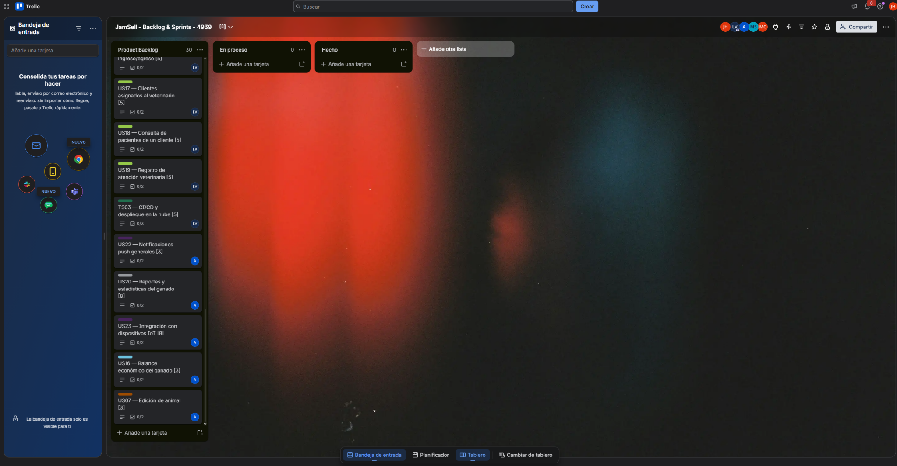

**Trello Board:** [JamSell - Backlog & Sprints - 4939](https://trello.com/invite/b/6abbfed00c437e902d9811f6/ATTI228a577e76ea799efc4fc42ab8619a372B80494F/jamsell-backlog-sprints-4939)

La distribución del Sprint Backlog se realizó considerando una carga planificada de aproximadamente 25 Story Points por integrante, alcanzando un total de 125 Story Points para el Sprint 1.

| Integrante | User Stories / Technical Stories | Story Points |
|---|---|---:|
| Mauricio Sebastian Castillo Yataco | TS01, US01, US02, US03, US04, TS06, TS05, US24 | 25 |
| Mateo Paolo Salazar Miranda | TS02, US05, US06, US08, US09, US10, TS04 | 25 |
| Juan Jose Meza Huanacune | US11, US12, US13, US14, US21 | 25 |
| Luis Angel Pillaca Vidal | US15, US17, US18, US19, TS03 | 25 |
| Nadhim Abigail Raymundo Villarroel | US22, US20, US23, US16, US07 | 25 |
| **Total** | **30 User Stories / Technical Stories** | **125** |

A continuación, se presenta el detalle de los elementos considerados en el Sprint Backlog. Debido a que las estimaciones registradas por el equipo en Trello se realizaron mediante Story Points, no se realiza una conversión arbitraria a horas. La columna **Estimation (Hours)** se mantiene como no definida hasta que el equipo establezca una equivalencia o estimación específica para los work-items.

| Sprint # | Story Id | Story Title | Task Id | Task Title | Task Description | Estimation (Hours) | Assigned To | Status |
|---|---|---|---|---|---|---|---|---|
| Sprint 1 | — | — | TS01 | Configurar repositorio, arquitectura y entornos | Configurar la estructura inicial del repositorio, arquitectura y entornos necesarios para el desarrollo del proyecto. | N/D - 3 SP | Equipo JamSell | To-do |
| Sprint 1 | US01 | Registro de usuario (API) | US01-T01 | Implementación de registro de usuario | Desarrollar y validar la funcionalidad definida para el registro de usuarios mediante la API. | N/D - 3 SP | Mauricio Sebastian Castillo Yataco | To-do |
| Sprint 1 | US02 | Inicio de sesión con JWT | US02-T01 | Implementación de inicio de sesión | Desarrollar y validar el proceso de autenticación mediante JWT. | N/D - 2 SP | Mauricio Sebastian Castillo Yataco | To-do |
| Sprint 1 | US03 | Recuperación de contraseña | US03-T01 | Implementación de recuperación de contraseña | Desarrollar y validar el flujo correspondiente a la recuperación de contraseña. | N/D - 3 SP | Mauricio Sebastian Castillo Yataco | To-do |
| Sprint 1 | US04 | Editar perfil | US04-T01 | Implementación de edición de perfil | Desarrollar la funcionalidad que permita modificar la información del perfil del usuario. | N/D - 2 SP | Mauricio Sebastian Castillo Yataco | To-do |
| Sprint 1 | — | — | TS06 | Roles y autorización (ganadero / veterinario) | Implementar la gestión de roles y autorización requerida para diferenciar las operaciones disponibles para ganaderos y veterinarios. | N/D - 3 SP | Mauricio Sebastian Castillo Yataco | To-do |
| Sprint 1 | — | — | TS05 | Manejo global de errores, logging y validaciones | Implementar mecanismos comunes para manejo de errores, registro de eventos y validaciones dentro de los servicios. | N/D - 3 SP | Mauricio Sebastian Castillo Yataco | To-do |
| Sprint 1 | US24 | Planes de suscripción in-app | US24-T01 | Implementación de planes de suscripción | Desarrollar la funcionalidad correspondiente a la visualización y gestión de planes de suscripción dentro de la aplicación. | N/D - 6 SP | Mauricio Sebastian Castillo Yataco | To-do |
| Sprint 1 | — | — | TS02 | Modelo de datos y migraciones de base de datos | Definir y preparar el modelo de datos y la estructura necesaria para la persistencia de la solución. | N/D - 5 SP | Mateo Paolo Salazar Miranda | To-do |
| Sprint 1 | US05 | Registro de animal | US05-T01 | Implementación de registro de animal | Desarrollar y validar la funcionalidad para registrar un animal dentro del sistema. | N/D - 5 SP | Mateo Paolo Salazar Miranda | To-do |
| Sprint 1 | US06 | Listado y búsqueda de animales | US06-T01 | Implementación de listado y búsqueda | Desarrollar la consulta y búsqueda de animales registrados en el sistema. | N/D - 5 SP | Mateo Paolo Salazar Miranda | To-do |
| Sprint 1 | US08 | Baja de animal (eliminación lógica) | US08-T01 | Implementación de baja de animal | Implementar la eliminación lógica de un animal registrado. | N/D - 2 SP | Mateo Paolo Salazar Miranda | To-do |
| Sprint 1 | US09 | Registro de granja | US09-T01 | Implementación de registro de granja | Desarrollar la funcionalidad para registrar una granja en el sistema. | N/D - 3 SP | Mateo Paolo Salazar Miranda | To-do |
| Sprint 1 | US10 | Asociar animales a una granja | US10-T01 | Implementación de asociación animal-granja | Permitir la asociación de animales registrados con una granja. | N/D - 3 SP | Mateo Paolo Salazar Miranda | To-do |
| Sprint 1 | — | — | TS04 | Documentación de la API (OpenAPI/Swagger) | Documentar los servicios desarrollados utilizando OpenAPI/Swagger. | N/D - 2 SP | Mateo Paolo Salazar Miranda | To-do |
| Sprint 1 | US11 | Registro de evento sanitario | US11-T01 | Implementación de registro sanitario | Desarrollar el registro de vacunas, tratamientos o enfermedades dentro del historial sanitario de un animal. | N/D - 5 SP | Juan Jose Meza Huanacune | To-do |
| Sprint 1 | US12 | Calendario sanitario | US12-T01 | Implementación de calendario sanitario | Desarrollar la consulta de eventos sanitarios programados mediante un calendario organizado por periodo. | N/D - 5 SP | Juan Jose Meza Huanacune | To-do |
| Sprint 1 | US13 | Recordatorio de vacunación (push) | US13-T01 | Implementación de recordatorio de vacunación | Implementar el mecanismo backend encargado de identificar vacunaciones próximas y generar su correspondiente recordatorio. | N/D - 5 SP | Juan Jose Meza Huanacune | To-do |
| Sprint 1 | US14 | Historial clínico por animal | US14-T01 | Implementación de historial clínico | Desarrollar la consulta cronológica de los eventos sanitarios asociados a un animal. | N/D - 5 SP | Juan Jose Meza Huanacune | To-do |
| Sprint 1 | US21 | Alertas automáticas por tendencias | US21-T01 | Implementación del mecanismo de alertas | Implementar la base de Analytics & Alerts para registrar tendencias clasificadas y generar alertas de acuerdo con una política configurable. | N/D - 5 SP | Juan Jose Meza Huanacune | To-do |
| Sprint 1 | US15 | Registro de ingreso/egreso | US15-T01 | Implementación de ingresos y egresos | Desarrollar el registro de operaciones económicas asociadas a la gestión del ganado. | N/D - 5 SP | Luis Angel Pillaca Vidal | To-do |
| Sprint 1 | US17 | Clientes asignados al veterinario | US17-T01 | Implementación de clientes asignados | Desarrollar la consulta de los clientes asociados a un veterinario. | N/D - 5 SP | Luis Angel Pillaca Vidal | To-do |
| Sprint 1 | US18 | Consulta de pacientes de un cliente | US18-T01 | Implementación de consulta de pacientes | Desarrollar la consulta de animales asociados a un cliente del veterinario. | N/D - 5 SP | Luis Angel Pillaca Vidal | To-do |
| Sprint 1 | US19 | Registro de atención veterinaria | US19-T01 | Implementación de atención veterinaria | Desarrollar el registro de una atención realizada por el veterinario a un paciente. | N/D - 5 SP | Luis Angel Pillaca Vidal | To-do |
| Sprint 1 | — | — | TS03 | CI/CD y despliegue en la nube | Configurar el proceso de integración continua, validación automática y despliegue de los servicios. | N/D - 5 SP | Luis Angel Pillaca Vidal | To-do |
| Sprint 1 | US22 | Notificaciones push generales | US22-T01 | Implementación de notificaciones push | Implementar el mecanismo requerido para gestionar notificaciones generales de la aplicación. | N/D - 3 SP | Nadhim Abigail Raymundo Villarroel | To-do |
| Sprint 1 | US20 | Reportes y estadísticas del ganado | US20-T01 | Implementación de reportes y estadísticas | Desarrollar la funcionalidad para consultar reportes y estadísticas relacionados con la gestión del ganado. | N/D - 8 SP | Nadhim Abigail Raymundo Villarroel | To-do |
| Sprint 1 | US23 | Integración con dispositivos IoT | US23-T01 | Implementación de integración IoT | Preparar la integración de Gethics con dispositivos IoT según las funcionalidades establecidas para el producto. | N/D - 8 SP | Nadhim Abigail Raymundo Villarroel | To-do |
| Sprint 1 | US16 | Balance económico del ganado | US16-T01 | Implementación de balance económico | Desarrollar la consulta del balance económico a partir de los ingresos y egresos registrados. | N/D - 3 SP | Nadhim Abigail Raymundo Villarroel | To-do |
| Sprint 1 | US07 | Edición de animal | US07-T01 | Implementación de edición de animal | Desarrollar la funcionalidad que permita modificar la información de un animal registrado. | N/D - 3 SP | Nadhim Abigail Raymundo Villarroel | To-do |

El Sprint Backlog permite establecer una referencia común para el trabajo del equipo y facilita el seguimiento de las responsabilidades asumidas durante la iteración. Cada integrante desarrolla las funcionalidades asignadas mediante ramas independientes en Git, integrando posteriormente los cambios mediante Pull Requests hacia la rama `develop`.

Los estados mostrados en esta tabla corresponden al estado inicial de planificación del Sprint, en el cual las tarjetas se encuentran dentro del Product Backlog. Durante el desarrollo, estas actividades deben desplazarse progresivamente entre los estados **To-do**, **In-Process**, **To-Review** y **Done**, de acuerdo con su avance y validación.


#### 4.2.1.4. Development Evidence for Sprint Review

##### Web Services / Backend

El repositorio `gethics-backend` concentra el mayor avance del Sprint. Se establecieron la estructura DDD por bounded contexts, el pipeline de CI/CD y los contextos de sanidad, analítica, finanzas y veterinaria.

| Historia / Tarea | Descripción | Autor | Fecha | Commit | Pull Request |
|---|---|---|---|---|---|
| TS01 | Estructura inicial DDD con bounded contexts | Luis Angel Pillaca Vidal | 01/10/2026 | `adca824` | — |
| TS03 | Pipeline de build y test, corrección de permisos de `mvnw` y dockerización | Luis Angel Pillaca Vidal | 01/10/2026 | `f940003`, `f2f6f41`, `f288e67` | #1 |
| US11 | Registro de evento sanitario | Juan José Meza Huanacune | 02/10/2026 | `32d2c26` | #3 |
| US12 | Calendario sanitario | Juan José Meza Huanacune | 02/10/2026 | `7e880f2` | #4 |
| US13 | Recordatorios de vacunación | Juan José Meza Huanacune | 03/10/2026 | `c343c3b`, `825fc7f` | #5, #14 |
| US14 | Historial clínico por animal | Juan José Meza Huanacune | 03/10/2026 | `5cdd75d` | #6 |
| US21 | Alertas automáticas por tendencias | Juan José Meza Huanacune | 03/10/2026 – 04/10/2026 | `825dcc7`, `4d932f4` | #7, #15 |
| TS03 | Lint con Checkstyle, health endpoint, perfil de producción y ajustes de seguridad | Luis Angel Pillaca Vidal | 03/10/2026 | `9266e60`, `f71b289`, `e8800ce` | #8 |
| US15 | Registro de ingresos y egresos (`/api/v1/finances`) | Luis Angel Pillaca Vidal | 03/10/2026 | `82c90bd`, `b620fba`, `26656d6` | integrado a `develop` |
| US17 | Clientes asignados al veterinario (`/api/v1/vet/clients`) | Luis Angel Pillaca Vidal | 03/10/2026 | `8fc3177`, `ef18c33`, `6e32e3c` | integrado a `develop` |
| US18 | Consulta de pacientes de un cliente | Luis Angel Pillaca Vidal | 03/10/2026 | `5746c2f`, `671ec02`, `45d640b` | integrado a `develop` |

Los commits se identifican con su hash abreviado de GitHub.

<div align="center">
  <p><b>Gráfico</b>: Historial de commits de la rama develop — gethics-backend</p>
  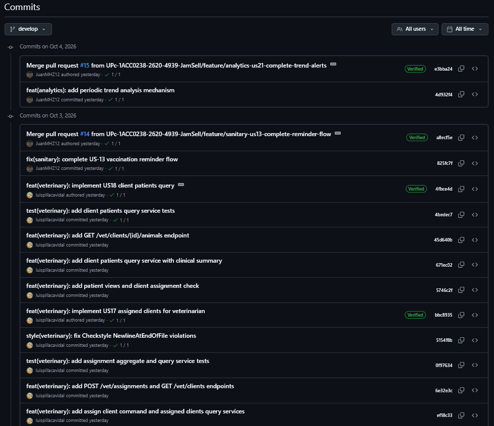
  <p><i><b>Fuente</b>: GitHub, repositorio gethics-backend.</i></p>
</div>

<div align="center">
  <p><b>Gráfico</b>: Pull Requests integrados a develop — gethics-backend</p>
  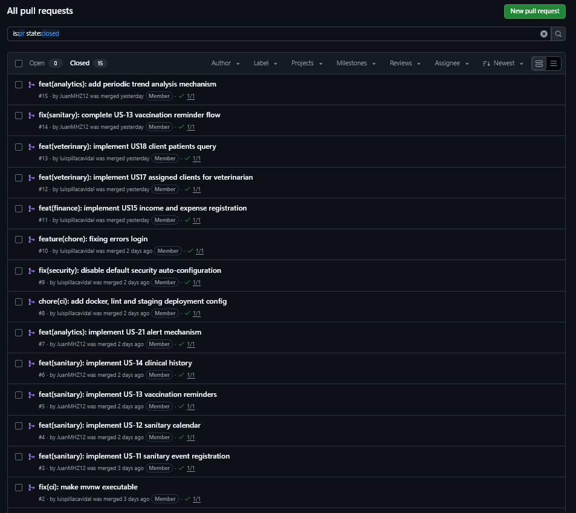
  <p><i><b>Fuente</b>: GitHub, repositorio gethics-backend.</i></p>
</div>

<div align="center">
  <p><b>Gráfico</b>: Ramas de funcionalidad del backend</p>
  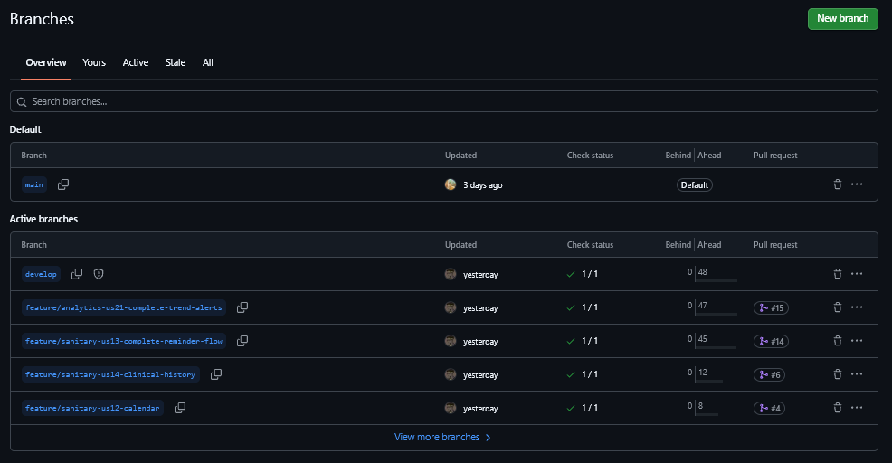
  <p><i><b>Fuente</b>: GitHub, repositorio gethics-backend.</i></p>
</div>

##### Funcionalidades en ramas pendientes de integración

Al cierre del registro de evidencias, las siguientes funcionalidades del módulo de Identity & Access Management y Subscription cuentan con una rama de trabajo propia, con su código implementado, que aún se encuentra pendiente de integración a `develop` mediante Pull Request:

| Historia / Tarea | Descripción | Rama | Autor |
|---|---|---|---|
| US01, US02 | Registro de usuario, inicio de sesión y seguridad con JWT | `feature/US01-US02-auth` | Mauricio Castillo Yataco |
| US03 | Recuperación de contraseña | `feature/US03-forgot-password` | Mauricio Castillo Yataco |
| US04 | Gestión de perfil y foto | `feature/US04-user-profile` | Mauricio Castillo Yataco |
| TS05 | Manejo global de errores y configuración base | `feature/TS05-error-handling` | Mauricio Castillo Yataco |
| TS06 | Anotaciones de acceso por rol | `feature/TS06-role-access` | Mauricio Castillo Yataco |
| US24 | Planes de suscripción | `feature/US24-subscription-plans` | Mauricio Castillo Yataco |

##### Aplicación móvil

El repositorio `gethics-mobile-app` establece la base de la aplicación en Kotlin con Jetpack Compose: estructura por contextos, Design System (colores, tipografía y componentes reutilizables), navegación con barra inferior, capa de red con Retrofit y persistencia local con Room para el modo offline. Como primera funcionalidad completa se implementó el registro de evento sanitario (US11), conectada al servicio del backend.

| Elemento | Descripción | Autor | Fecha | Commit | Pull Request |
|---|---|---|---|---|---|
| Base del proyecto | Estructura Android, navegación, tema, componentes compartidos y esqueleto de todos los contextos | Juan José Meza Huanacune | 04/10/2026 | `aa2af6d` | — |
| US11 | Pantalla y lógica de registro de evento sanitario, con validación de fecha y pruebas unitarias | Juan José Meza Huanacune | 04/10/2026 | `896d9eb` | #1 |

Las demás pantallas (autenticación, inventario, calendario sanitario, historial clínico, módulo veterinario, finanzas, reportes y planes) se encuentran creadas en la estructura del proyecto con un componente provisional, a la espera de su implementación en los siguientes Sprints.

<div align="center">
  <p><b>Gráfico</b>: Historial de commits de la rama develop — gethics-mobile-app</p>
  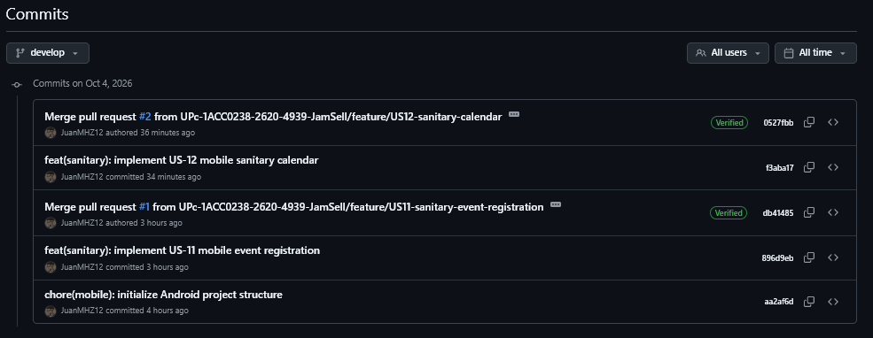
  <p><i><b>Fuente</b>: GitHub, repositorio gethics-mobile-app.</i></p>
</div>

<div align="center">
  <p><b>Gráfico</b>: Pantalla de registro de evento sanitario (US11) en ejecución</p>
  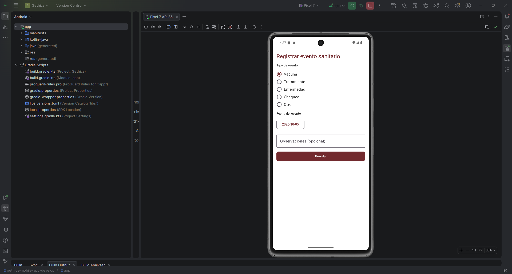
  <p><i><b>Fuente</b>: Elaboración propia, emulador de Android Studio.</i></p>
</div>

##### Landing Page

El repositorio `gethics-landing-page` contiene el sitio estático de Gethics, que implementa el diseño definido en la sección 3.1.3 con contenido tomado de los Capítulos I y II: propuesta de valor, segmentos objetivo, funcionalidades, modelo de negocio y equipo. Fue desarrollado por Nadhim Abigail Raymundo Villarroel en tres versiones sucesivas el 04/10/2026.

<div align="center">
  <p><b>Gráfico</b>: Historial de commits — gethics-landing-page</p>
  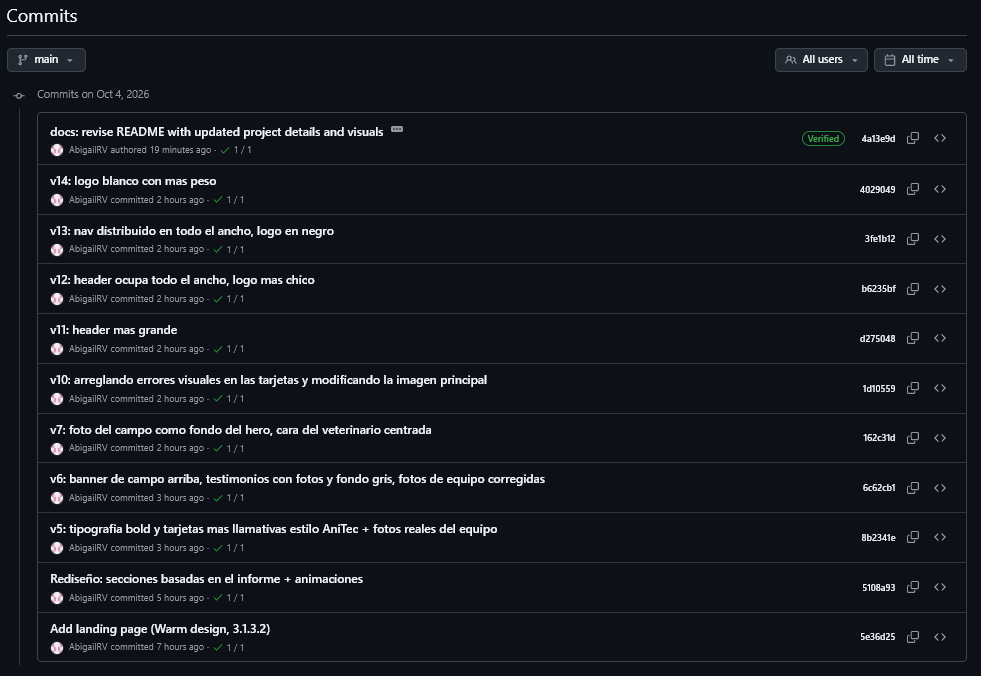
  <p><i><b>Fuente</b>: GitHub, repositorio gethics-landing-page.</i></p>
</div>

---

#### 4.2.1.5. Testing Suite Evidence for Sprint Review

##### Estrategia de pruebas

| Producto | Herramientas | Tipos de prueba | Ejecución |
|---|---|---|---|
| Web Services | JUnit, Mockito, Spring Boot Test (`@DataJpaTest`, `@WebMvcTest`, `@SpringBootTest`) y base PostgreSQL 16 | Unitarias de dominio, de servicios de aplicación, de controladores (capa web), de persistencia y de flujo completo | `./mvnw verify` y GitHub Actions |
| Aplicación móvil | JUnit 4 | Unitarias de ViewModel y de Repository, con dobles de prueba para el servicio de red | `./gradlew test` |

##### Pipeline de integración continua

El workflow `CI` del repositorio `gethics-backend` se ejecuta en cada Pull Request y en cada push a `develop` o `main`. Levanta un contenedor de PostgreSQL 16 y realiza tres pasos en orden: configuración de Java 21, verificación de estilo con Checkstyle (`./mvnw -B checkstyle:check`) y compilación con ejecución de todas las pruebas (`./mvnw -B verify`). Si alguno de estos pasos falla, el Pull Request no debe integrarse.

<div align="center">
  <p><b>Gráfico</b>: Ejecución del pipeline de CI en GitHub Actions — gethics-backend</p>
  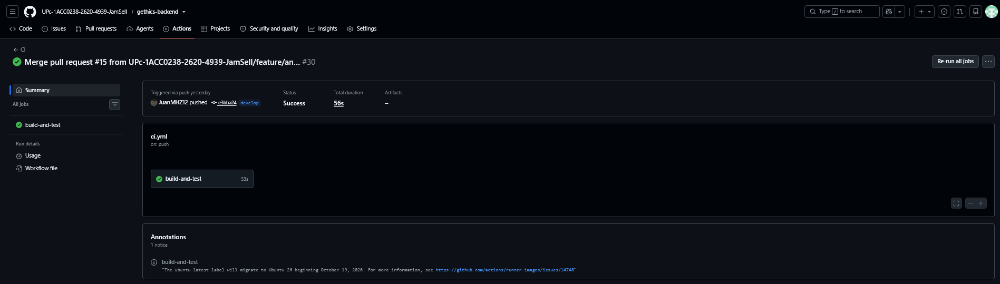
  <p><i><b>Fuente</b>: GitHub Actions, repositorio gethics-backend.</i></p>
</div>

##### Suite de pruebas del backend

En la rama `develop` el backend cuenta con **37 clases de prueba y 223 casos de prueba**, distribuidos por bounded context de la siguiente manera:

| Bounded context | Clases de prueba | Casos de prueba | Qué cubre |
|---|---:|---:|---|
| Sanitary Tracking | 19 | 132 | Historial clínico, eventos sanitarios, calendario, recordatorios de vacunación (agregado, servicios, controladores, persistencia y flujo completo) |
| Analytics & Alerts | 13 | 75 | Análisis de tendencias, generación y envío de alertas, configuración y trabajo periódico |
| Veterinary Care | 3 | 10 | Asignación veterinario-cliente y consulta de clientes y pacientes |
| Financial Management | 1 | 5 | Agregado de gestión financiera y registro de transacciones |
| Aplicación (arranque) | 1 | 1 | Carga del contexto de Spring |
| **Total** | **37** | **223** | |

Las pruebas se organizan en cuatro niveles: pruebas de dominio, que verifican las reglas de negocio de los aggregates y entidades (por ejemplo, `ClinicalHistoryTest` y `ReminderTest`); pruebas de servicios de aplicación (`ClinicalHistoryCommandServiceImplTest`, `SanitaryCalendarQueryServiceImplTest`); pruebas de controladores (`SanitaryEventControllerTest`, `SanitaryCalendarControllerTest`); y pruebas de persistencia y de flujo completo (`VaccinationReminderEndToEndTest`, `AlertFlowTest`).

<div align="center">
  <p><b>Gráfico</b>: Resultado de la ejecución de las pruebas del backend (./mvnw verify)</p>
  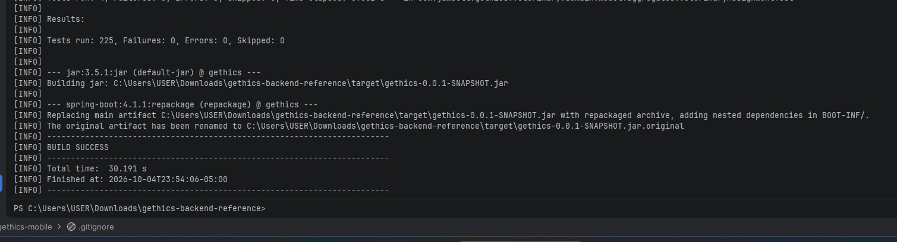
  <p><i><b>Fuente</b>: Elaboración propia, terminal.</i></p>
</div>

##### Suite de pruebas de la aplicación móvil

La aplicación móvil cuenta con **2 clases de prueba y 9 casos de prueba** correspondientes a la funcionalidad US11:

| Clase de prueba | Casos | Qué verifica |
|---|---:|---|
| `RegisterEventViewModelTest` | 5 | La fecha de ayer y de hoy son válidas; la fecha de mañana es rechazada; la fecha se envía al backend en formato ISO con segundos; si la fecha es futura, se muestra el mensaje de error y no se llama al backend. |
| `SanitaryRepositoryTest` | 4 | Una respuesta 201 devuelve éxito; una respuesta 400 muestra el mensaje del backend; un cuerpo no interpretable devuelve un mensaje genérico con el código HTTP; la falta de conexión devuelve un mensaje de error. |

Estas pruebas cubren las validaciones de la pantalla de registro y el manejo de errores de red, que son los puntos más sensibles del uso en campo con conectividad limitada. Aún no se cuenta con pruebas de interfaz (instrumentadas) ni con pruebas para los demás módulos, que se incorporarán conforme se implementen sus pantallas.

<div align="center">
  <p><b>Gráfico</b>: Resultado de las pruebas unitarias de la aplicación móvil</p>
  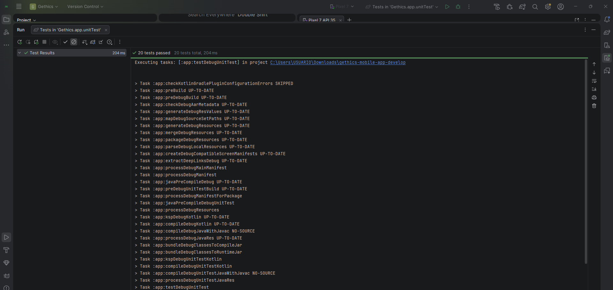
  <p><i><b>Fuente</b>: Elaboración propia, Android Studio.</i></p>
</div>

##### Verificación de estilo

El análisis estático con Checkstyle se ejecuta como paso independiente del pipeline antes de las pruebas, por lo que un Pull Request con violaciones de estilo (por ejemplo, un archivo sin salto de línea final) falla sin llegar a compilar. Durante el Sprint esto permitió detectar y corregir violaciones, como en el commit `5154f8b`: `style(veterinary): fix Checkstyle NewlineAtEndOfFile violations`.


#### 4.2.1.6. Execution Evidence for Sprint Review
En esta sección se presentan las evidencias de la ejecución y correcto funcionamiento de los productos digitales que integran la solución **Gethics** durante la revisión del Sprint. Se valida el cumplimiento de las Historias de Usuario priorizadas a través de capturas de pantalla de la **Aplicación Móvil**, la **Landing Page** y los **Web Services**.

---

#### 1. Evidencias de Ejecución de la Aplicación Móvil

Se verifica la ejecución de la aplicación móvil desarrollada en **Kotlin y Jetpack Compose** en un entorno de emulación/dispositivo físico Android, mostrando el flujo de interacción de los principales módulos.

* **Autenticación e Inicio de Sesión:** Pantalla de ingreso de credenciales para usuarios registrados (ganaderos y veterinarios).
* **Gestión del Hato (Livestock):** Vista de listado de bovinos registrados con detalle de estado de salud y ficha individual.
* **Registro de Eventos Sanitarios:** Formulario dinámico para el registro de vacunaciones, tratamientos y controles médicos.


---

#### 2. Evidencias de Ejecución de la Landing Page

Se confirma la disponibilidad pública de la **Landing Page** alojada en Vercel, verificando la maquetación responsive, navegación entre secciones informativas y acceso a la descarga del APK.


---

#### 3. Evidencias de Ejecución de Pruebas en Postman (Backend)

Ejecución exitosa de la colección de pruebas automatizadas sobre la API REST desplegada en Render, asegurando el correcto procesamiento de las peticiones HTTP y códigos de respuesta (`200 OK`, `201 Created`).


---

#### 4.2.1.7. Services Documentation Evidence for Sprint Review

En esta sección se detalla la documentación técnica interactiva de los **Web Services (Backend)** desarrollados en **Spring Boot**, correspondiente a la API REST expuesta para el consumo de la aplicación móvil y servicios de integración.

La documentación se generó automáticamente utilizando **OpenAPI 3.0 / Swagger UI**, lo cual permite explorar la estructura de las peticiones, esquemas de datos (*DTOs*), parámetros requeridos, códigos de estado HTTP y realizar pruebas de endpoints en tiempo real.

---

#### 1. Especificación OpenAPI y Swagger UI

Se documentaron los endpoints organizados por bounded contexts de acuerdo con la arquitectura Domain-Driven Design (DDD) implementada:

* **IAM (`/api/v1/authentication`, `/api/v1/users`):** Registro, autenticación mediante JWT y gestión de perfiles de usuario.
* **Livestock (`/api/v1/animals`):** Registro, consulta, actualización y trazabilidad del ganado vacuno.
* **Sanitary (`/api/v1/sanitary-events`, `/api/v1/vaccinations`):** Programación y seguimiento de eventos sanitarios y tratamientos.
* **Veterinary (`/api/v1/prescriptions`, `/api/v1/consultations`):** Gestión de recetas y consultas médicas veterinarias.
---

#### 2. Detalle de Esquemas de Datos (Schemas / DTOs)

Cada endpoint cuenta con la definición explícita de sus modelos de transferencia de datos (`RequestDTO` y `ResponseDTO`), especificando los tipos de datos, restricciones de validación y respuestas de error estandarizadas.


#### 4.2.1.8. Software Deployment Evidence for Sprint Review
Durante el presente Sprint, el equipo llevó a cabo el aprovisionamiento, configuración e integración del entorno de despliegue continuo para los tres productos digitales principales que conforman la solución **Gethics**: la **Landing Page**, los **Web Services (Backend)** y la **Aplicación Móvil**.

Las actividades realizadas abarcaron desde la gestión de cuentas y creación de proyectos en las plataformas cloud correspondientes, hasta la configuración de variables de entorno, pipelines de compilación automática y distribución de los artefactos ejecutables.

---

#### 1. Despliegue de la Landing Page

Para la Landing Page se utilizó **Vercel** como proveedor de hosting cloud, debido a su integración nativa con repositorios de GitHub y su capacidad de despliegue continuo (CD) ante eventos de push en la rama principal.

* **Paso 1:** Vinculación del repositorio del proyecto en Vercel y selección de la rama principal (`main`).
* **Paso 2:** Configuración de los parámetros de build (Framework Preset: HTML/CSS/JS) y directorio raíz.
* **Paso 3:** Ejecución del pipeline automático y verificación de disponibilidad mediante el dominio público generado por la plataforma.

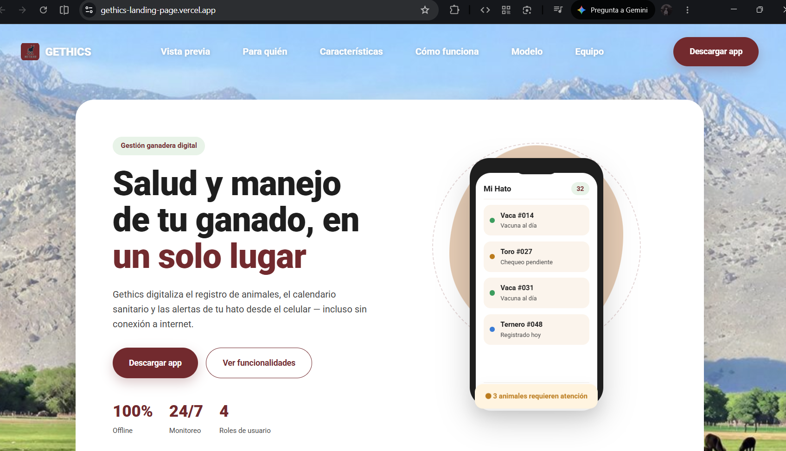
*Figura 4.X. Estado del despliegue exitoso de la Landing Page en Vercel y confirmación de la URL pública de producción.*

---

#### 2. Despliegue de los Web Services (Backend)

El backend, desarrollado en **Spring Boot** con Java 21, se desplegó en **Render** integrando una base de datos PostgreSQL gestionada. Se configuró un entorno de producción optimizado mediante el perfil `prod` y variables de entorno para resguardar las credenciales de conexión.

* **Paso 1:** Creación del Web Service en Render y vinculación directa con el repositorio `gethics-backend` en la rama `main` / `develop`.
* **Paso 2:** Configuración de las variables de entorno dentro del panel del Cloud Provider:
  * `SPRING_PROFILES_ACTIVE`: `prod`
  * `DB_URL`: `jdbc:postgresql://<host-render>:<port>/<database>`
  * `DB_USER`: `<usuario-bd>`
  * `DB_PASSWORD`: `<password-bd>`
* **Paso 3:** Definición del comando de compilación (`./mvnw clean package -DskipTests`) y comando de inicio (`java -jar target/*.jar`).
* **Paso 4:** Verificación de la compilación exitosa, despliegue de contenedores y prueba de disponibilidad de los endpoints mediante la especificación OpenAPI / Swagger.

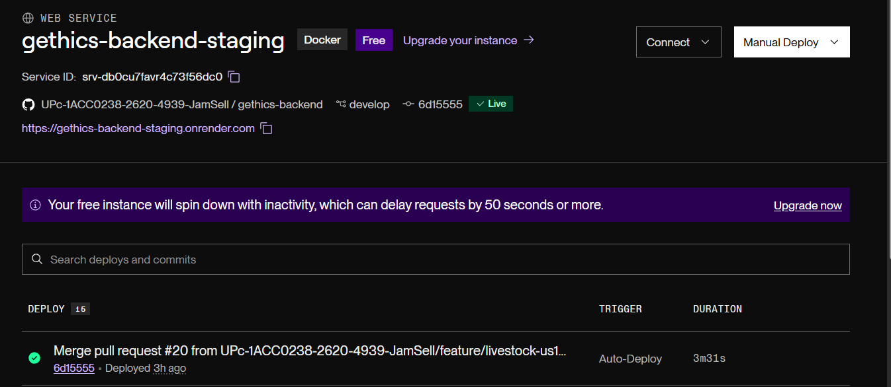
*Figura 4.X. Panel de control en Render mostrando los logs de compilación exitosa y la ejecución activa de los Web Services.*

---

#### 3. Distribución de la Aplicación Móvil (Android)

La aplicación móvil desarrollada en **Kotlin y Jetpack Compose** fue compilada en su variante de lanzamiento (`release`) para la generación del paquete instalable (`.apk`).

* **Paso 1:** Configuración de la URL base del backend de producción dentro de la capa de datos de la aplicación (`BASE_URL`).
* **Paso 2:** Ejecución del comando de construcción del paquete ejecutable:
  ```bash
  ./gradlew assembleRelease
#### 4.2.1.9. Team Collaboration Insights during Sprint
Durante el desarrollo del presente Sprint, el equipo **JamSell** mantuvo una dinámica de trabajo altamente colaborativa y distribuida de manera equitativa entre los tres productos digitales principales de la solución **Gethics**: la **Landing Page**, los **Web Services (Backend)** y la **Aplicación Móvil**.

Para garantizar la transparencia, trazabilidad y sincronización en la ejecución de las tareas, la gestión del código fuente y el flujo de integración se respaldaron mediante analíticos de colaboración, métricas de commits y Pull Requests dentro de los repositorios de GitHub.

---

#### 1. Analíticos de Colaboración y Commits en GitHub

Las métricas e historial de commits reflejan la participación activa y constante de los integrantes del equipo en los repositorios de cada producto digital durante las fases de desarrollo, integración y despliegue del Sprint.

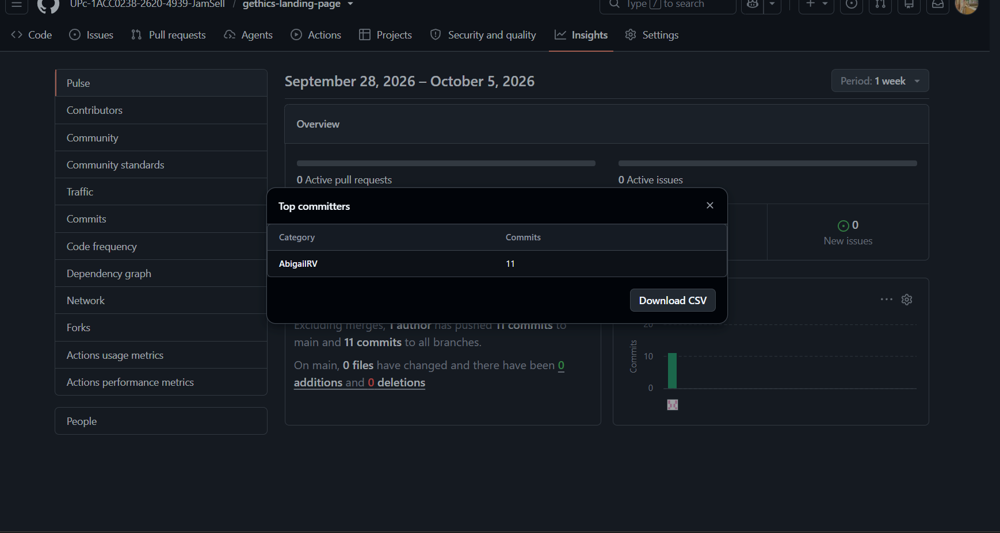
*Figura 4.X. Historial de commits y contribuciones en el repositorio de la Landing Page.*

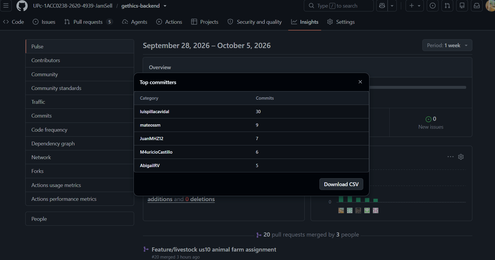
*Figura 4.X. Historial de commits y flujo de integración en el repositorio del Backend (Spring Boot).*

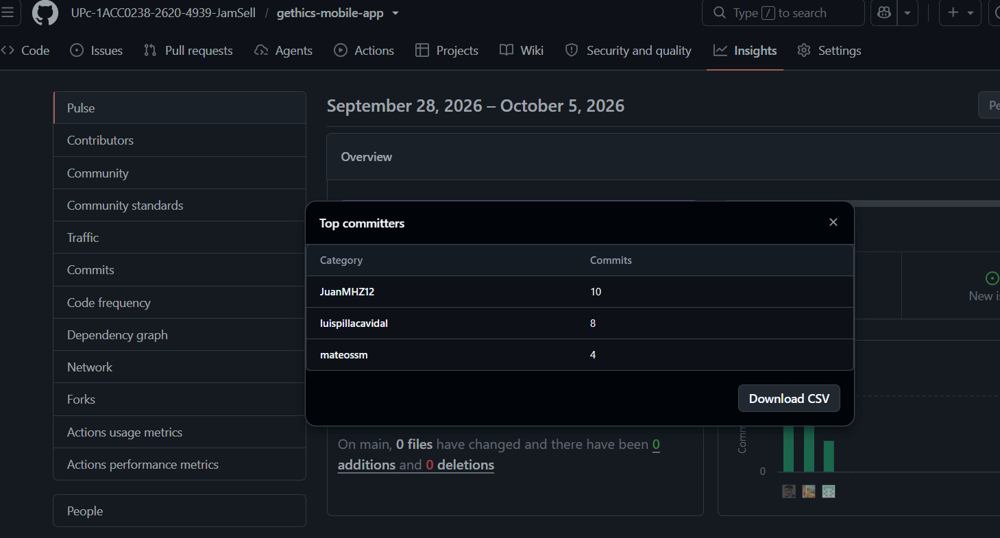
*Figura 4.X. Historial de commits y desarrollo de funcionalidades en el repositorio de la Aplicación Móvil (Android).*

---

#### 2. Interpretación de los Analíticos por Integrante

A partir de los analíticos y registros registrados en las plataformas de control de versiones, se detalla el aporte específico de cada miembro del equipo en los distintos frentes de trabajo:

| Integrante | Código Student | Responsabilidades y Aportes en la Implementación |
| :--- | :--- | :--- |
| **Castillo Yataco, Mauricio Sebastian** | U202113229 | Lideró la maquetación responsive, estructuración HTML/CSS y despliegue continuo de la **Landing Page** en Vercel, asegurando la alineación con la propuesta de valor y las secciones informativas. |
| **Pillaca Vidal, Luis Angel** | U202315654 | Estructuró los pipelines de **Deployment**, aprovisionamiento de servicios cloud (Render), configuración de variables de entorno de producción y apoyo en la arquitectura del **Backend Spring Boot**. |
| **Salazar Miranda, Mateo Paolo** | U202315171 | Implementó las capas del **Backend (Web Services)** en Spring Boot, incluyendo controladores REST, servicios y persistencia de datos con PostgreSQL para los módulos de ganado y eventos sanitarios. |
| **Raymundo Villarroel, Nadhim Abigail** | U202318001 | Desarrolló vistas y componentes UI en la **Aplicación Móvil (Kotlin & Jetpack Compose)**, integrando la navegación principal, consumo de API REST y manejo de estados del cliente. |
| **Meza Huanacune, Juan José** | U202320574 | Diseñó la lógica de negocio y validaciones en la **Aplicación Móvil**, la generación del paquete ejecutable (`.apk`) y la configuración del flujo de releases en GitHub. |

---

#### 3. Conclusión del Desempeño del Equipo

El análisis cuantitativo de los repositorios evidencia un trabajo sinérgico y equilibrado. Se logró cumplir con los criterios de aceptación establecidos en el Sprint Backlog mediante la integración fluida entre el frontend, backend y la aplicación móvil, garantizando la estabilidad de las entregas y la correcta implementación de las funcionalidades planificadas.
## 4.3. Validation Interviews

### 4.3.1. Diseño de Entrevistas

Las entrevistas de validación se plantean con el objetivo de evaluar la percepción de los usuarios después de interactuar con el Landing Page y la aplicación móvil de Gethics. A diferencia de las entrevistas exploratorias realizadas en capítulos anteriores, esta etapa se enfoca en validar la claridad de la propuesta de valor, la facilidad de navegación, la comprensión de las funcionalidades principales y la utilidad percibida por los segmentos objetivo.

Para esta validación se consideran los dos segmentos principales definidos para Gethics:

- Pequeños y medianos ganaderos.
- Veterinarios y técnicos agropecuarios.

La dinámica de la entrevista consiste en presentar primero el Landing Page de Gethics, para observar si el usuario comprende el problema que busca resolver la solución, la confianza que transmite y la claridad de sus secciones. Posteriormente, se muestra la aplicación móvil, revisando el Inicio, el menú de navegación inferior y los módulos principales (Inventario, Tareas, Perfil) según corresponda al rol del entrevistado.

En el caso del segmento ganadero, la evaluación se orienta al registro de animales, el calendario sanitario (vacunas y tratamientos), las alertas automáticas y el control económico del hato. En el caso del segmento veterinario/técnico, se evalúa la revisión de clientes asignados, la consulta de pacientes (animales), el historial clínico, el registro de eventos sanitarios en campo y el comportamiento de la aplicación sin conexión. Al finalizar la demostración, el entrevistado responde un conjunto de preguntas diseñadas para recoger sus opiniones, dificultades y recomendaciones de mejora.

### Guía de preguntas para el segmento Ganadero

1. ¿A qué se dedica actualmente dentro de la actividad ganadera y qué tipo de animales maneja?
2. ¿Cómo registra hoy la información de sus animales, vacunas, tratamientos o gastos?
3. Al ver el Landing Page de Gethics, ¿entiende rápidamente qué problema busca resolver la aplicación?
4. ¿La información del Landing Page le genera confianza para probar la aplicación? ¿Por qué?
5. ¿Qué sección del Landing Page le pareció más útil o clara?
6. ¿Hubo alguna parte del Landing Page que le pareció confusa, innecesaria o poco creíble?
7. Al abrir la aplicación, ¿le resultó claro hacia dónde debía ir primero?
8. ¿La pantalla de Inicio le muestra información útil para tomar decisiones rápidas sobre su ganado?
9. ¿Los nombres de las opciones del menú (Inicio, Inventario, Tareas, Perfil) le resultan comprensibles?
10. ¿Le resultó fácil encontrar y buscar un animal dentro del Inventario?
11. ¿El formulario para registrar o editar un animal le parece claro y completo (raza, edad, sexo, estado de salud)?
12. ¿Qué dato importante sobre un animal cree que falta registrar?
13. ¿Le resulta útil registrar una vacuna o un tratamiento desde la ficha del animal?
14. ¿La sección de Tareas le ayudaría a no olvidar vacunas, desparasitaciones u otros eventos sanitarios?
15. ¿Las alertas que muestra la aplicación le parecen oportunas y fáciles de entender?
16. ¿La sección de reportes le parece útil para controlar ingresos, egresos o la rentabilidad de su hato?
17. ¿Qué tan importante es para usted que la aplicación funcione sin conexión a internet, dado el lugar donde trabaja?
18. ¿El lenguaje usado en la aplicación le parece cercano y fácil de entender?
19. ¿Qué parte de la aplicación le resultó más difícil de usar o encontrar?
20. Después de probar Gethics, ¿la usaría en su trabajo diario? ¿Qué tendría que mejorar para que sí la use?

### Guía de preguntas para el segmento Veterinario / Técnico agropecuario

1. ¿Cuál es su experiencia trabajando con ganaderos o productores pecuarios?
2. ¿Cómo organiza actualmente la información de sus clientes, pacientes y visitas en campo?
3. Al ver el Landing Page de Gethics, ¿queda claro que también está pensada para veterinarios y técnicos?
4. ¿Qué información del Landing Page le ayudó más a entender el valor de la aplicación para su trabajo?
5. ¿Qué información agregaría al Landing Page para que un veterinario confíe más en Gethics?
6. Al abrir la aplicación, ¿la pantalla de Inicio le permite entender rápidamente qué requiere su atención?
7. ¿Le resultó fácil encontrar y revisar a sus clientes (ganaderos) asignados?
8. ¿La vista de pacientes (animales) por cliente le ayuda a encontrar rápidamente a quién debe revisar?
9. ¿Le parece adecuado el flujo de buscar primero un animal o cliente antes de ver su información clínica?
10. ¿El historial clínico de cada animal es suficiente para hacer una revisión veterinaria básica?
11. ¿El formulario para registrar un evento sanitario (chequeo, vacuna, tratamiento) le permite registrar lo que necesita?
12. ¿Qué campos clínicos considera que faltan en el registro sanitario?
13. ¿La sección de Tareas le serviría para organizar sus visitas, controles o seguimientos pendientes?
14. ¿Qué tan clara le resultó la forma de priorizar entre varios animales o productores pendientes de atención?
15. Al probar el registro sin conexión, ¿la aplicación le dio la confianza de que no perdería la información ingresada?
16. ¿Qué tan importante es para usted no depender de señal para registrar un chequeo en campo?
17. ¿El lenguaje y los términos usados en la aplicación coinciden con cómo usted trabaja en el día a día?
18. ¿Hubo alguna pantalla, botón o texto que no entendió durante la prueba?
19. ¿Qué le pareció más valioso de la aplicación frente a sus fichas físicas o anotaciones en el celular?
20. Después de probar Gethics, ¿la recomendaría como herramienta de apoyo veterinario/técnico? ¿Qué cambios serían prioritarios?


### 4.3.2. Registro de Entrevistas
A continuación se presentan los registros detallados de las entrevistas semiestructuradas realizadas a los representantes de los segmentos objetivo identificados para el proyecto **Gethics**: el **Segmento 1 (Ganaderos / Productores Pecuarios)** y el **Segmento 2 (Veterinarios / Técnicos Agropecuarios)**.

---

#### Segmento 1: Ganaderos y Productores Pecuarios

##### Entrevista #1: Daniel Ruiz
* **Edad:** 42 años
* **Ocupación / Rol:** Propietario y gestor de establo ganadero
* **Ubicación:** Cajamarca, Perú
* **Fecha de entrevista:** 15 de septiembre de 2026
* **Duración:** 22 minutos
* **Evolución y Resumen:**  
  Daniel cuenta con un hato de aproximadamente 35 cabezas de ganado vacuno enfocado en la producción lechera. Expresa que su principal problema es el registro en cuadernos de papel, lo cual provoca extravío de datos sobre fechas de vacunación y partos. Le interesa una herramienta móvil sencilla que le permita recibir alertas directas antes de que se venzan los plazos sanitarios y llevar un control rápido de sus ingresos y egresos diarios.


---

##### Entrevista #2: Yarkin Quispe
* **Edad:** 38 años
* **Ocupación / Rol:** Ganadero de producción mixta (carne y leche)
* **Ubicación:** Arequipa, Perú
* **Fecha de entrevista:** 16 de septiembre de 2026
* **Duración:** 18 minutos
* **Evolución y Resumen:**  
  Yarkin gestiona un establo familiar de 20 bovinos. Destaca la dificultad de mantener un historial individual por cada animal, lo que dificulta identificar cuáles son los más productivos o cuáles han recibido tratamientos antibióticos recientes. Valora positivamente contar con una aplicación móvil intuitiva que funcione de forma ágil y le permita registrar eventos sanitarios directamente desde el corral.


---

##### Entrevista #3: Jesús Manrique
* **Edad:** 50 años
* **Ocupación / Rol:** Productor pecuario y administrador de fundo
* **Ubicación:** Lima Provincias (Canta), Perú
* **Fecha de entrevista:** 17 de septiembre de 2026
* **Duración:** 25 minutos
* **Evolución y Resumen:**  
  Jesús administra más de 50 vacunos. Su mayor preocupación reside en las pérdidas financieras asociadas a enfermedades no detectadas a tiempo y el descontrol en la compra de insumos veterinarios. Resalta que necesita una plataforma que integre reportes visuales de rentabilidad y alertas claras sobre eventos del hato, ya que actualmente consolida sus datos de forma manual a fin de mes.

---

#### Segmento 2: Veterinarios y Técnicos Agropecuarios

##### Entrevista #4: Andrea Arango
* **Edad:** 31 años
* **Ocupación / Rol:** Médico Veterinaria Zootecnista
* **Ubicación:** Trujillo, Perú
* **Fecha de entrevista:** 18 de septiembre de 2026
* **Duración:** 20 minutos
* **Evolución y Resumen:**  
  Andrea presta servicios de asistencia técnica ambulatoria a múltiples establos en la región. Menciona que la falta de un historial clínico digitalizado por parte de los ganaderos dificulta dar un diagnóstico certero cuando atiende una emergencia. Sugiere que la aplicación incluya una sección limpia para el historial sanitario individual del animal que pueda ser consultada rápidamente durante sus visitas de campo.


---

##### Entrevista #5: Manuel Fajardo
* **Edad:** 36 años
* **Ocupación / Rol:** Técnico Agropecuario y consultor pecuario
* **Ubicación:** Junín, Perú
* **Fecha de entrevista:** 19 de septiembre de 2026
* **Duración:** 24 minutos
* **Evolución y Resumen:**  
  Manuel supervisa el cumplimiento de calendarios de vacunación y control de parásitos en varios fundos medianos. Indica que la falta de seguimiento por parte del personal del fundo arruina con frecuencia los tratamientos preventivos. Considera indispensable que el sistema permita programar recordatorios automáticos de dosis y tratamientos posteriores para asegurar la trazabilidad del hato.


### 4.3.3. Evaluaciones según heurísticas

**UX Heuristics & Principles Evaluation**  
*Usability - Inclusive Design - Information Architecture*

* **CARRERA:** Ingeniería de Software  
* **CURSO:** 1acc0238 Aplicaciones para dispositivos móviles  
* **NRC:** 1ACC0238  
* **PROFESORES:** David Gerardo Quevedo Velasco  
* **AUDITOR:** JamSell  
* **CLIENTE(S):** Ganaderos, Veterinarios y Técnicos Agropecuarios  

---

### SITE o APP A EVALUAR:
**Gethics Mobile** (Aplicación Móvil para la Gestión Pecuaria y Seguimiento Sanitario)

---

### TAREAS A EVALUAR:

El alcance de esta evaluación incluye la revisión de la usabilidad de las siguientes tareas:
1. Registro de usuario e inicio de sesión en la plataforma móvil.
2. Registro e ingreso de datos de un nuevo bovino en el hato.
3. Consulta y filtrado del historial de eventos sanitarios de un animal.
4. Registro de un nuevo tratamiento sanitario/vacunación.
5. Visualización del resumen financiero y alertas preventivas del hato.

No están incluidas en esta versión de la evaluación las siguientes tareas:
1. Exportación masiva de reportes en formato PDF/Excel.
2. Sincronización offline en zonas sin cobertura de red.
3. Configuración avanzada de permisos por roles de operario secundario.

---

### ESCALA DE SEVERIDAD:

Los errores serán puntuados tomando en cuenta la siguiente escala de severidad:

| Nivel | Descripción |
| :---: | :--- |
| **1** | **Problema superficial:** Puede ser fácilmente superado por el usuario y ocurre con muy poca frecuencia. No necesita ser arreglado a no ser que exista disponibilidad de tiempo. |
| **2** | **Problema menor:** Puede ocurrir un poco más frecuentemente o es un poco más difícil de superar para el usuario. Se le debería asignar una prioridad baja para resolverlo de cara al siguiente release. |
| **3** | **Problema mayor:** Ocurre frecuentemente o los usuarios no son capaces de resolverlos. Es importante que sean corregidos y se les debe asignar una prioridad alta. |
| **4** | **Problema muy grave:** Un error de gran impacto que impide al usuario continuar con el uso de la herramienta. Es imperativo que sea corregido antes del lanzamiento. |

---

### TABLA RESUMEN:

| # | Problema | Escala de severidad | Heurística/Principio violada(o) |
| :---: | :--- | :---: | :--- |
| **1** | Ausencia de mensaje de confirmación previo a la eliminación de un registro vacuno | **3** | Usability: Prevención de errores |
| **2** | Iconografía inconsistente entre la navegación inferior de la App y el Landing Page | **1** | Usability: Consistencia y estándares |
| **3** | Indicadores de gráficos financieros distinguibles únicamente por contraste de color | **2** | Inclusive Design: Proporciona experiencias comparables |
| **4** | Sección de eventos sanitarios vacía sin mensaje explícito de estado ("Empty State") | **2** | Information Architecture: Is it usable? |
| **5** | Imposibilidad de regresar al menú principal desde la pantalla de registro de tratamiento | **3** | Usability: Libertad y control del usuario |

---

### DESCRIPCIÓN DE PROBLEMAS:

#### PROBLEMA #1: Ausencia de mensaje de confirmación previo a la eliminación de un registro vacuno
* **Severidad:** 3
* **Heurística violada:** Usabilidad - Prevención de errores
* **Problema:**  
  Al presionar el botón de eliminación en la ficha de un vacuno, el sistema borra inmediatamente el registro sin solicitar una confirmación previa al usuario. Esto puede ocasionar la pérdida accidental de información crítica del hato si el usuario presiona el botón por error mientras trabaja en campo.

* **Recomendación:**  
  Implementar un modal/diálogo de confirmación explícito ("*¿Está seguro de eliminar este registro? Esta acción no se puede deshacer*") con botones de acción clara (*Cancelar* y *Eliminar*).

---

#### PROBLEMA #2: Iconografía inconsistente entre la navegación inferior de la App y el Landing Page
* **Severidad:** 1
* **Heurística violada:** Usabilidad - Consistencia y estándares
* **Problema:**  
  El ícono utilizado para representar el módulo de "Alertas y Notificaciones" en la navegación inferior de la aplicación móvil difiere del ícono e ilustración empleados en la Landing Page informativa para el mismo concepto, generando una leve confusión conceptual en la curva de aprendizaje inicial.


* **Recomendación:**  
  Estandarizar la librería de íconos del Design System en Figma y asegurar que tanto el frontend de la Landing Page como la aplicación móvil consuman el mismo paquete de assets vectoriales.

---

#### PROBLEMA #3: Indicadores de gráficos financieros distinguibles únicamente por contraste de color
* **Severidad:** 2
* **Heurística violada:** Inclusive Design - Proporciona experiencias comparables
* **Problema:**  
  En el resumen del módulo financiero, los estados de rentabilidad (ingresos vs. egresos) se diferencian únicamente mediante códigos de color (verde y rojo) sin el apoyo de etiquetas de texto alternativas o patrones visuales. Esto dificulta la interpretación adecuada para usuarios con deficiencias visuales como daltonismo.

* **Recomendación:**  
  Añadir íconos descriptivos adicionales (p. ej., flecha ascendente/descendente) o etiquetas de texto visibles junto a los montos para garantizar el cumplimiento de los principios de diseño inclusivo.

---

#### PROBLEMA #4: Sección de eventos sanitarios vacía sin mensaje explícito de estado ("Empty State")
* **Severidad:** 2
* **Heurística violada:** Information Architecture - Is it usable?
* **Problema:**  
  Cuando un animal no cuenta con registros sanitarios previos, la pantalla de historial muestra una lista en blanco sin indicar explícitamente si la información se está cargando, si hubo un fallo de red o si efectivamente no existen datos registrados.

  
* **Recomendación:**  
  Diseñar e incorporar un componente visual de "Empty State" con un texto ilustrativo (*"No hay eventos sanitarios registrados para este bovino"*) y un botón de llamada a la acción rápida (*"Registrar tratamiento"*).

---

#### PROBLEMA #5: Imposibilidad de regresar al menú principal desde la pantalla de registro de tratamiento
* **Severidad:** 3
* **Heurística violada:** Usabilidad - Libertad y control del usuario
* **Problema:**  
  Al ingresar al formulario de registro de un tratamiento sanitario, la barra superior de la pantalla no incluye el botón estándar de retorno ("<-"), ni existe un botón para cancelar el proceso. La única forma que tiene el usuario para salir del formulario sin guardar es forzar el cierre de la aplicación o presionar el botón físico de retroceso del sistema operativo.


* **Recomendación:**  
  Incluir un botón de retorno evidente en el `TopAppBar` de la pantalla y un botón secundario de "*Cancelar*" en la parte inferior del formulario que devuelva al usuario al módulo anterior manteniendo la integridad del estado.
---

# Conclusiones

## Conclusiones y recomendaciones


---

# Video App Validation


# Video About the Product


# Video About the Team


---

# Glosario


# Bibliografía


# Anexos
