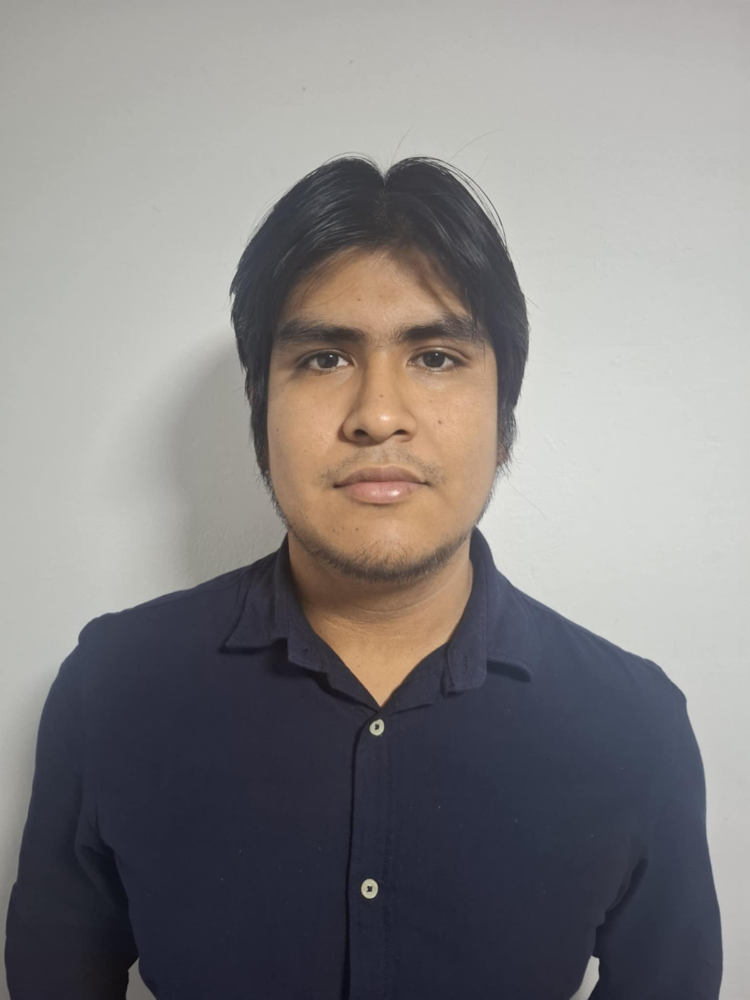

# 1.1. Startup Profile

En esta sección se presenta la descripción de la startup y los perfiles de los miembros del equipo.

## 1.1.1. Descripción de la startup.

JamSell es una startup enfocada en brindar soluciones tecnológicas accesibles y efectivas para los pequeños y medianos ganaderos de Latinoamérica. A través de una aplicación móvil intuitiva, Gethics digitaliza la gestión del ganado mediante una estructura organizada en módulos clave que abarcan toda la operación productiva. Asimismo, la solución considera al segmento veterinario, permitiendo que los profesionales puedan revisar clientes asignados, consultar pacientes, registrar eventos sanitarios y dar seguimiento clínico a los animales atendidos desde la palma de su mano.

La aplicación organiza la vida productiva del ganado en los siguientes módulos clave:

- Gestión integral de animales, incluyendo el registro individual (raza, edad, sexo y estado de salud), así como su listado, búsqueda, filtrado, edición y eliminación.
- Registro y gestión del historial de las visitas médicas por cada animal.
- Calendario sanitario (eventos, vacunas, tratamientos).
- Control económico (ingresos, egresos).
- Visualización de reportes y estadísticas, con alertas automáticas push según el análisis de tendencias del ganado.

Gracias a la integración de datos históricos y actualizados en tiempo real, Gethics permite a los ganaderos tomar decisiones informadas, mejorar la productividad, reducir pérdidas operativas y optimizar el control sanitario del ganado. De esta manera, se transforma la gestión tradicional en una ganadería más inteligente, eficiente y sostenible adaptada a dispositivos móviles.

**Misión:** Revolucionar la gestión y trazabilidad del ganado en pequeños y medianos hatos ganaderos de Latinoamérica, mediante una aplicación móvil accesible que optimice los procesos productivos, sanitarios y económicos.

**Visión:** Gethics se proyecta como una de las aplicaciones móviles más destacadas del sector ganadero en el registro y control integral de animales durante los próximos tres años. La startup busca consolidarse como un modelo de negocio sostenible, confiable y orientado a la mejora continua de la productividad rural a través de tecnología móvil simple y efectiva.

## 1.1.2. Perfiles de los integrantes del equipo.

<table>
  <tr>
    <td width="30%" align="center">
      
    </td>
    <td width="70%">
      <h3>Mauricio Sebastian Castillo Yataco</h3>
      <h4>-</h4>
      

        Mi nombre es Mauricio Sebastian Castillo Yataco. Actualmente me encuentro cursando la carrera de Ingeniería de Software en la UPC. Me apasiona el desarrollo de software y la búsqueda de soluciones tecnológicas que puedan impactar positivamente en la sociedad. Me comprometo a aportar mis habilidades analíticas, mi dedicación y mi capacidad para trabajar en equipo para asegurar que Gethics sea un producto funcional y de alta calidad.
      

    </td>
  </tr>

   <tr>
    <td width="30%" align="center">
      
    </td>
    <td width="70%">
      <h3>Juan Jose Meza Huanacune</h3>
      <h4>-</h4>
      

      

    </td>
  </tr>

   <tr>
    <td width="30%" align="center">
      
    </td>
    <td width="70%">
      <h3>Luis Angel Pillaca Vidal</h3>
      <h4>-</h4>
      

      

    </td>
  </tr>

   <tr>
    <td width="30%" align="center">
      
    </td>
    <td width="70%">
      <h3>Nadhim Abigail Raymundo Villarroel</h3>
      <h4>-</h4>
      

      

    </td>
  </tr>

   <tr>
    <td width="30%" align="center">
      
    </td>
    <td width="70%">
      <h3>Mateo Paolo Salazar Miranda</h3>
      <h4>-</h4>
      

      

    </td>
  </tr>
</table>